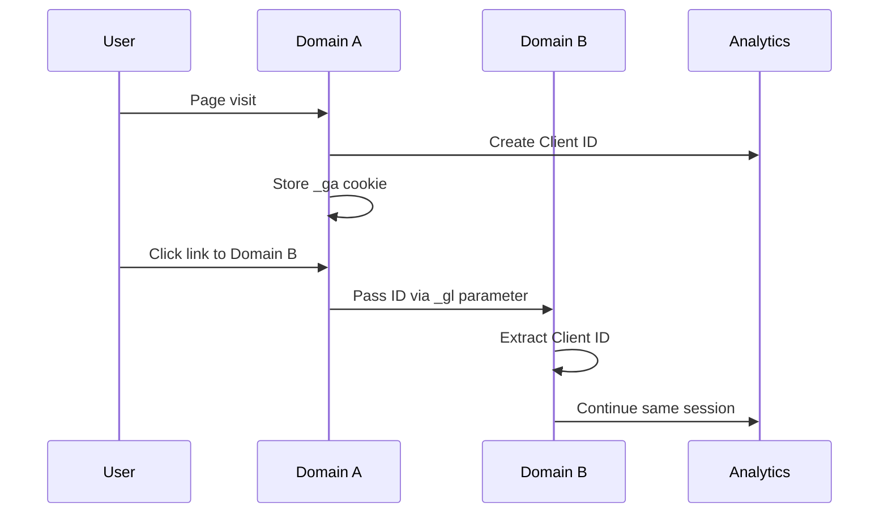
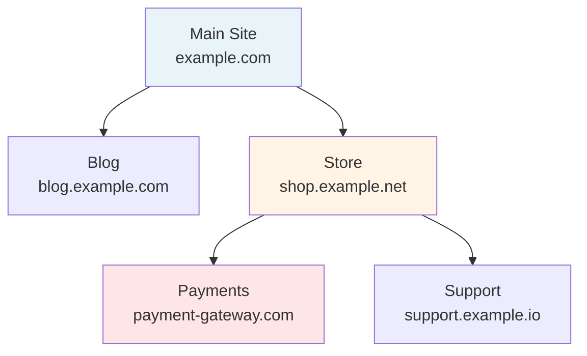
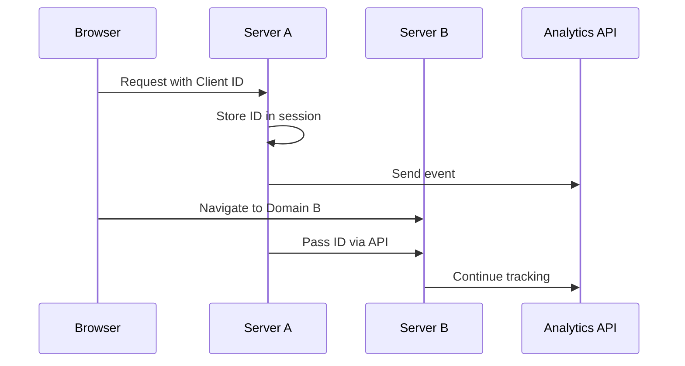
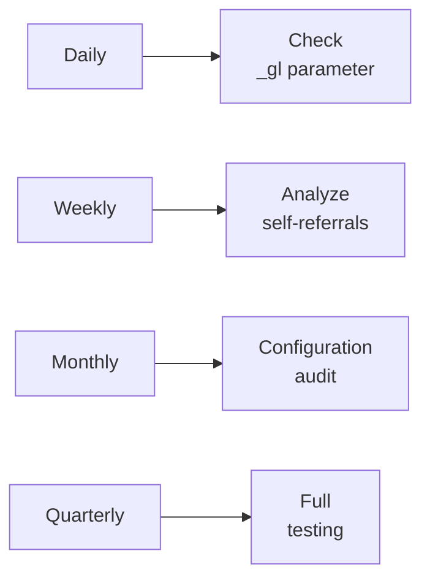

# Cross-Domain Tracking: Linking User Sessions Across Multiple Domains

Cross-domain tracking is a technology for monitoring user activity as they navigate between different domains, allowing you to combine fragmented sessions into a unified view of the customer journey. Without proper cross-domain tracking setup, each user transition to a new domain is registered as a separate session from a new visitor, leading to distorted analytics data.

## The Data Fragmentation Problem

Cookies used for user identification in web analytics are bound to a specific domain and cannot be automatically read by other domains for security reasons. This creates a fundamental problem for businesses with multi-domain architecture.

!!! example "Typical E-commerce Scenario"
    
    An online store on `example-store.com` uses a third-party payment service on `payment-provider.com`:
    
    **Without cross-domain tracking:**

    - User from advertising campaign: session #1 on main site
    - Transition to payment: session #2 on payment domain
    - Result: 2 different users, lost conversion attribution
    
    **With cross-domain tracking:**

    - Single session across both domains
    - Preserved traffic source
    - Correct transaction attribution to advertising campaign

### Consequences of Missing Cross-Domain Tracking

| Metric | Distortion | Business Impact |
|---------|-----------|-------------------|
| User Count | Inflated by 40-60% | Incorrect audience size estimation |
| Sessions | Duplicated at each transition | Skewed engagement picture |
| Traffic Sources | Lost original source | Misallocated marketing budget |
| Conversions | Attribution to direct traffic | Undervalued campaign effectiveness |
| Bounce Rate | Artificially inflated | False signals about traffic quality |

## How Cross-Domain Tracking Works

Cross-domain tracking operates by passing user identifiers through URL parameters when navigating between domains. Cookies maintain the same IDs as they are passed from one domain to another via a URL parameter (_gl) when users navigate between domains through links or forms.



### System Components

=== "Linker (source)"
    
    **Functions:**
    
    - Track clicks on cross-domain links
    - Generate _gl parameter with encrypted Client ID
    - Automatically append parameter to URL
    - Handle forms and redirects
    
    **Features:**
    
    - Linker parameters expire after two minutes, so the parameter is only added at click time
    - Multiple domain support
    - Works with dynamically created links

=== "Acceptor (destination)"
    
    **Functions:**
    
    - Parse incoming _gl parameter
    - Validate timestamp
    - Restore Client ID
    - Overwrite local cookie
    
    **Features:**
    
    - Automatic rejection of expired parameters
    - Data integrity verification
    - Preserve original traffic source

## Google Analytics 4 Setup

GA4 has significantly simplified the cross-domain tracking setup process compared to Universal Analytics. In Google Analytics 4, configuration is done through the admin interface, eliminating confusion with code-level or GTM setup.

### Step-by-Step Configuration

!!! info "Setup Requirements"
    
    - Editor rights in GA4 property
    - Same Measurement ID on all domains
    - Access to code on all tracked domains
    - Maximum 100 domain conditions

**Configuration Process:**

**Navigate to Data Stream Settings**

   - Open Admin → Data Streams
   - Select web data stream
   - Click "Configure tag settings"

**Add Domains**

   - In Settings section, select "Configure your domains"
   - If using same Google tag across domains, they're automatically detected and appear in Recommendations
   - Manually add domains via "Add condition"

**Configure Match Conditions**

   | Match Type | Example | What It Includes |
   |-------------------|--------|--------------|
   | Contains | example.com | All subdomains and paths |
   | Exact match | shop.example.com | Only exact domain |
   | Starts with | secure. | All domains with prefix |
   | Ends with | .example.com | Main and subdomains |
   | Regex | ^(shop\|pay)\.example | Complex patterns |

### Google Tag Manager Setup

For more flexible management, many specialists prefer using GTM:

```javascript
// Google Tag configuration with cross-domain
gtag('config', 'G-XXXXXXXXXX', {
  'linker': {
    'domains': ['example.com', 'checkout.example.com', 'payment-provider.com']
  }
});
```

!!! tip "GTM Approach Advantages"
    
    - Centralized management for multiple domains
    - Conditional activation logic
    - Change versioning
    - Pre-publish testing
    - Integration with other tags

## Testing and Debugging

Proper setup verification is critical for data reliability. To verify, open a page with a link to the second domain, click it, and ensure the URL contains the _gl parameter, for example: https://www.example.com/?_gl=1*abcde5*.

### Verification Methods

=== "Quick Check"
    
    **Steps:**
    
    1. Open first domain in incognito mode
    2. Navigate via link to second domain
    3. Check for `_gl` parameter in URL
    4. Open developer console
    5. Check `_ga` cookie value on both domains
    
    **Success Indicators:**
    
    - ✓ _gl parameter present
    - ✓ _ga cookie values identical
    - ✓ Session continues in GA4

=== "Detailed Debugging"
    
    **Tools:**
    
    - GA4 DebugView for real-time verification
    - Tag Assistant for tag validation
    - Network tab for request analysis
    - Cookie inspector for value checking
    
    **What to Verify:**
    
    - Client ID consistency
    - Session ID preservation
    - Traffic source attribution
    - Event parameter passing

### Common Issues and Solutions

| Issue | Cause | Solution |
|----------|---------|---------|
| Missing _gl parameter | Incorrect domain configuration | Verify exact domain match in settings |
| Parameter removed on transition | Redirects clear query parameters | Configure parameter preservation in redirect rules |
| Different Client IDs on domains | Cookie not overwritten | Check allowLinker setting on receiving domain |
| Session resets | Parameter expired (>2 minutes) | Reduce number of redirects |
| Cookie-blocking extensions block cookies | User privacy settings | Consider server-side tracking |

## Special Use Cases

### Subdomains

Google Analytics 4 can track visitors across subdomains without additional configuration. However, there are nuances:

!!! warning "When Subdomain Setup is Needed"
    
    - Different cookie domain settings
    - Using different GTM containers
    - Custom JavaScript implementation
    - Need to filter specific subdomains

### Multiple Domains

When working with more than two domains, consider:



**Optimization Strategies:**

- Minimize cross-domain transitions
- Use single domain for critical processes
- Implement fallback mechanisms for parameter loss
- Monitor data integrity through custom alerts

### Payment Gateway Integration

Payment gateways present special complexity:

| Scenario | Problem | Solution |
|----------|----------|---------|
| Redirect-based payment | Multiple redirects | Use webhooks for server-side tracking |
| iFrame integration | Isolated context | PostMessage API for data passing |
| External checkout | Complete context loss | Enhanced e-commerce with transaction ID matching |
| Multi-step verification | Parameter timeouts | Session storage as backup |

## Alternative Approaches

### Server-Side Tracking

For business-critical processes, server-side approach ensures reliability:



**Advantages:**

- Independence from browser restrictions
- Complete data control
- Data enrichment capabilities
- Ad-blocker resistance

### First-Party Data Approach

Creating your own identification system:

!!! info "System Components"
    
    **Identification:**

    - Persistent ID generation
    - Cross-device matching
    - Probabilistic fingerprinting
    
    **Storage:**

    - Centralized database
    - Real-time synchronization
    - State backup
    
    **Application:**

    - Injection into analytics systems
    - CRM data enrichment
    - Experience personalization

## Impact on Metrics and Reporting

Proper cross-domain tracking setup dramatically changes the analytics picture:

### Before and After Implementation

| Metric | Before Implementation | After | Change |
|---------|--------------|--------|-----------|
| Users | 10,000 | 6,500 | -35% |
| Sessions | 15,000 | 8,000 | -47% |
| Bounce Rate | 65% | 45% | -20pp |
| Conversion Rate | 1.2% | 2.1% | +75% |
| Avg. Session Duration | 1:30 | 3:45 | +150% |
| Pages/Session | 2.3 | 5.7 | +148% |

### Historical Data Adjustment

When implementing cross-domain tracking, it's important to:

1. **Create an annotation** in GA4 with implementation date
2. **Save baseline metrics** before changes
3. **Recalculate KPIs** considering new methodology
4. **Update dashboards** with change explanations
5. **Inform stakeholders** about reporting impact

## Best Practices and Recommendations

### Architecture Planning

!!! tip "Optimal Domain Structure"
    
    **Minimize domain count:**

    - Use subdomains instead of separate domains where possible
    - Consolidate functionality on main domain
    - Avoid unnecessary redirects
    
    **Standardize naming conventions:**

    - Consistent subdomain prefixes
    - Logical URL hierarchy
    - Consistent parameters across domains

### Configuration Documentation

Create detailed documentation including:

- List of all tracked domains
- Domain transition matrix
- Each domain's configuration
- Testing procedures
- Responsible party contacts
- Change history

### Monitoring and Maintenance

Regular checks:



## The Future of Cross-Domain Tracking

### Privacy-First Approaches

Tightening privacy regulations require new solutions:

- **Privacy Sandbox APIs** for aggregated reporting
- **Consent-based tracking** with granular permissions
- **Federated Learning** for analysis without data transfer
- **Differential Privacy** for protecting individual data

### Technological Innovations

Technology development opens new possibilities:

!!! info "Emerging Approaches"
    
    **Edge Computing:**

    - Data processing at CDN level
    - Minimal latency
    - Geographic distribution
    
    **Blockchain ID:**

    - Decentralized identification
    - User-controlled data
    - Transparent attribution
    
    **AI-driven matching:**

    - Probabilistic user matching
    - Behavioral pattern recognition
    - Predictive journey completion

## Our Approach to Cross-Domain Tracking

We're developing a solution that eliminates the technical limitations of traditional cross-domain tracking. Unlike systems requiring complex setup and constant maintenance, our approach provides automatic detection of related domains and intelligent session linking.

We plan to implement technology that will work even when cookies and URL parameters are blocked. We focus on creating a resilient identification system using multiple signals to identify users.

Our platform will provide a visual map of cross-domain transitions with automatic problem point detection. This will enable quick identification and resolution of tracking gaps without the need for deep technical analysis.

Unlike solutions with fixed domain quantity limitations, we're working on a system that scales with your infrastructure growth. Each new domain will automatically integrate into the unified tracking system.

--8<-- "snippets/ai.md"

!!! success "Ready to unify data from all your domains?"
    
    Sign up for a free trial of our analytics platform. Get automatic cross-domain tracking setup, intelligent session linking, and a complete customer journey picture without traditional technical complexities.