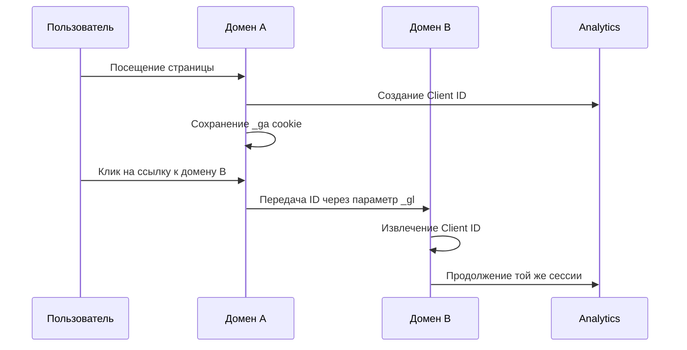
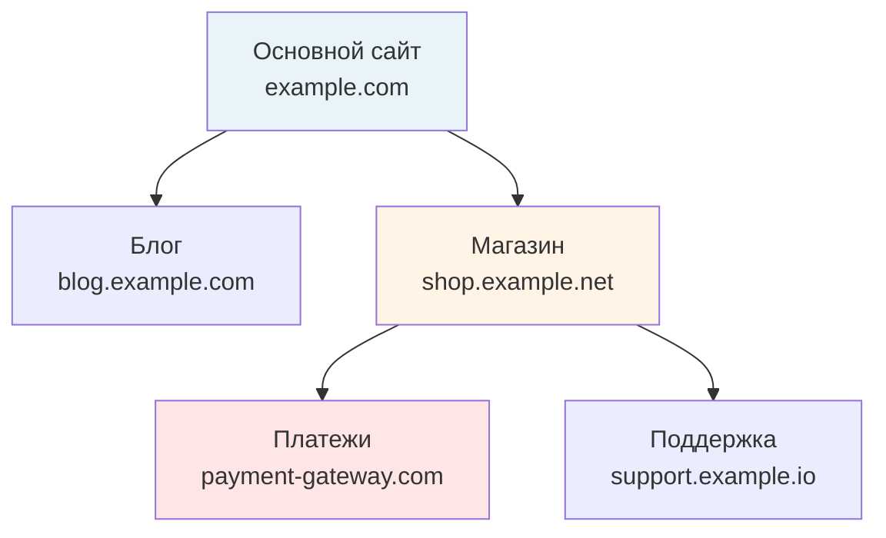
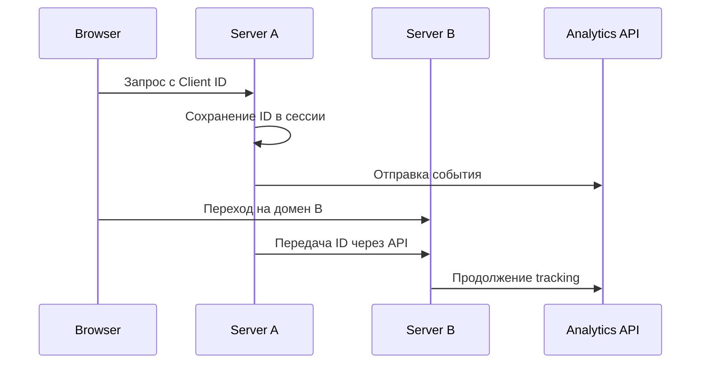
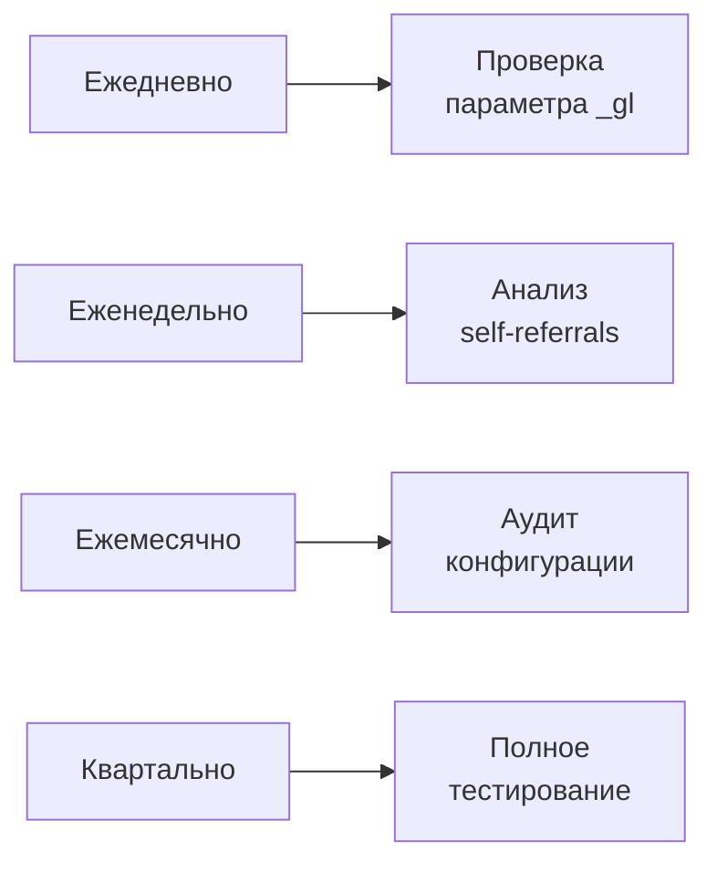

# Cross-Domain Tracking: объединение пользовательских сессий между доменами

Cross-domain tracking — технология отслеживания активности пользователей при переходе между различными доменами, которая позволяет объединить разрозненные сессии в единое представление о пути клиента. Без правильной настройки междоменного отслеживания каждый переход пользователя на новый домен регистрируется как отдельная сессия от нового посетителя, что приводит к искажению данных аналитики.

## Проблема фрагментации данных

Cookies, используемые для идентификации пользователей в веб-аналитике, привязаны к конкретному домену и не могут быть автоматически прочитаны другими доменами по соображениям безопасности. Это создает фундаментальную проблему для бизнеса с многодоменной архитектурой.

!!! example "Типичный сценарий e-commerce"
    
    Интернет-магазин на домене `example-store.com` использует сторонний платежный сервис на домене `payment-provider.com`:
    
    **Без cross-domain tracking:**

    - Пользователь из рекламной кампании: сессия #1 на основном сайте
    - Переход к оплате: сессия #2 на платежном домене
    - Результат: 2 разных пользователя, потеря атрибуции конверсии
    
    **С cross-domain tracking:**

    - Единая сессия через оба домена
    - Сохранение источника трафика
    - Правильная атрибуция транзакции к рекламной кампании

### Последствия отсутствия междоменного отслеживания

| Метрика | Искажение | Влияние на бизнес |
|---------|-----------|-------------------|
| Количество пользователей | Завышение на 40-60% | Неверная оценка размера аудитории |
| Количество сессий | Дублирование при каждом переходе | Искаженная картина вовлеченности |
| Источники трафика | Потеря первоисточника | Неправильное распределение маркетингового бюджета |
| Конверсии | Атрибуция к прямому трафику | Недооценка эффективности кампаний |
| Bounce rate | Искусственное завышение | Ложные сигналы о качестве трафика |

## Технология работы cross-domain tracking

Междоменное отслеживание работает путем передачи идентификатора пользователя через URL-параметры при переходе между доменами. Cookies сохраняют одинаковые ID при передаче от одного домена к другому через URL-параметр (_gl), когда пользователь переходит между доменами через ссылку или форму.



### Компоненты системы

=== "Linker (источник)"
    
    **Функции:**
    
    - Отслеживание кликов на междоменные ссылки
    - Генерация параметра _gl с зашифрованным Client ID
    - Автоматическое добавление параметра к URL
    - Обработка форм и перенаправлений
    
    **Особенности:**
    
    - Параметры linker истекают через две минуты, поэтому параметр добавляется только в момент клика
    - Поддержка множественных доменов
    - Работа с динамически создаваемыми ссылками

=== "Acceptor (получатель)"
    
    **Функции:**
    
    - Парсинг входящего параметра _gl
    - Валидация временной метки
    - Восстановление Client ID
    - Перезапись локального cookie
    
    **Особенности:**
    
    - Автоматическое игнорирование устаревших параметров
    - Проверка целостности данных
    - Сохранение оригинального источника трафика

## Настройка в Google Analytics 4

GA4 значительно упростил процесс настройки междоменного отслеживания по сравнению с Universal Analytics. В Google Analytics 4 конфигурация выполняется через интерфейс администратора, что устраняет путаницу с настройкой на уровне кода или в GTM.

### Пошаговая настройка

!!! info "Требования для настройки"
    
    - Права редактора в GA4 property
    - Один и тот же Measurement ID на всех доменах
    - Доступ к коду всех отслеживаемых доменов
    - Максимум 100 условий для доменов

**Процесс конфигурации:**

**Навигация в настройки потока данных**

   - Откройте Admin → Data Streams
   - Выберите веб-поток данных
   - Нажмите "Configure tag settings"

**Добавление доменов**

   - В разделе Settings выберите "Configure your domains"
   - Если используется один Google tag на разных доменах, они автоматически определяются и появляются в разделе Recommendations
   - Добавьте домены вручную через "Add condition"

**Настройка условий соответствия**

   | Тип соответствия | Пример | Что включает |
   |-------------------|--------|--------------|
   | Contains | example.com | Все поддомены и пути |
   | Exact match | shop.example.com | Только точный домен |
   | Starts with | secure. | Все домены с префиксом |
   | Ends with | .example.com | Основной и поддомены |
   | Regex | ^(shop\|pay)\.example | Сложные паттерны |

### Настройка через Google Tag Manager

Для более гибкого управления многие специалисты предпочитают использовать GTM:

```javascript
// Конфигурация Google Tag с cross-domain
gtag('config', 'G-XXXXXXXXXX', {
  'linker': {
    'domains': ['example.com', 'checkout.example.com', 'payment-provider.com']
  }
});
```

!!! tip "Преимущества GTM-подхода"
    
    - Централизованное управление для множества доменов
    - Условная логика активации
    - Версионирование изменений
    - Тестирование перед публикацией
    - Интеграция с другими тегами

## Тестирование и отладка

Правильная проверка настройки критически важна для достоверности данных. Для проверки откройте страницу с ссылкой на второй домен, кликните по ней и убедитесь, что URL содержит параметр _gl, например: https://www.example.com/?_gl=1*abcde5*.

### Методы проверки

=== "Быстрая проверка"
    
    **Шаги:**
    
    1. Откройте первый домен в режиме инкогнито
    2. Перейдите по ссылке на второй домен
    3. Проверьте наличие параметра `_gl` в URL
    4. Откройте консоль разработчика
    5. Проверьте значение cookie `_ga` на обоих доменах
    
    **Индикаторы успеха:**
    
    - ✓ Параметр _gl присутствует
    - ✓ Значения _ga cookie идентичны
    - ✓ Сессия продолжается в GA4

=== "Детальная отладка"
    
    **Инструменты:**
    
    - GA4 DebugView для real-time проверки
    - Tag Assistant для валидации тегов
    - Network tab для анализа запросов
    - Cookie inspector для проверки значений
    
    **Что проверять:**
    
    - Client ID consistency
    - Session ID preservation
    - Traffic source attribution
    - Event parameter passing

### Частые проблемы и решения

| Проблема | Причина | Решение |
|----------|---------|---------|
| Отсутствует параметр _gl | Неправильная конфигурация доменов | Проверить точное соответствие доменов в настройках |
| Параметр удаляется при переходе | Редиректы очищают query параметры | Настроить сохранение параметров в правилах редиректа |
| Разные Client ID на доменах | Cookie не перезаписывается | Проверить allowLinker настройку на принимающем домене |
| Сессия сбрасывается | Истек срок параметра (>2 минуты) | Уменьшить количество редиректов |
| Cookie-blocking расширения блокируют cookies | Пользовательские privacy настройки | Рассмотреть server-side tracking |

## Особые сценарии использования

### Поддомены

Google Analytics 4 способен отслеживать посетителей на поддоменах без дополнительной настройки. Однако существуют нюансы:

!!! warning "Когда нужна настройка для поддоменов"
    
    - Различные cookie domain настройки
    - Использование разных GTM контейнеров
    - Кастомная JavaScript реализация
    - Необходимость фильтрации определенных поддоменов

### Множественные домены

При работе с более чем двумя доменами важно учитывать:



**Стратегии оптимизации:**

- Минимизация количества междоменных переходов
- Использование единого домена для критических процессов
- Реализация fallback-механизмов для потери параметров
- Мониторинг целостности данных через custom alerts

### Интеграция с платежными системами

Платежные шлюзы представляют особую сложность:

| Сценарий | Проблема | Решение |
|----------|----------|---------|
| Redirect-based payment | Множественные перенаправления | Использование webhooks для server-side tracking |
| iFrame integration | Изолированный контекст | PostMessage API для передачи данных |
| External checkout | Полная потеря контекста | Enhanced e-commerce с transaction ID matching |
| Multi-step verification | Таймауты параметров | Session storage как backup |

## Альтернативные подходы

### Server-side tracking

Для критически важных бизнес-процессов server-side подход обеспечивает надежность:



**Преимущества:**

- Независимость от браузерных ограничений
- Контроль над всеми данными
- Возможность обогащения данных
- Устойчивость к ad-blockers

### First-party data подход

Создание собственной системы идентификации:

!!! info "Компоненты системы"
    
    **Идентификация:**

    - Генерация устойчивых ID
    - Cross-device matching
    - Probabilistic fingerprinting
    
    **Хранение:**

    - Централизованная база данных
    - Real-time синхронизация
    - Резервное копирование состояния
    
    **Применение:**

    - Injection в аналитические системы
    - Обогащение CRM данных
    - Персонализация опыта

## Влияние на метрики и отчетность

Правильная настройка cross-domain tracking кардинально меняет картину аналитики:

### До и после внедрения

| Метрика | До внедрения | После | Изменение |
|---------|--------------|--------|-----------|
| Users | 10,000 | 6,500 | -35% |
| Sessions | 15,000 | 8,000 | -47% |
| Bounce Rate | 65% | 45% | -20pp |
| Conversion Rate | 1.2% | 2.1% | +75% |
| Avg. Session Duration | 1:30 | 3:45 | +150% |
| Pages/Session | 2.3 | 5.7 | +148% |

### Корректировка исторических данных

При внедрении cross-domain tracking важно:

1. **Создать аннотацию** в GA4 с датой внедрения
2. **Сохранить baseline метрики** до изменений
3. **Пересчитать KPI** с учетом новой методологии
4. **Обновить дашборды** с пояснениями изменений
5. **Информировать stakeholders** о влиянии на отчетность

## Best practices и рекомендации

### Планирование архитектуры

!!! tip "Оптимальная структура доменов"
    
    **Минимизируйте количество доменов:**

    - Используйте поддомены вместо отдельных доменов где возможно
    - Консолидируйте функционал на основном домене
    - Избегайте unnecessary редиректов
    
    **Стандартизируйте naming conventions:**

    - Единообразные префиксы для поддоменов
    - Логичная иерархия URL структуры
    - Consistent параметры между доменами

### Документирование настроек

Создайте подробную документацию включающую:

- Список всех отслеживаемых доменов
- Матрицу переходов между доменами
- Конфигурацию каждого домена
- Процедуры тестирования
- Контакты ответственных лиц
- История изменений

### Мониторинг и maintenance

Регулярно проверяйте:



## Будущее cross-domain tracking

### Privacy-first подходы

Ужесточение privacy регулирований требует новых решений:

- **Privacy Sandbox APIs** для aggregated reporting
- **Consent-based tracking** с granular permissions
- **Federated Learning** для анализа без передачи данных
- **Differential Privacy** для защиты индивидуальных данных

### Технологические инновации

Развитие технологий открывает новые возможности:

!!! info "Emerging подходы"
    
    **Edge Computing:**

    - Обработка данных на CDN уровне
    - Минимальная latency
    - Географическая distribution
    
    **Blockchain ID:**

    - Децентрализованная идентификация
    - User-controlled данные
    - Transparent attribution
    
    **AI-driven matching:**

    - Probabilistic user matching
    - Behavioral pattern recognition
    - Predictive journey completion

## Наш подход к cross-domain tracking

Мы разрабатываем решение, которое устраняет технические ограничения традиционного междоменного отслеживания. В отличие от систем, требующих сложной настройки и постоянного maintenance, наш подход предусматривает автоматическое определение связанных доменов и интеллектуальную связку сессий.

Планируется реализация технологии, которая будет работать даже при блокировке cookies и параметров URL. Мы фокусируемся на создании устойчивой системы идентификации, использующей множественные сигналы для определения пользователя.

Наша платформа будет предоставлять визуальную карту переходов между доменами с автоматическим обнаружением проблемных точек. Это позволит быстро идентифицировать и устранять разрывы в отслеживании без необходимости глубокого технического анализа.

В отличие от решений с фиксированными ограничениями на количество доменов, мы работаем над системой, которая масштабируется с ростом вашей инфраструктуры. Каждый новый домен будет автоматически интегрироваться в единую систему отслеживания.

--8<-- "snippets/ai.ru.md"

!!! success "Готовы объединить данные со всех ваших доменов?"
    
    Зарегистрируйтесь для бесплатного тестирования нашей аналитической платформы. Получите автоматическую настройку cross-domain tracking, интеллектуальное связывание сессий и полную картину customer journey без традиционных технических сложностей.