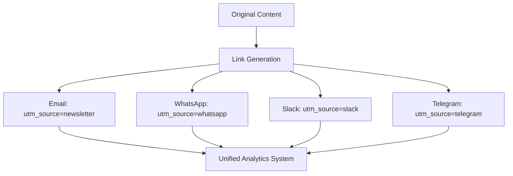
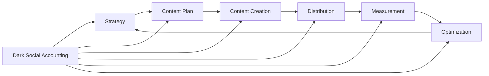

# Dark Social: Invisible Traffic and Its Impact on Web Analytics

Dark Social is traffic from private communication channels that cannot be accurately tracked by standard web analytics tools. When someone copies a link to your site and sends it via messenger, email, or SMS, the analytics system classifies such a transition as direct traffic, losing information about the true source.

## What is Dark Social

Dark Social represents all website visits that occur through private communication channels. The term was coined by Alexis Madrigal in 2012 to describe the vast layer of social traffic invisible to analytics systems.

!!! info "Main Dark Social Channels"

    **Messengers and Apps:**
    
    - WhatsApp, Telegram, Signal
    - Facebook Messenger, Instagram Direct
    - Slack, Discord, Microsoft Teams
    - iMessage, SMS
    
    **Email Clients:**
    
    - Corporate email
    - Personal email services
    - Forwarded emails with links
    
    **Other Sources:**
    
    - Private groups and communities
    - Private forums
    - Documents and presentations
    - Mobile apps without referrer

According to research, 84% of all content sharing occurs through Dark Social channels, while public sharing on Facebook accounts for only 9%, and other social networks — 7%. This means most companies see only the tip of the iceberg of social traffic.

## Why Dark Social Matters for Analysis

Dark Social creates significant distortions in understanding marketing channel effectiveness and user behavior.

### Scale of the Problem

Studies show that up to 60% of mobile organic traffic can be misclassified as direct due to technical limitations of browsers and applications. For certain industries, this figure is even higher:

| Industry | Share of Dark Social in Social Traffic |
|----------|----------------------------------------|
| Finance and Investments | 74% |
| Food and Beverage | 72% |
| Travel | 71% |
| B2B Technology | 68% |
| E-commerce | 65% |

### Impact on Attribution

Dark Social distorts the understanding of the customer journey, making correct attribution of conversions impossible. When a user sees content on social media, receives a link via messenger from a colleague, then visits the site — all the value of the original source is lost.

!!! tip "Typical User Journey Through Dark Social"

    1. User sees an interesting article on LinkedIn
    2. Copies the link and sends it to colleagues in Slack
    3. Colleague opens the link and reads the article
    4. Returns to the site directly after a few days
    5. Makes a conversion
    
    Result: conversion is attributed as direct traffic, although the source was LinkedIn + Slack

## Methods for Measuring Dark Social

While accurate measurement of Dark Social is impossible, there are approaches to estimate its volume and sources.

### Direct Traffic Analysis

The first step is segmenting direct traffic in Google Analytics or another analytics system.

=== "Creating a Segment"

    **Excluded Pages:**
    
    - Homepage (/)
    - Easily memorable pages (/blog, /contact, /about)
    - Bookmarked pages
    - Pages for returning visitors
    
    **Included Criteria:**
    
    - New users only
    - Visits to deep pages
    - Mobile traffic
    - Short sessions

=== "Data Interpretation"

    If after filtering there remains:
    
    - **Less than 25%** of traffic — situation under control
    - **25-50%** — requires attention and optimization
    - **50-75%** — serious attribution problem
    - **More than 75%** — critical problem, possible technical errors

### URL Shorteners and UTM Parameters

Using link shorteners allows tracking transitions even through private channels:

```
Original URL:
example.com/products/analytics-tool

Shortened with tracking:
bit.ly/3xY9Abc → redirect to example.com/products/analytics-tool?utm_source=dark_social&utm_medium=shortlink
```

!!! warning "Method Limitations"

    - Users may copy the final URL without parameters
    - Shortened links look suspicious to some users
    - Requires an additional step in the content publishing process

### Specialized Tools

Modern platforms offer solutions for tracking Dark Social:

| Tool | Capabilities | Features |
|------|--------------|----------|
| GetSocial | Copy & paste tracking | JavaScript tracking, virality score |
| AddThis | Share buttons with analytics | Integration with email and messengers |
| ShareThis | Tracking private shares | Support for 40+ channels |
| Po.st | Social sharing analytics | Real-time dashboard |

### Behavioral Analysis

Identifying Dark Social through behavior patterns:

!!! note "Signs of Dark Social Traffic"

    **Temporal Patterns:**
    
    - Traffic spikes after social media posts (with 2-4 hour delay)
    - Increased direct traffic during working hours (Slack, Teams)
    - Weekend peaks for entertainment content
    
    **Behavioral Signals:**
    
    - High percentage of new users (> 80%)
    - Direct transitions to deep pages
    - Geography matching target audience
    - Devices and browsers of target group

## Strategies for Working with Dark Social

### Content Optimization for Private Sharing

Creating content that users want to share in private channels:

=== "Content Formats"

    **High Sharing Probability:**
    
    - Practical guides and checklists
    - Research with unique data
    - Calculators and interactive tools
    - Infographics with useful information
    
    **Low Sharing Probability:**
    
    - General company news
    - Promotional content
    - Outdated materials
    - Content without practical value

=== "Technical Elements"

    **Required Components:**
    
    - Open Graph tags for correct preview
    - Short, clear URLs
    - Mobile optimization
    - Fast page loading
    
    **Additional Improvements:**
    
    - "Share to messenger" buttons
    - QR codes for offline materials
    - Automatic UTMs for social buttons

### Direct Surveys and Qualitative Research

Sometimes the simplest way is to ask directly:

!!! example "Information Collection Methods"

    **On-site:**
    
    - "How did you hear about us?" popup for new visitors
    - Source dropdown field in registration form
    - Post-conversion survey with detailed questions
    
    **Email Surveys:**
    
    - NPS with additional source question
    - Quarterly surveys of active users
    - Exit interviews on unsubscribe
    
    **Response Analysis:**
    
    - Grouping mentions of specific channels (Slack, Teams)
    - Identifying communities and groups
    - Determining influencers within companies

### Creating Trackable Links for Different Channels

A proactive strategy involves creating unique links for each distribution channel:



## Calculating Real ROI with Dark Social

### Dark Social Coefficient

Determining the multiplier for metrics adjustment:

!!! info "Calculation Formula"

    ```
    Dark Social Multiplier = (Visible Social + Estimated Dark Social) / Visible Social
    
    Where:
    - Visible Social = traffic with known social referrers
    - Estimated Dark Social = filtered direct traffic
    
    Example:
    - Visible Social: 1,000 visits
    - Estimated Dark Social: 2,500 visits
    - Multiplier = 3,500 / 1,000 = 3.5x
    ```

### Attribution Model Adjustment

Applying the coefficient to various metrics:

| Metric | Without Dark Social | With Dark Social | Real Value |
|--------|-------------------|------------------|------------|
| Social traffic share | 15% | 52% | 3.5x higher |
| Social media ROI | $1.20 | $4.20 | 3.5x higher |
| CAC from social | $50 | $14 | 3.5x lower |
| Social conversions | 120 | 420 | 3.5x higher |

### Multi-touch Attribution with Dark Social

Building a complete customer journey picture requires combining data:

=== "Data Sources"

    - Web analytics (Google Analytics, Matomo)
    - CRM data with surveys
    - Marketing automation platforms
    - Social listening tools
    - Server-side tracking
    - Customer surveys

=== "Weight Coefficients"

    Value distribution across touchpoints:
    
    - First touch: 30% (awareness)
    - Dark Social shares: 40% (consideration)
    - Last touch: 30% (decision)

## Privacy Regulations Impact on Dark Social

### Current Changes

Strengthening privacy policies increases Dark Social share:

!!! warning "Dark Social Growth Factors"

    **Technical Limitations:**
    
    - iOS 14.5+ Mail Privacy Protection blocks tracking pixels
    - Browsers block third-party cookies
    - Referrer policies become stricter
    - VPN and privacy-focused browsers grow
    
    **Regulatory Requirements:**
    
    - GDPR requires explicit tracking consent
    - CCPA limits data collection
    - National privacy laws tighten

### Future of Measurement

Development of Dark Social methods moves toward:

=== "Technological Solutions"

    **Server-side tracking:**
    
    - Bypassing blockers
    - Full data control
    - Privacy compliance
    
    **Machine learning:**
    
    - Source prediction by patterns
    - Similar behavior clustering
    - Automatic classification

=== "Methodological Approaches"

    **Probabilistic Models:**
    
    - Statistical modeling instead of exact tracking
    - Cohort analysis instead of individual tracking
    - Aggregate reporting for privacy compliance
    
    **Qualitative Research:**
    
    - In-depth interviews
    - Ethnographic studies
    - Social listening and sentiment analysis

## Practical Recommendations for Working with Dark Social

### Marketer's Checklist

!!! tip "Monthly Actions"

    **Data Analysis:**
    
    - [ ] Check direct traffic share in total volume
    - [ ] Segment direct traffic by Dark Social criteria
    - [ ] Compare dynamics with previous periods
    - [ ] Identify anomalous spikes after publications
    
    **Process Optimization:**
    
    - [ ] Update UTM parameters for all channels
    - [ ] Check social sharing buttons functionality
    - [ ] Add new channels to tracking system
    - [ ] Conduct A/B tests of forms with source question
    
    **Reporting:**
    
    - [ ] Adjust ROI with Dark Social multiplier
    - [ ] Update attribution model
    - [ ] Prepare insights for team

### Integration into Marketing Strategy

Dark Social should be considered at all planning stages:



### KPIs for Dark Social

Metrics for evaluating invisible traffic effectiveness:

| KPI | Formula | Target Value |
|-----|---------|--------------|
| Dark Social Share | Dark Social / Total Traffic | < 40% |
| Attribution Coverage | Tracked Traffic / Total Traffic | > 60% |
| Dark Social Conversion Rate | Dark Social Conversions / Dark Social Traffic | > Average CR |
| Share Button Usage | Button Clicks / Page Views | > 2% |
| Source Survey Response Rate | Responses / New Users | > 30% |

## Our Approach to Solving Dark Social Problem

We're developing a solution that addresses key Dark Social traffic tracking problems. Unlike traditional platform limitations where significant social traffic gets lost in the "direct" category, we focus on intelligent source classification.

Our approach provides automatic Dark Social pattern detection through behavioral signal analysis. We're working on a system that will recover lost touchpoints using machine learning to predict probable traffic sources.

We plan to implement functionality for tracking viral content distribution chains. This will allow seeing the complete path from initial publication to final conversion, even when intermediate steps occur through private channels.

Unlike standard solutions where Dark Social remains a "black box," we strive to provide a detailed picture of all social interactions. Each transition will be enriched with contextual data to understand the channel's true value, even when direct attribution is impossible.

--8<-- "snippets/ai.md"

!!! success "Ready to See the Complete Picture of Your Traffic?"

    Sign up for a free trial of our analytics platform and discover the real sources of your traffic hidden in Dark Social. Get access to advanced classification and attribution tools that will help make decisions based on complete data.