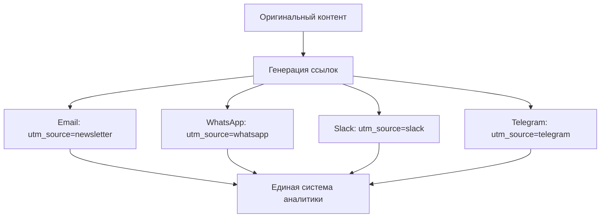
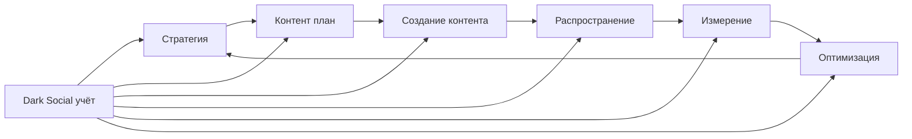

# Dark Social: Невидимый трафик и его влияние на веб-аналитику

Dark Social — это трафик из частных каналов коммуникации, который невозможно точно отследить стандартными инструментами веб-аналитики. Когда кто-то копирует ссылку на ваш сайт и отправляет её через мессенджер, электронную почту или SMS, система аналитики классифицирует такой переход как прямой трафик, теряя информацию об истинном источнике.

## Что такое Dark Social

Dark Social представляет собой все переходы на сайт, которые происходят через приватные каналы коммуникации. Термин был введен Алексисом Мадригалом в 2012 году для описания огромного пласта социального трафика, невидимого для аналитических систем.

!!! info "Основные каналы Dark Social"

    **Мессенджеры и приложения:**
    
    - WhatsApp, Telegram, Signal
    - Facebook Messenger, Instagram Direct
    - Slack, Discord, Microsoft Teams
    - iMessage, SMS
    
    **Email-клиенты:**
    
    - Корпоративная почта
    - Персональные почтовые сервисы
    - Пересылка писем с ссылками
    
    **Другие источники:**
    
    - Закрытые группы и сообщества
    - Приватные форумы
    - Документы и презентации
    - Мобильные приложения без referrer

Согласно исследованиям, 84% всех расшариваний контента происходит через Dark Social каналы, в то время как публичные расшаривания в Facebook составляют лишь 9%, а в других социальных сетях — 7%. Это означает, что большинство компаний видят только верхушку айсберга социального трафика.

## Почему Dark Social важен для анализа

Dark Social создаёт существенные искажения в понимании эффективности маркетинговых каналов и поведения пользователей.

### Масштаб проблемы

Исследования показывают, что до 60% мобильного органического трафика может быть неправильно классифицировано как прямой из-за технических ограничений браузеров и приложений. Для определённых индустрий этот показатель ещё выше:

| Индустрия | Доля Dark Social в социальном трафике |
|-----------|---------------------------------------|
| Финансы и инвестиции | 74% |
| Продукты питания | 72% |
| Путешествия | 71% |
| B2B технологии | 68% |
| E-commerce | 65% |

### Влияние на атрибуцию

Dark Social искажает понимание customer journey, делая невозможной корректную атрибуцию конверсий. Когда пользователь видит контент в социальной сети, получает ссылку через мессенджер от коллеги, а затем переходит на сайт — вся ценность первоначального источника теряется.

!!! tip "Типичный путь пользователя через Dark Social"

    1. Пользователь видит интересную статью в LinkedIn
    2. Копирует ссылку и отправляет коллегам в Slack
    3. Коллега открывает ссылку и читает статью
    4. Через несколько дней возвращается на сайт напрямую
    5. Совершает конверсию
    
    Результат: конверсия атрибутируется как прямой трафик, хотя источником был LinkedIn + Slack

## Методы измерения Dark Social

Хотя точное измерение Dark Social невозможно, существуют подходы для оценки его объёма и источников.

### Анализ прямого трафика

Первый шаг — сегментация прямого трафика в Google Analytics или другой системе аналитики.

=== "Создание сегмента"

    **Исключаемые страницы:**
    
    - Главная страница (/)
    - Страницы, легко запоминаемые (/blog, /contact, /about)
    - Страницы из закладок
    - Страницы для возвращающихся пользователей
    
    **Включаемые критерии:**
    
    - Только новые пользователи
    - Переходы на глубокие страницы
    - Мобильный трафик
    - Короткие сессии

=== "Интерпретация данных"

    Если после фильтрации остаётся:
    
    - **Менее 25%** трафика — ситуация под контролем
    - **25-50%** — требуется внимание и оптимизация
    - **50-75%** — серьёзная проблема с атрибуцией
    - **Более 75%** — критическая проблема, возможны технические ошибки

### URL-сокращатели и UTM-параметры

Использование сокращателей ссылок позволяет отслеживать переходы даже через приватные каналы:

```
Исходный URL:
example.com/products/analytics-tool

Сокращённый с трекингом:
bit.ly/3xY9Abc → редирект на example.com/products/analytics-tool?utm_source=dark_social&utm_medium=shortlink
```

!!! warning "Ограничения метода"

    - Пользователи могут копировать финальный URL без параметров
    - Сокращённые ссылки выглядят подозрительно для некоторых пользователей
    - Требуется дополнительный шаг в процессе публикации контента

### Специализированные инструменты

Современные платформы предлагают решения для отслеживания Dark Social:

| Инструмент | Возможности | Особенности |
|------------|-------------|-------------|
| GetSocial | Отслеживание copy & paste | JavaScript tracking, virality score |
| AddThis | Кнопки шаринга с аналитикой | Интеграция с email и мессенджерами |
| ShareThis | Tracking private shares | Поддержка 40+ каналов |
| Po.st | Social sharing analytics | Real-time dashboard |

### Поведенческий анализ

Идентификация Dark Social через паттерны поведения:

!!! note "Признаки Dark Social трафика"

    **Временные паттерны:**
    
    - Всплески трафика после публикации в соцсетях (с задержкой 2-4 часа)
    - Увеличение прямого трафика в рабочие часы (Slack, Teams)
    - Пики в выходные для развлекательного контента
    
    **Поведенческие сигналы:**
    
    - Высокий процент новых пользователей (> 80%)
    - Переходы сразу на глубокие страницы
    - География, соответствующая целевой аудитории
    - Устройства и браузеры целевой группы

## Стратегии работы с Dark Social

### Оптимизация контента для приватного шаринга

Создание контента, который пользователи захотят поделиться в приватных каналах:

=== "Форматы контента"

    **Высокая вероятность шаринга:**
    
    - Практические руководства и чек-листы
    - Исследования с уникальными данными
    - Калькуляторы и интерактивные инструменты
    - Инфографика с полезной информацией
    
    **Низкая вероятность шаринга:**
    
    - Общие новости компании
    - Рекламный контент
    - Устаревшие материалы
    - Контент без практической ценности

=== "Технические элементы"

    **Обязательные компоненты:**
    
    - Open Graph теги для корректного превью
    - Короткие, понятные URL
    - Мобильная оптимизация
    - Быстрая загрузка страниц
    
    **Дополнительные улучшения:**
    
    - Кнопки "Поделиться в мессенджере"
    - QR-коды для офлайн-материалов
    - Автоматические UTM для социальных кнопок

### Прямые опросы и качественные исследования

Иногда самый простой способ — спросить напрямую:

!!! example "Методы сбора информации"

    **На сайте:**
    
    - Поп-ап "Как вы узнали о нас?" для новых посетителей
    - Поле в форме регистрации с выпадающим списком источников
    - Post-conversion survey с детальными вопросами
    
    **Email-опросы:**
    
    - NPS с дополнительным вопросом об источнике
    - Квартальные опросы активных пользователей
    - Exit-интервью при отписке
    
    **Анализ ответов:**
    
    - Группировка упоминаний конкретных каналов (Slack, Teams)
    - Выявление сообществ и групп
    - Определение influencers внутри компаний

### Создание trackable ссылок для разных каналов

Проактивная стратегия предполагает создание уникальных ссылок для каждого канала распространения:



## Расчёт реального ROI с учётом Dark Social

### Коэффициент Dark Social

Определение множителя для корректировки метрик:

!!! info "Формула расчёта"

    ```
    Dark Social Multiplier = (Visible Social + Estimated Dark Social) / Visible Social
    
    Где:
    - Visible Social = трафик с известными социальными referrers
    - Estimated Dark Social = отфильтрованный прямой трафик
    
    Пример:
    - Visible Social: 1,000 визитов
    - Estimated Dark Social: 2,500 визитов
    - Multiplier = 3,500 / 1,000 = 3.5x
    ```

### Корректировка attribution модели

Применение коэффициента к различным метрикам:

| Метрика | Без учёта Dark Social | С учётом Dark Social | Реальное значение |
|---------|----------------------|---------------------|-------------------|
| Social traffic share | 15% | 52% | 3.5x выше |
| Social media ROI | $1.20 | $4.20 | 3.5x выше |
| CAC from social | $50 | $14 | 3.5x ниже |
| Social conversions | 120 | 420 | 3.5x выше |

### Multi-touch attribution с учётом Dark Social

Построение полной картины customer journey требует комбинации данных:

=== "Источники данных"

    - Web analytics (Google Analytics, Matomo)
    - CRM данные с опросами
    - Marketing automation platforms
    - Social listening tools
    - Server-side tracking
    - Customer surveys

=== "Весовые коэффициенты"

    Распределение ценности по touchpoints:
    
    - First touch: 30% (awareness)
    - Dark Social shares: 40% (consideration)
    - Last touch: 30% (decision)

## Влияние privacy-регуляций на Dark Social

### Текущие изменения

Усиление privacy-политик увеличивает долю Dark Social:

!!! warning "Факторы роста Dark Social"

    **Технические ограничения:**
    
    - iOS 14.5+ Mail Privacy Protection блокирует tracking pixels
    - Браузеры блокируют third-party cookies
    - Referrer policies становятся строже
    - VPN и privacy-focused браузеры растут
    
    **Регуляторные требования:**
    
    - GDPR требует явного согласия на tracking
    - CCPA ограничивает сбор данных
    - Национальные законы о privacy ужесточаются

### Будущее измерений

Развитие методов работы с Dark Social движется в сторону:

=== "Технологические решения"

    **Server-side tracking:**
    
    - Обход блокировщиков
    - Полный контроль над данными
    - Соответствие privacy-требованиям
    
    **Machine learning:**
    
    - Предсказание источников по паттернам
    - Кластеризация похожего поведения
    - Автоматическая классификация

=== "Методологические подходы"

    **Вероятностные модели:**
    
    - Statistical modeling вместо точного tracking
    - Cohort analysis вместо individual tracking
    - Aggregate reporting для privacy compliance
    
    **Качественные исследования:**
    
    - Углублённые интервью
    - Этнографические исследования
    - Social listening и sentiment analysis

## Практические рекомендации по работе с Dark Social

### Чек-лист для маркетологов

!!! tip "Ежемесячные действия"

    **Анализ данных:**
    
    - [ ] Проверить долю прямого трафика в общем объёме
    - [ ] Сегментировать прямой трафик по критериям Dark Social
    - [ ] Сравнить динамику с предыдущими периодами
    - [ ] Выявить аномальные всплески после публикаций
    
    **Оптимизация процессов:**
    
    - [ ] Обновить UTM-параметры для всех каналов
    - [ ] Проверить работу кнопок социального шаринга
    - [ ] Добавить новые каналы в tracking систему
    - [ ] Провести A/B тесты форм с вопросом об источнике
    
    **Отчётность:**
    
    - [ ] Скорректировать ROI с учётом Dark Social multiplier
    - [ ] Обновить attribution модель
    - [ ] Подготовить insights для команды

### Интеграция в маркетинговую стратегию

Dark Social должен учитываться на всех этапах планирования:



### KPI для Dark Social

Метрики для оценки эффективности работы с невидимым трафиком:

| KPI | Формула | Целевое значение |
|-----|---------|-----------------|
| Dark Social Share | Dark Social / Total Traffic | < 40% |
| Attribution Coverage | Tracked Traffic / Total Traffic | > 60% |
| Dark Social Conversion Rate | Dark Social Conversions / Dark Social Traffic | > Average CR |
| Share Button Usage | Button Clicks / Page Views | > 2% |
| Source Survey Response Rate | Responses / New Users | > 30% |

## Наш подход к решению проблемы Dark Social

Мы разрабатываем решение, которое адресует ключевые проблемы отслеживания Dark Social трафика. В отличие от ограничений традиционных платформ, где значительная часть социального трафика теряется в категории "прямой", мы фокусируемся на интеллектуальной классификации источников.

Наш подход предусматривает автоматическое определение паттернов Dark Social через анализ поведенческих сигналов. Мы работаем над системой, которая будет восстанавливать потерянные точки касания, используя machine learning для предсказания вероятных источников трафика.

Планируется реализация функциональности для отслеживания виральных цепочек распространения контента. Это позволит видеть полный путь от первоначальной публикации до финальной конверсии, даже когда промежуточные шаги происходят через приватные каналы.

В отличие от стандартных решений, где Dark Social остаётся "чёрным ящиком", мы стремимся предоставить детализированную картину всех социальных взаимодействий. Каждый переход будет обогащён контекстными данными для понимания истинной ценности канала, даже когда прямая атрибуция невозможна.

--8<-- "snippets/ai.ru.md"

!!! success "Готовы увидеть полную картину вашего трафика?"

    Зарегистрируйтесь для бесплатного тестирования нашей платформы аналитики и откройте реальные источники вашего трафика, скрытые в Dark Social. Получите доступ к продвинутым инструментам классификации и attribution, которые помогут принимать решения на основе полных данных.