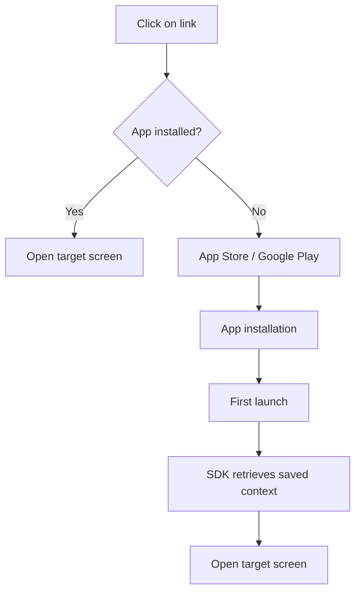

# Deep Link and Deferred Deep Link: Mobile App Navigation and Attribution

Deep linking has evolved from a simple navigation mechanism into a critical tool for mobile marketing and user experience. The technology allows directing users not just to an app, but to a specific screen with the desired content, creating a seamless transition between web and mobile environments.

## Deep Link Mechanics

A deep link is a URI scheme that allows opening a specific screen or performing an action within a mobile application, bypassing the home screen. Unlike regular links that open web pages, deep links activate installed applications and pass them transition context.

### Types of Deep Links

The mobile linking ecosystem includes several technology levels with different capabilities:

!!! info "Evolution of Linking Technologies"

    **Traditional Deep Links (Custom URL Schemes)**

    - Work only if the app is installed
    - Simple implementation via URI scheme
    - Don't support fallback to web
    - Example: `myapp://product/123`

    **Universal Links (iOS) / App Links (Android)**

    - Use regular HTTP(S) URLs
    - Automatic fallback to web version
    - Require domain verification
    - Example: `https://example.com/product/123`

    **Deferred Deep Links**

    - Work even if app is not installed
    - Preserve context through installation
    - Require attribution SDK
    - Navigate to target location after first launch

### Technical Implementation

Setting up deep linking requires configuration on both the app side and web infrastructure side.

=== "iOS Implementation"

    **Configuration:**

    - Register URL scheme in Info.plist
    - Configure Associated Domains
    - Host apple-app-site-association file
    - Handle incoming links in AppDelegate

    **Domain Validation:**
    ```json
    {
      "applinks": {
        "apps": [],
        "details": [{
          "appID": "TEAMID.bundleID",
          "paths": ["/products/*", "/categories/*"]
        }]
      }
    }
    ```

=== "Android Implementation"

    **Configuration:**

    - Declare intent-filter in AndroidManifest.xml
    - Configure App Links with auto-verification
    - Host assetlinks.json file
    - Handle intents in Activity

    **Digital Asset Links:**
    ```json
    [{
      "relation": ["delegate_permission/common.handle_all_urls"],
      "target": {
        "namespace": "android_app",
        "package_name": "com.example.app",
        "sha256_cert_fingerprints": ["..."]
      }
    }]
    ```

## Deferred Deep Linking: Solving the Uninstalled App Problem

The main problem with traditional deep links is they don't work if the app isn't installed. Users land in the app store and lose the original context. Deferred deep linking solves this problem by preserving user intent through the installation process.

### How Deferred Deep Link Works



The attribution matching process includes several stages:

**Saving context before redirect**

   - Capture device fingerprint
   - Save campaign parameters
   - Record timestamp and referrer

**Matching after installation**

   - Match device fingerprint
   - Check attribution window
   - Validate installation source

**Context restoration**

   - Extract saved parameters
   - Pass deep link data to app
   - Navigate to target content

### Key Use Cases

!!! example "E-commerce: From Ad to Purchase"

    **Scenario:**

    1. User sees product ad on Instagram
    2. Clicks link but app is not installed
    3. Goes to App Store and installs the app
    4. On first launch automatically lands on product page from ad
    
    **Result:** Purchase conversion increases 2-3x compared to regular installation

!!! example "Content Platforms: Sharing and Engagement"

    **Scenario:**

    1. User receives article link in messenger
    2. App not installed, web version opens
    3. Web version offers "Read in App"
    4. After installation article opens automatically
    
    **Result:** New user retention rate 40-60% higher

## Attribution and Performance Measurement

Deep linking plays a critical role in mobile attribution, allowing tracking of the complete user journey from traffic source to in-app conversion.

### Attribution Parameters in Deep Links

Deep link structure with attribution parameters:

```
https://example.com/product/123?
  utm_source=facebook
  &utm_medium=paid_social
  &utm_campaign=summer_sale
  &utm_content=carousel_ad
  &deep_link_sub1=audience_lookalike
  &deep_link_sub2=placement_feed
```

**Standard Tracking Parameters:**

| Parameter | Purpose | Example Values |
|-----------|---------|----------------|
| utm_source | Traffic source | facebook, google, email |
| utm_medium | Channel type | cpc, organic, referral |
| utm_campaign | Campaign identifier | summer_sale_2025 |
| utm_content | Creative variant | video_15s, banner_320x50 |
| utm_term | Keyword | For search campaigns |

### Deep Linking Performance Metrics

**Conversion Metrics:**

- **Click-to-Install Rate**: percentage of installs after deep link click
- **Deferred Deep Link Conversion**: conversion of users who went through deferred linking
- **Deep Link Attribution Rate**: percentage of correctly attributed installs

**Engagement Metrics:**

- **Deep Link Session Duration**: duration of sessions started from deep link
- **Retention by Deep Link Source**: retention by deep link traffic sources
- **Deep Link Re-engagement Rate**: return percentage through deep links

### Attribution Windows

Proper attribution window setup is critical for accurate measurement:

!!! warning "Standard Attribution Windows"

    **Click-to-Install Window:**

    - iOS: 1-7 days (24 hours recommended)
    - Android: 1-30 days (7 days recommended)

    **View-Through Window:**

    - Usually 1-24 hours for video
    - Not applicable for direct deep links

    **Re-engagement Window:**

    - 7-30 days for re-engagement
    - Depends on app usage frequency

## Problems and Limitations

### iOS Privacy and App Tracking Transparency

With the introduction of ATT in iOS 14.5, attribution capabilities are significantly limited:

- **IDFA Loss**: unable to use advertising identifier without user consent
- **Probabilistic matching limited**: Apple prohibits fingerprinting
- **SKAdNetwork**: limited attribution with 24-48 hour delay

### Android Privacy Sandbox

Google is gradually introducing limitations similar to iOS:

- **GAID access restriction**: explicit permission required
- **Privacy Sandbox for Android**: new APIs for attribution
- **Fingerprinting restrictions**: ban on collecting persistent identifiers

### Technical Challenges

**Platform fragmentation:**

- Implementation differences between iOS and Android
- Incompatibility between OS versions
- Different browser and app behavior

**Routing problems:**

- Conflicts with website web version
- Edge case handling complexity
- Need for fallback scenarios

## Attribution Tools and Platforms

Implementing full deferred deep linking requires specialized platforms:

| Platform | Features | Cost |
|----------|----------|------|
| Branch | Market leader, rich functionality | From $0 (basic) |
| AppsFlyer | Focus on attribution and antifraud | From $0.05 per install |
| Adjust | Simple integration, reliability | Custom pricing |
| Kochava | Advanced analytics | From $500/month |
| Firebase Dynamic Links | Free but limited | Free |

### Platform Selection Criteria

**Technical requirements:**

- Support for needed platforms and OS versions
- SDK and documentation quality
- Redirect speed and reliability
- Customization capabilities

**Analytics capabilities:**

- Attribution and reporting depth
- Real-time data vs batching
- Analytics system integrations
- Cohort analysis capabilities

## Implementation Best Practices

### User Experience Optimization

**Contextual hints:**

Use smart app banners and custom prompts to explain app installation value.

**Progressive navigation:**

Don't force app installation. Let users first see content value in web.

**Onboarding personalization:**

Adapt first launch to the context from which the user came.

### Technical Optimization

!!! tip "Configuration Recommendations"

    **Always use Universal Links / App Links**

       - Best UX on transition
       - Search engine support
       - Automatic fallback

    **Implement correct fallback scenarios**

       - Web version for unsupported devices
       - Installation error handling
       - Alternative conversion paths

    **Minimize redirects**

       - Each redirect = potential user loss
       - Use direct links where possible
       - Cache routing data

    **Test all scenarios**

       - Different browsers and OS versions
       - App installed / not installed
       - Various traffic sources

### Monitoring and Optimization

**Key metrics to track:**

- **Technical Success Rate**: percentage of successful deep link transitions
- **Attribution Match Rate**: install matching accuracy
- **Time to Content**: time from click to target content display
- **Fallback Conversion Rate**: user conversion through fallback scenarios

**A/B testing:**

- Different link and parameter formats
- Onboarding variants after deferred linking
- Re-engagement strategies through deep links
- Attribution windows and matching logic

## Our Approach to Mobile Attribution

We're developing a mobile analytics solution that addresses key problems of existing platforms. Unlike traditional SDKs with heavy libraries, our approach focuses on lightweight integration and privacy-first architecture.

We plan to implement an intelligent attribution system that will work even under iOS ATT and Android Privacy Sandbox restrictions. We're working on technology that will allow reconstructing the customer journey without violating platform privacy policies.

Our solution provides a unified platform for managing all types of deep links with a visual route builder and automatic technical configuration generation. This will allow marketers to independently create and test deep link campaigns without involving developers.

Unlike platforms with closed attribution algorithms, we focus on transparency and control. Each attribution decision will be accompanied by logic explanation and customization options for business specifics.

--8<-- "snippets/ai.md"

!!! success "Ready to improve mobile attribution?"

    Sign up for a free trial of our analytics platform. Get full control over deep linking, accurate install attribution, and tools for optimizing mobile campaigns without traditional system limitations.