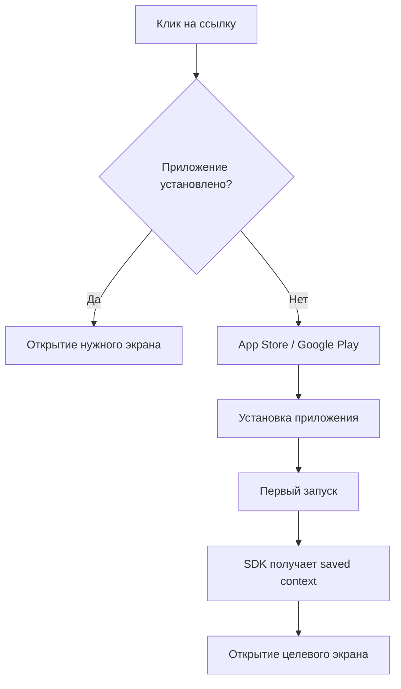

# Deep Link и Deferred Deep Link: навигация в мобильных приложениях и атрибуция

Deep linking превратился из простого механизма навигации в критически важный инструмент мобильного маркетинга и пользовательского опыта. Технология позволяет направлять пользователей не просто в приложение, а на конкретный экран с нужным контентом, создавая бесшовный переход между веб и мобильной средой.

## Механика работы Deep Link

Deep link — это URI-схема, которая позволяет открыть конкретный экран или выполнить действие внутри мобильного приложения, минуя главный экран. В отличие от обычных ссылок, которые открывают веб-страницы, deep links активируют установленные приложения и передают им контекст перехода.

### Типы Deep Link

Экосистема мобильных ссылок включает несколько уровней технологий с разными возможностями:

!!! info "Эволюция технологий linking"

    **Traditional Deep Links (Custom URL Schemes)**

    - Работают только если приложение установлено
    - Простая реализация через URI схему
    - Не поддерживают fallback на веб
    - Пример: `myapp://product/123`

    **Universal Links (iOS) / App Links (Android)**

    - Используют обычные HTTP(S) URL
    - Автоматический fallback на веб-версию
    - Требуют верификацию домена
    - Пример: `https://example.com/product/123`

    **Deferred Deep Links**

    - Работают даже если приложение не установлено
    - Сохраняют контекст через установку
    - Требуют SDK атрибуции
    - Направляют в нужное место после первого запуска

### Техническая реализация

Настройка deep linking требует конфигурации как на стороне приложения, так и на стороне веб-инфраструктуры.

=== "iOS Implementation"

    **Конфигурация:**

    - Регистрация URL схемы в Info.plist
    - Настройка Associated Domains
    - Размещение apple-app-site-association файла
    - Обработка входящих ссылок в AppDelegate

    **Валидация домена:**
    ```json
    {
      "applinks": {
        "apps": [],
        "details": [{
          "appID": "TEAMID.bundleID",
          "paths": ["/products/*", "/categories/*"]
        }]
      }
    }
    ```

=== "Android Implementation"

    **Конфигурация:**

    - Объявление intent-filter в AndroidManifest.xml
    - Настройка App Links с автоверификацией
    - Размещение assetlinks.json файла
    - Обработка интентов в Activity

    **Digital Asset Links:**
    ```json
    [{
      "relation": ["delegate_permission/common.handle_all_urls"],
      "target": {
        "namespace": "android_app",
        "package_name": "com.example.app",
        "sha256_cert_fingerprints": ["..."]
      }
    }]
    ```

## Deferred Deep Linking: решение проблемы неустановленных приложений

Основная проблема traditional deep links — они не работают, если приложение не установлено. Пользователь попадает в магазин приложений и теряет исходный контекст. Deferred deep linking решает эту проблему, сохраняя намерение пользователя через процесс установки.

### Как работает Deferred Deep Link



Процесс attribution matching включает несколько этапов:

**Сохранение контекста перед редиректом**

   - Фиксация device fingerprint
   - Сохранение параметров кампании
   - Запись timestamp и referrer

**Matching после установки**

   - Сопоставление device fingerprint
   - Проверка временного окна (attribution window)
   - Валидация источника установки

**Восстановление контекста**

   - Извлечение сохранённых параметров
   - Передача deep link data в приложение
   - Навигация к целевому контенту

### Ключевые сценарии использования

!!! example "E-commerce: От рекламы к покупке"

    **Сценарий:**

    1. Пользователь видит рекламу товара в Instagram
    2. Кликает на ссылку, но приложение не установлено
    3. Переходит в App Store и устанавливает приложение
    4. При первом запуске автоматически попадает на карточку товара из рекламы
    
    **Результат:** Конверсия в покупку увеличивается на 2-3x по сравнению с обычной установкой

!!! example "Контент-платформы: Шеринг и вовлечение"

    **Сценарий:**

    1. Пользователь получает ссылку на статью в мессенджере
    2. Приложение не установлено, открывается веб-версия
    3. Веб-версия предлагает "Читать в приложении"
    4. После установки статья открывается автоматически
    
    **Результат:** Retention rate новых пользователей выше на 40-60%

## Атрибуция и измерение эффективности

Deep linking играет критическую роль в мобильной атрибуции, позволяя отслеживать полный путь пользователя от источника трафика до конверсии в приложении.

### Параметры атрибуции в deep links

Структура deep link с параметрами атрибуции:

```
https://example.com/product/123?
  utm_source=facebook
  &utm_medium=paid_social
  &utm_campaign=summer_sale
  &utm_content=carousel_ad
  &deep_link_sub1=audience_lookalike
  &deep_link_sub2=placement_feed
```

**Стандартные параметры отслеживания:**

| Параметр | Назначение | Пример значений |
|----------|------------|-----------------|
| utm_source | Источник трафика | facebook, google, email |
| utm_medium | Тип канала | cpc, organic, referral |
| utm_campaign | Идентификатор кампании | summer_sale_2025 |
| utm_content | Вариант креатива | video_15s, banner_320x50 |
| utm_term | Ключевое слово | Для поисковых кампаний |

### Метрики эффективности deep linking

**Конверсионные метрики:**

- **Click-to-Install Rate**: процент установок после клика на deep link
- **Deferred Deep Link Conversion**: конверсия пользователей, прошедших через deferred linking
- **Deep Link Attribution Rate**: процент корректно атрибутированных установок

**Метрики вовлечённости:**

- **Deep Link Session Duration**: длительность сессий, начатых с deep link
- **Retention by Deep Link Source**: удержание по источникам deep link трафика
- **Deep Link Re-engagement Rate**: процент возвращений через deep links

### Окна атрибуции

Правильная настройка attribution windows критична для точного измерения:

!!! warning "Стандартные окна атрибуции"

    **Click-to-Install Window:**

    - iOS: 1-7 дней (рекомендовано 24 часа)
    - Android: 1-30 дней (рекомендовано 7 дней)

    **View-Through Window:**

    - Обычно 1-24 часа для видео
    - Не применяется для direct deep links

    **Re-engagement Window:**

    - 7-30 дней для повторного вовлечения
    - Зависит от частоты использования приложения

## Проблемы и ограничения

### iOS Privacy и App Tracking Transparency

С введением ATT в iOS 14.5 возможности атрибуции значительно ограничены:

- **Потеря IDFA**: без согласия пользователя невозможно использовать рекламный идентификатор
- **Probabilistic matching ограничен**: Apple запрещает fingerprinting
- **SKAdNetwork**: ограниченная атрибуция с задержкой 24-48 часов

### Android Privacy Sandbox

Google постепенно вводит ограничения, аналогичные iOS:

- **Ограничение доступа к GAID**: требуется явное разрешение
- **Privacy Sandbox for Android**: новые API для атрибуции
- **Ограничения fingerprinting**: запрет на сбор устойчивых идентификаторов

### Технические сложности

**Фрагментация платформ:**

- Различия в реализации между iOS и Android
- Несовместимость между версиями ОС
- Разное поведение браузеров и приложений

**Проблемы маршрутизации:**

- Конфликты с веб-версией сайта
- Сложность обработки edge cases
- Необходимость fallback сценариев

## Инструменты и платформы атрибуции

Реализация полноценного deferred deep linking требует использования специализированных платформ:

| Платформа | Особенности | Стоимость |
|-----------|-------------|-----------|
| Branch | Лидер рынка, богатая функциональность | От $0 (базовый) |
| AppsFlyer | Фокус на атрибуции и антифроде | От $0.05 за установку |
| Adjust | Простота интеграции, надёжность | Custom pricing |
| Kochava | Расширенная аналитика | От $500/месяц |
| Firebase Dynamic Links | Бесплатно, но ограничено | Бесплатно |

### Критерии выбора платформы

**Технические требования:**

- Поддержка нужных платформ и версий ОС
- Качество SDK и документации
- Скорость и надёжность редиректов
- Возможности кастомизации

**Аналитические возможности:**

- Глубина атрибуции и отчётности
- Real-time данные vs батчинг
- Интеграции с системами аналитики
- Возможности когортного анализа

## Лучшие практики реализации

### Оптимизация пользовательского опыта

**Контекстуальные подсказки:**

Используйте smart app banners и кастомные промпты для объяснения ценности установки приложения.

**Прогрессивная навигация:**

Не форсируйте установку приложения. Позвольте пользователю сначала увидеть ценность контента в вебе.

**Персонализация onboarding:**

Адаптируйте первый запуск под контекст, из которого пришёл пользователь.

### Техническая оптимизация

!!! tip "Рекомендации по настройке"

    **Всегда используйте Universal Links / App Links**

       - Лучший UX при переходе
       - Поддержка поисковиками
       - Автоматический fallback

    **Реализуйте корректные fallback сценарии**

       - Веб-версия для неподдерживаемых устройств
       - Обработка ошибок установки
       - Альтернативные пути конверсии

    **Минимизируйте редиректы**

       - Каждый редирект = потенциальная потеря пользователя
       - Используйте прямые ссылки где возможно
       - Кешируйте данные маршрутизации

    **Тестируйте все сценарии**

       - Различные браузеры и версии ОС
       - Приложение установлено / не установлено
       - Различные источники трафика

### Мониторинг и оптимизация

**Ключевые метрики для отслеживания:**

- **Technical Success Rate**: процент успешных deep link переходов
- **Attribution Match Rate**: точность сопоставления установок
- **Time to Content**: время от клика до показа целевого контента
- **Fallback Conversion Rate**: конверсия пользователей через запасные сценарии

**A/B тестирование:**

- Различные форматы ссылок и параметров
- Варианты onboarding после deferred linking
- Стратегии re-engagement через deep links
- Окна атрибуции и логика matching

## Наш подход к мобильной атрибуции

Мы разрабатываем решение для мобильной аналитики, которое решает ключевые проблемы существующих платформ. В отличие от традиционных SDK с тяжёлыми библиотеками, наш подход фокусируется на лёгкой интеграции и privacy-first архитектуре.

Планируется реализация интеллектуальной системы атрибуции, которая будет работать даже в условиях ограничений iOS ATT и Android Privacy Sandbox. Мы работаем над технологией, которая позволит восстанавливать customer journey без нарушения privacy-политик платформ.

Наше решение предусматривает унифицированную платформу для управления всеми типами deep links с визуальным конструктором маршрутов и автоматической генерацией технической конфигурации. Это позволит маркетологам самостоятельно создавать и тестировать deep link кампании без привлечения разработчиков.

В отличие от платформ с закрытыми алгоритмами атрибуции, мы фокусируемся на прозрачности и контроле. Каждое решение по атрибуции будет сопровождаться объяснением логики и возможностью кастомизации под специфику бизнеса.

--8<-- "snippets/ai.ru.md"

!!! success "Готовы улучшить мобильную атрибуцию?"

    Зарегистрируйтесь для бесплатного тестирования нашей платформы аналитики. Получите полный контроль над deep linking, точную атрибуцию установок и инструменты для оптимизации мобильных кампаний без ограничений традиционных систем.