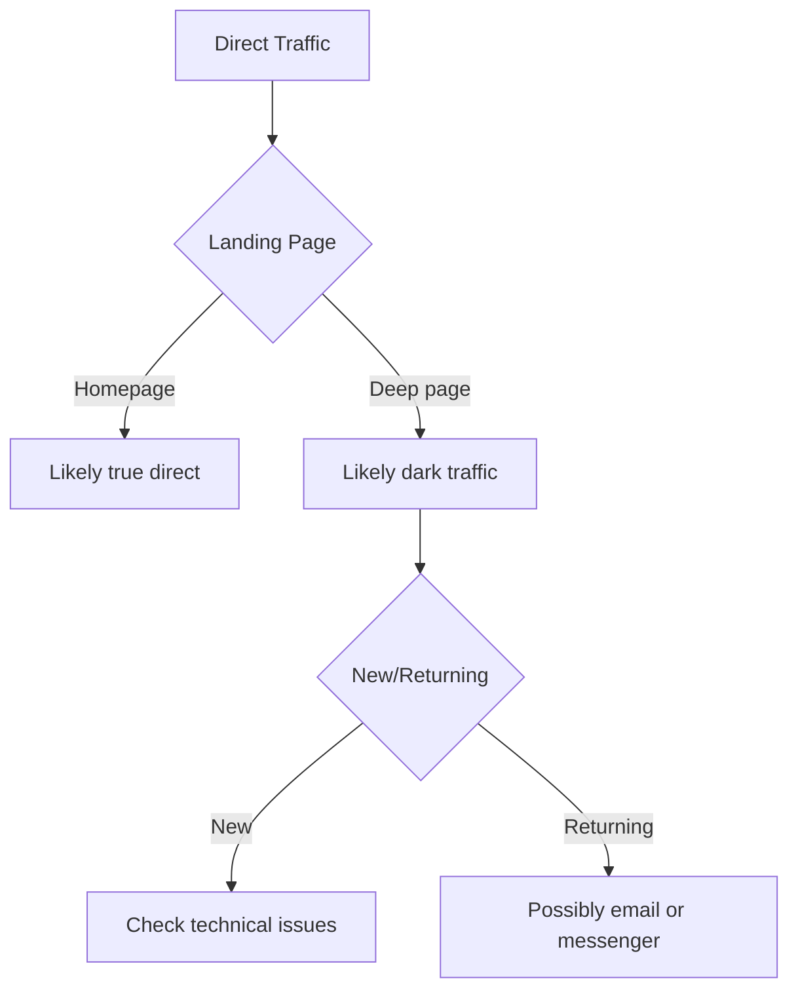

# Direct Traffic: Unattributed Traffic Sources and Data Cleansing Methods

Direct traffic represents one of the most enigmatic categories in web analytics. This metric includes all site visits where the analytics system cannot determine a specific referral source. While traditionally thought to consist of users typing URLs directly into their browser's address bar, the reality is significantly more complex — this category often becomes a catch-all "basket" for all unattributed traffic.

## What is Direct Traffic

Direct traffic in Google Analytics 4 and other analytics systems refers to site visits where the traffic source is unknown or not properly tracked. The system classifies a session as direct/none when it cannot detect information about where the user came from — here "direct" indicates the nature of the traffic, while "none" signifies the absence of a detectable source or channel.

!!! info "Source Determination Mechanism"

    Google Analytics uses the following hierarchy to determine traffic sources:
    
    1. UTM parameters in URL (utm_source, utm_medium, utm_campaign)
    2. Referrer — the previous page's URL
    3. gclid parameters and other advertising campaign identifiers
    4. If none of the above returns meaningful data, traffic is attributed as (direct)

Direct traffic can be viewed as the "black box" of web analytics. Unlike other traffic sources where visitor origin can be precisely determined, direct traffic conceals numerous different site entry scenarios.

## Real Causes of Direct Traffic

### Legitimate Direct Traffic Sources

Several scenarios exist where traffic is genuinely direct:

**Direct URL Entry**

Users type the site address directly into the browser's address bar. Modern browsers simplify this process through autocomplete functions.

**Browser Bookmarks**

Transitions from saved bookmarks contain no referrer information and are classified as direct.

**Browser History Navigation**

When users return to a site through browsing history or the "Back" function.

### Technical Causes of Misclassification

A significant portion of direct traffic arises from technical limitations:

**HTTPS to HTTP Transitions**

When a user transitions from a secure site (HTTPS) to an unsecured one (HTTP), browsers don't transmit referrer information for security reasons. This is part of the HTTPS security protocol and cannot be bypassed.

!!! warning "Impact of Security Protocols"

    With the mass migration of sites to HTTPS, this problem has become less relevant but can still affect sites not using SSL certificates

**Mobile Applications**

Transitions from mobile applications often lack referrer information:

- Clicks from social media apps (native versions)
- Transitions from messengers (WhatsApp, Telegram, Viber)
- Links from mobile email clients
- "Open in..." function on iOS devices

**Email Clients**

Many desktop email clients don't transmit referrers:

- Microsoft Outlook
- Mozilla Thunderbird
- Apple Mail
- Other native email applications

### Dark Traffic — The Hidden Component

"Dark traffic" represents a special category of unattributed traffic that cannot be classified using standard methods:

| Dark Traffic Source | Attribution Loss Reason | Share of Total Traffic |
|---------------------|------------------------|------------------------|
| Messengers | Lack of HTTP referrer | 15-25% |
| PDF Documents | Clicks from offline documents | 5-10% |
| Mobile Browsers | Privacy limitations | Up to 60% of mobile organic traffic |
| Private Mode | Cookie and referrer blocking | 10-15% |

!!! note "Dark Traffic Research"

    According to studies, up to 60% of mobile organic traffic may be misclassified as direct due to technical limitations of browsers and applications

## Attribution Problems and Their Impact

### Analytics Data Distortion

High direct traffic share creates several serious analysis problems:

**Incorrect Channel Effectiveness Assessment**

When a significant portion of traffic falls into the direct category, it becomes impossible to correctly assess marketing campaign ROI. Traffic from social networks, email campaigns, and other sources may be undervalued.

**Decision-Making Difficulties**

Without accurate attribution, it's impossible to determine which channels truly bring valuable visitors, leading to inefficient marketing budget allocation.

**Reporting Problems**

Explaining high direct traffic share to stakeholders often raises questions about tracking quality and data reliability.

### Signs of Tracking Problems

Certain indicators point to technical problems rather than real direct traffic:

!!! warning "Warning Signals"

    - Direct traffic exceeds 20% of total volume (for unknown brands)
    - Sharp direct traffic growth without corresponding marketing activities
    - High bounce rate for direct traffic
    - Direct traffic to deep site pages (not homepage)

## Methods for Cleaning and Reducing Direct Traffic

### Proper UTM Parameter Usage

UTM parameters are the primary tool for correct traffic attribution:

**Required parameters for all campaigns:**

```
utm_source - traffic source (facebook, newsletter, partner-site)
utm_medium - channel type (social, email, cpc, referral)
utm_campaign - campaign name (summer-sale-2025, product-launch)
```

!!! tip "Source/Medium Documentation Template"

    **Social Media:**
    
    - Facebook organic: `source=facebook, medium=social`
    - Facebook ads: `source=facebook, medium=cpc`
    - Instagram Stories: `source=instagram, medium=stories`
    
    **Email Campaigns:**
    
    - Regular newsletter: `source=newsletter, medium=email`
    - Transactional emails: `source=crm, medium=email-transactional`
    - Automated campaigns: `source=automation, medium=email`

### Technical Solutions for Attribution Recovery

**Migration to HTTPS**

Migrating the entire site to a secure protocol prevents referrer loss when transitioning from other HTTPS sites.

**Cross-Domain Tracking Setup**

For sites operating on multiple domains, proper configuration of session information transfer between domains is critical.

**Redirect Fixes**

=== "Problematic Redirects"

    **Characteristics:**
    
    - 301 and 302 redirects may lose URL parameters
    - Meta-refresh redirects don't transmit referrers
    - JavaScript redirects can disrupt attribution

=== "Proper Configuration"

    **Solutions:**
    
    - Preserving UTM parameters during redirects
    - Using server-side redirects with parameter passing
    - Testing all redirects for attribution preservation

### Organizational Practices

**Creating a Unified Tagging System**

Developing and implementing a standardized UTM parameter system for the entire organization:

**Documenting Naming Conventions**

   - Using only lowercase letters
   - Replacing spaces with hyphens or underscores
   - Uniform source and channel names

**Centralized Link Management**

   - Using specialized tools for UTM generation
   - Maintaining a registry of all used parameters
   - Regular auditing and cleaning of outdated tags

**Team Training**

   - Conducting training on proper UTM usage
   - Creating internal documentation and examples
   - Assigning data quality responsibilities

!!! example "UTM Responsibility Matrix"

    | Channel | Responsible Department | Parameter Format | Check Frequency |
    |---------|----------------------|------------------|-----------------|
    | Email | Email Marketing | newsletter_[date]_[segment] | Weekly |
    | Social | SMM | social_[platform]_[content-type] | Daily |
    | Paid | Performance | [platform]_[campaign-id]_[ad-group] | Real-time |

### Advanced Analysis Techniques

**Direct Traffic Segmentation for Pattern Detection**

Analyzing behavioral characteristics can help understand the true nature of direct traffic:



**Using Additional Parameters**

Beyond standard UTM parameters, you can use:

- `utm_content` - for A/B testing different ad versions
- `utm_term` - for tracking keywords in paid search
- Custom parameters for internal analytics

## Data Quality Monitoring and Control

### Setting Up Alerts and Dashboards

Creating a monitoring system helps quickly identify problems:

!!! info "Key Metrics to Monitor"

    **Weekly Checks:**
    
    - Percentage of direct traffic from total volume
    - Week-over-week direct traffic share change
    - Direct traffic to unpopular pages
    
    **Investigation Triggers:**
    
    - Direct traffic growth exceeding 30% per week
    - Direct traffic exceeding 25% of total traffic
    - Direct traffic appearing on new pages

### Regular Traffic Source Audit

**Monthly Audit Checklist:**

- [ ] Check all active email campaigns for UTM presence
- [ ] Validate UTM parameters in social media
- [ ] Test redirects for parameter preservation
- [ ] Analyze new sources of unassigned traffic
- [ ] Verify cross-domain tracking functionality
- [ ] Validate GA4 filter settings

## Privacy Regulation Impact

### iOS App Tracking Transparency (ATT)

ATT introduction significantly impacted mobile traffic attribution:

- 15-25% reduction in attribution accuracy
- Need to transition to probabilistic attribution
- Enhanced role of first-party data

### Third-Party Cookie Removal

Browser cross-site tracking blocking creates new challenges:

**Adaptation Strategies:**

- Developing server-side tracking
- Implementing first-party identifiers
- Using Privacy Sandbox API

### Traffic from AI Systems

The emergence of AI platforms creates new classification problems:

!!! warning "New Sources of Unattributed Traffic"

    ChatGPT, Claude, Perplexity, and other AI systems can recommend sites without transmitting traditional referral data, increasing direct traffic share

## Our Approach to Solving the Dark Traffic Problem

We're developing a solution to help webmasters gain a complete picture of traffic sources. Unlike limitations in traditional analytics platforms, our approach focuses on recovering lost attribution through behavioral pattern analysis and contextual signals.

Our system employs advanced algorithms to classify "dark traffic" even when explicit source markers are absent. We're working on automatic source data enrichment and intelligent classification of traffic with limited information.

We plan to implement functionality for automatic UTM parameter creation and management, helping avoid errors and ensuring consistency in campaign tracking. Our solution will allow webmasters to spend less time on technical setup and more on analysis and optimization.

--8<-- "snippets/ai.md"

---

!!! success "Ready to gain full control over your traffic sources?"

    Sign up for a free trial of our analytics platform and unlock new opportunities for understanding your visitors. Get detailed reports on all traffic sources without the limitations of traditional systems and transform undefined direct traffic into actionable insights for your business growth.