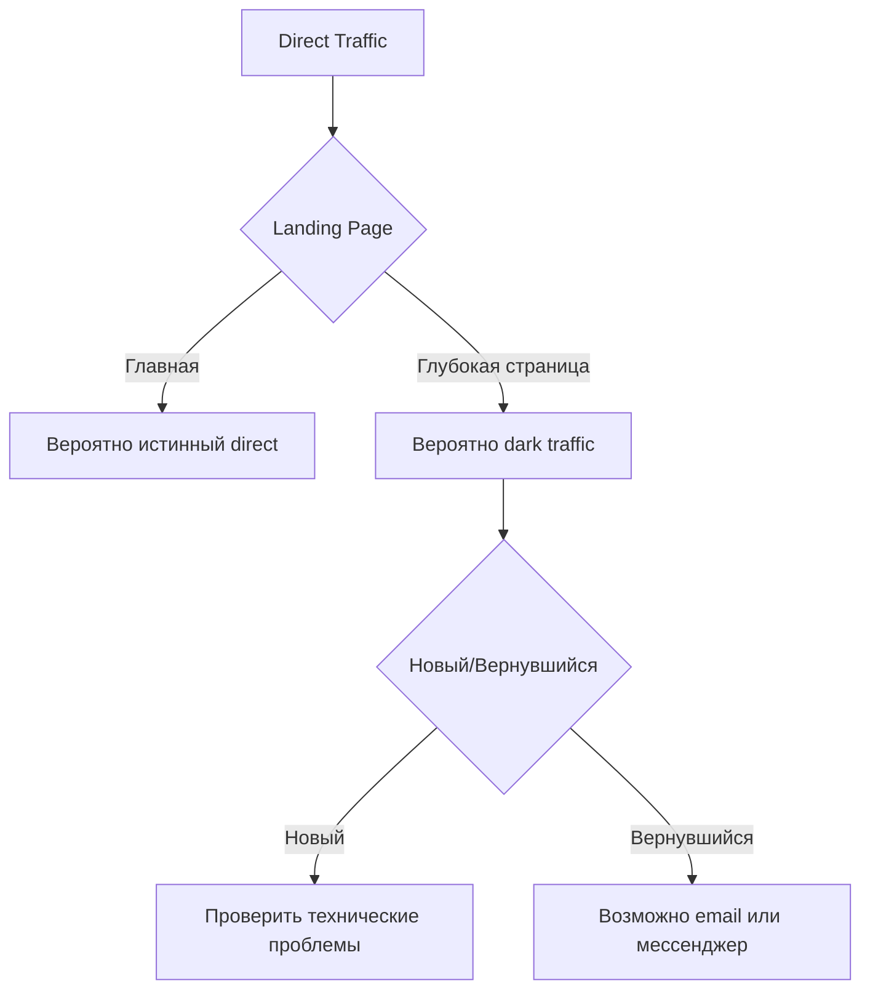

# Direct Traffic: Неопределенные источники трафика и методы очистки данных

Direct traffic представляет собой одну из наиболее загадочных категорий в веб-аналитике. Эта метрика включает все посещения сайта, для которых система аналитики не может определить конкретный источник перехода. Хотя традиционно считается, что direct traffic состоит из пользователей, вводящих URL напрямую в адресную строку браузера, реальность значительно сложнее — эта категория часто становится своеобразной «корзиной» для всего неатрибутированного трафика.

## Что такое Direct Traffic

Direct traffic в Google Analytics 4 и других системах аналитики относится к посещениям сайта, где источник трафика неизвестен или не отслеживается должным образом. Система классифицирует сессию как direct/none, когда не может обнаружить информацию о том, откуда пришел пользователь — здесь "direct" указывает на характер трафика, а "none" означает отсутствие определяемого источника или канала.

!!! info "Механизм определения источника"

    Google Analytics использует следующую иерархию для определения источника трафика:
    
    1. UTM-параметры в URL (utm_source, utm_medium, utm_campaign)
    2. Реферер — URL предыдущей страницы
    3. Параметры gclid и другие идентификаторы рекламных кампаний
    4. Если ничего из перечисленного не возвращает значимых данных, трафик атрибутируется как (direct)

Direct traffic можно рассматривать как «черный ящик» веб-аналитики. В отличие от других источников трафика, где можно точно определить происхождение посетителя, direct traffic скрывает множество различных сценариев входа на сайт.

## Реальные причины появления Direct Traffic

### Легитимные источники прямого трафика

Существует несколько сценариев, когда трафик действительно является прямым:

**Прямой ввод URL**

Пользователи вводят адрес сайта непосредственно в адресную строку браузера. Современные браузеры упрощают этот процесс через функции автозаполнения.

**Закладки браузера**

Переходы из сохраненных закладок не содержат информации о реферере и классифицируются как direct.

**Навигация через историю браузера**

Когда пользователи возвращаются на сайт через историю посещений или функцию «Назад».

### Технические причины неправильной классификации

Значительная часть direct traffic возникает из-за технических ограничений:

**Переход с HTTPS на HTTP**

Когда пользователь переходит с защищенного сайта (HTTPS) на незащищенный (HTTP), браузеры не передают информацию о реферере из соображений безопасности. Это часть протокола безопасности HTTPS и не может быть обойдено.

!!! warning "Влияние протоколов безопасности"

    С массовым переходом сайтов на HTTPS эта проблема стала менее актуальной, но все еще может влиять на сайты, не использующие SSL-сертификаты

**Мобильные приложения**

Переходы из мобильных приложений часто не содержат информации о реферере:

- Клики из приложений социальных сетей (нативные версии)
- Переходы из мессенджеров (WhatsApp, Telegram, Viber)
- Ссылки из мобильных почтовых клиентов
- Функция "Open in..." на iOS устройствах

**Email-клиенты**

Многие настольные почтовые клиенты не передают реферер:

- Microsoft Outlook
- Mozilla Thunderbird
- Apple Mail
- Другие нативные почтовые приложения

### Dark Traffic — скрытая составляющая

«Dark traffic» представляет особую категорию неатрибутированного трафика, который невозможно классифицировать стандартными методами:

| Источник Dark Traffic | Причина потери атрибуции | Доля в общем трафике |
|----------------------|-------------------------|---------------------|
| Мессенджеры | Отсутствие HTTP-реферера | 15-25% |
| PDF-документы | Клики из офлайн-документов | 5-10% |
| Мобильные браузеры | Ограничения privacy | До 60% мобильного органического трафика |
| Приватный режим | Блокировка cookies и рефереров | 10-15% |

!!! note "Исследование Dark Traffic"

    Согласно исследованиям, до 60% мобильного органического трафика может быть неправильно классифицировано как direct из-за технических ограничений браузеров и приложений

## Проблемы с атрибуцией и их влияние

### Искажение данных аналитики

Высокая доля direct traffic создает несколько серьезных проблем для анализа:

**Неверная оценка эффективности каналов**

Когда значительная часть трафика попадает в категорию direct, становится невозможно правильно оценить ROI маркетинговых кампаний. Трафик из социальных сетей, email-рассылок и других источников может быть недооценен.

**Затруднение в принятии решений**

Без точной атрибуции невозможно определить, какие каналы действительно приносят ценных посетителей, что приводит к неэффективному распределению маркетингового бюджета.

**Проблемы с отчетностью**

Объяснение высокой доли direct traffic стейкхолдерам часто вызывает вопросы о качестве трекинга и достоверности данных.

### Признаки проблем с трекингом

Определенные показатели указывают на технические проблемы, а не на реальный прямой трафик:

!!! warning "Тревожные сигналы"

    - Direct traffic составляет более 20% от общего объема (для неизвестных брендов)
    - Резкий рост direct traffic без соответствующих маркетинговых активностей
    - Высокий bounce rate для direct traffic
    - Direct traffic на глубокие страницы сайта (не главную)

## Методы очистки и уменьшения Direct Traffic

### Правильное использование UTM-параметров

UTM-параметры — основной инструмент для правильной атрибуции трафика:

**Обязательные параметры для всех кампаний:**

```
utm_source - источник трафика (facebook, newsletter, partner-site)
utm_medium - тип канала (social, email, cpc, referral)
utm_campaign - название кампании (summer-sale-2025, product-launch)
```

!!! tip "Шаблон документации Source/Medium"

    **Социальные сети:**
    
    - Facebook органика: `source=facebook, medium=social`
    - Facebook реклама: `source=facebook, medium=cpc`
    - Instagram Stories: `source=instagram, medium=stories`
    
    **Email-рассылки:**
    
    - Регулярная рассылка: `source=newsletter, medium=email`
    - Транзакционные письма: `source=crm, medium=email-transactional`
    - Автоматизированные кампании: `source=automation, medium=email`

### Технические решения для восстановления атрибуции

**Переход на HTTPS**

Миграция всего сайта на защищенный протокол предотвращает потерю реферера при переходах с других HTTPS-сайтов.

**Настройка кросс-доменного трекинга**

Для сайтов, работающих на нескольких доменах, критически важна правильная настройка передачи информации о сессии между доменами.

**Исправление редиректов**

=== "Проблемные редиректы"

    **Характеристики:**
    
    - 301 и 302 редиректы могут терять параметры URL
    - Meta-refresh редиректы не передают реферер
    - JavaScript редиректы могут нарушать атрибуцию

=== "Правильная настройка"

    **Решения:**
    
    - Сохранение UTM-параметров при редиректах
    - Использование server-side редиректов с передачей параметров
    - Тестирование всех редиректов на сохранение атрибуции

### Организационные практики

**Создание единой системы тегирования**

Разработка и внедрение стандартизированной системы UTM-параметров для всей организации:

**Документирование соглашений о наименовании**
   
   - Использование только строчных букв
   - Замена пробелов на дефисы или подчеркивания
   - Единообразные названия источников и каналов

**Централизованное управление ссылками**
   
   - Использование специализированных инструментов для генерации UTM
   - Ведение реестра всех используемых параметров
   - Регулярный аудит и очистка устаревших тегов

**Обучение команды**

   - Проведение тренингов по правильному использованию UTM
   - Создание внутренней документации и примеров
   - Назначение ответственных за качество данных

!!! example "Матрица ответственности за UTM"

    | Канал | Ответственный отдел | Формат параметров | Частота проверки |
    |-------|---------------------|-------------------|------------------|
    | Email | Email-маркетинг | newsletter_[date]_[segment] | Еженедельно |
    | Social | SMM | social_[platform]_[content-type] | Ежедневно |
    | Paid | Performance | [platform]_[campaign-id]_[ad-group] | В реальном времени |

### Продвинутые техники анализа

**Сегментация direct traffic для выявления паттернов**

Анализ поведенческих характеристик может помочь понять истинную природу direct traffic:



**Использование дополнительных параметров**

Помимо стандартных UTM-параметров, можно использовать:

- `utm_content` - для A/B тестирования разных версий объявлений
- `utm_term` - для отслеживания ключевых слов в платном поиске
- Кастомные параметры для внутренней аналитики

## Мониторинг и контроль качества данных

### Настройка алертов и дашбордов

Создание системы мониторинга помогает быстро выявлять проблемы:

!!! info "Ключевые метрики для мониторинга"

    **Еженедельные проверки:**
    
    - Процент direct traffic от общего объема
    - Изменение доли direct traffic неделя к неделе
    - Direct traffic на непопулярные страницы
    
    **Триггеры для расследования:**
    
    - Рост direct traffic более чем на 30% за неделю
    - Direct traffic превышает 25% от общего трафика
    - Появление direct traffic на новые страницы

### Регулярный аудит источников трафика

**Чек-лист ежемесячного аудита:**

- [ ] Проверка всех активных email-кампаний на наличие UTM
- [ ] Валидация UTM-параметров в социальных сетях
- [ ] Тестирование редиректов на сохранение параметров
- [ ] Анализ новых источников unassigned traffic
- [ ] Проверка корректности работы кросс-доменного трекинга
- [ ] Валидация настроек фильтров в GA4

## Влияние privacy-регулирований

### iOS App Tracking Transparency (ATT)

Введение ATT существенно повлияло на атрибуцию мобильного трафика:

- Снижение точности атрибуции на 15-25%
- Необходимость перехода на вероятностную атрибуцию
- Усиление роли first-party данных

### Удаление third-party cookies

Блокировка межсайтового трекинга браузерами создает новые вызовы:

**Адаптационные стратегии:**

- Развитие server-side трекинга
- Внедрение first-party идентификаторов
- Использование Privacy Sandbox API

### Трафик от AI-систем

Появление AI-платформ создает новые проблемы классификации:

!!! warning "Новые источники неатрибутированного трафика"

    ChatGPT, Claude, Perplexity и другие AI-системы могут рекомендовать сайты без передачи традиционных referral данных, увеличивая долю direct traffic

## Наш подход к решению проблемы Dark Traffic

Мы разрабатываем решение, которое поможет веб-мастерам получить полную картину источников трафика. В отличие от ограничений традиционных платформ аналитики, наш подход фокусируется на восстановлении потерянной атрибуции через анализ поведенческих паттернов и контекстных сигналов.

Наша система предусматривает использование продвинутых алгоритмов для классификации "dark traffic" даже при отсутствии явных маркеров источника. Мы работаем над автоматическим обогащением данных об источниках и интеллектуальной классификацией трафика с ограниченной информацией.

Планируется реализация функциональности для автоматического создания и управления UTM-параметрами, что поможет избежать ошибок и обеспечить консистентность в отслеживании кампаний. Наше решение позволит веб-мастерам тратить меньше времени на техническую настройку и больше — на анализ и оптимизацию.

--8<-- "snippets/ai.ru.md"

---

!!! success "Готовы получить полный контроль над источниками трафика?"

    Зарегистрируйтесь для бесплатного тестирования нашей платформы аналитики и откройте новые возможности для понимания ваших посетителей. Получите детальные отчеты по всем источникам трафика без ограничений традиционных систем и превратите неопределенный direct traffic в actionable insights для роста вашего бизнеса.