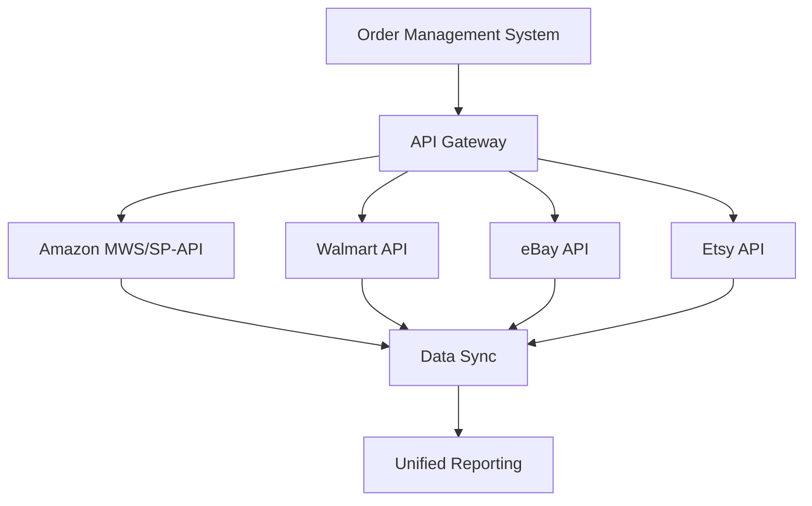
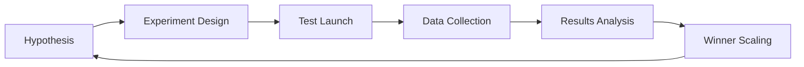

# Marketplace Traffic: Integration and Attribution

Marketplaces have become the dominant force in e-commerce. Amazon, eBay, Walmart, Etsy, and other platforms generate trillions of dollars in sales annually. For brands and sellers, these platforms present both enormous opportunities and serious challenges in tracking and traffic attribution. Unlike your own website where you can fully control analytics, marketplaces create a "black box" of data, complicating understanding of the real customer journey.

## Marketplace Traffic Specifics

### Closed Ecosystem

Marketplaces function as closed ecosystems with their own rules of the game. Amazon controls over 40% of all e-commerce in the US while limiting brand access to customer data. Sellers don't receive customer email addresses, cannot install tracking pixels on product pages, and have limited access to behavioral data.

!!! warning "Data Limitations on Marketplaces"
    
    **Unavailable Information:**
    
    - Customer emails and contact data
    - Complete product view history
    - Cross-category user behavior
    - Traffic sources before reaching the marketplace
    
    **Available Metrics:**
    
    - Product page views
    - Add to cart conversion
    - Sales by SKU
    - Basic demographics (region, device)

### Multi-channel Attribution

The customer journey on marketplaces is rarely linear. A typical scenario includes multiple touchpoints:

Each of these points influences the purchase decision, but traditional attribution systems only see the last click — the transition to Amazon. This leads to undervaluing upper funnels and incorrect marketing budget allocation.

## Amazon Attribution: Breakthrough in Measurement

### How It Works

Amazon Attribution is a free measurement tool that allows tracking the impact of external marketing channels on sales within Amazon. The system works through special attribution tags added to URL links in advertising campaigns outside Amazon.

!!! info "Amazon Attribution Working Principle"
    
    1. **Tag Creation**: Generating unique parameters for each channel and campaign
    
    2. **Campaign Implementation**: Adding tags to links in Google Ads, Facebook, email campaigns
    
    3. **Conversion Tracking**: Monitoring user actions after clicks
    
    4. **Sales Attribution**: Linking purchases to specific marketing sources

### Available Metrics

Amazon Attribution provides a complete set of metrics for performance evaluation:

| Metric | Description | Application |
|--------|-------------|-------------|
| Impressions | Ad displays | Reach assessment |
| Clicks | Ad clicks | Interest measurement |
| Detail Page Views | Product page views | Traffic quality |
| Add to Cart | Cart additions | Intent signals |
| Purchase | Completed purchases | ROI calculation |
| New-to-Brand | New brand customers | Audience growth |

### Attribution Windows

The system supports various attribution windows from 1 to 30 days, allowing for different decision-making cycles. Short windows (1-3 days) suit impulse purchases, while extended ones (14-30 days) work for products with long consideration cycles.

## Walmart and Omnichannel Attribution

### Store Attribution for Sponsored Search

Walmart went further than Amazon by launching offline sales attribution to digital advertising. The Store Attribution system links clicks on Walmart Connect ads with subsequent purchases in physical stores.

!!! note "Types of Walmart Attributed Sales"
    
    **In-store Advertised Sales**: Direct product sales after ad clicks
    
    **In-store Other Sales**: Halo effect — purchases of other brand products
    
    **In-store Attributed Sales**: Total of all attributed offline sales

### Category Impact

Walmart data analysis shows significant differences in omnichannel attribution effectiveness by category:

=== "High Impact"

    Categories with rare purchases and high error risk:
    
    - Auto parts: +45% to attributed sales
    - Home goods: +38%
    - Toys: +35%
    - Specialty products: +42%

=== "Low Impact"

    Everyday items with frequent purchases:
    
    - Groceries: +8%
    - Household chemicals: +12%
    - Basic goods: +10%
    - Regular purchases: +7%

## Integration Platforms

### Shopify Marketplace Connect

Shopify Marketplace Connect automates multi-channel sales by synchronizing catalogs, orders, and inventory between Shopify and marketplaces.

!!! tip "Centralized Management Advantages"
    
    **Unified Product Catalog**
    
    - Single management point for all platforms
    - Automatic change synchronization
    - Currency conversion and localization
    
    **Consolidated Analytics**
    
    - Channel performance comparison
    - Unified performance metrics
    - Cross-platform attribution

### API Integrations

Modern marketplaces provide APIs for deep integration:

## Attribution Problems and Solutions

### Dark Traffic from Marketplaces

A significant portion of marketplace traffic falls into the "direct" category due to:

- Transitions from mobile applications
- Use of platform internal search
- Marketplace email notifications
- Recommendation algorithms

### Cross-device Tracking

Buyers often research products on one device but purchase on another:

!!! example "Typical Multi-device Path"
    
    1. **Morning (smartphone)**: Viewing Instagram Stories with product ads
    
    2. **Day (desktop at work)**: Searching reviews and comparing prices
    
    3. **Evening (tablet)**: Studying specifications on brand site
    
    4. **Night (smartphone)**: Purchase through Amazon app

### Data Discrepancies

Typical discrepancies between attribution systems are 15-25% and caused by:

| Cause | Impact | Solution |
|-------|--------|----------|
| Different counting methodologies | 10-15% | Definition standardization |
| Different attribution windows | 5-10% | Period alignment |
| Tracking blocking | 8-12% | Server-side tracking |
| Technical errors | 3-5% | Regular tag audit |

## Optimization Strategies

### Traffic Source Diversification

Dependence solely on organic search within marketplaces creates risks:

- Ranking algorithm changes
- Increased competition
- Rising platform advertising costs

!!! success "Optimal Source Distribution"
    
    **Recommended Traffic Structure:**
    
    - Marketplace organic search: 30-35%
    - Platform paid advertising: 20-25%
    - External paid traffic: 25-30%
    - Email and CRM: 10-15%
    - Social media and content: 10-15%

### Using Brand Referral Bonus

Amazon offers up to 10% cashback on sales generated by external traffic with proper attribution. This significantly improves external campaign economics:

=== "Without Brand Referral Bonus"

    - Acquisition cost: $50
    - Average order: $100
    - Amazon fee: $15
    - Net profit: $35
    - ROI: 70%

=== "With Brand Referral Bonus"

    - Acquisition cost: $50
    - Average order: $100
    - Amazon fee: $15
    - Bonus 10%: +$10
    - Net profit: $45
    - ROI: 90%

### Channel A/B Testing

Systematic testing helps determine the most effective combinations:

## Future of Marketplaces and Attribution

### Privacy-first Approaches

With tightening privacy requirements, marketplaces are developing new attribution methods:

- **Clean rooms** for secure data matching
- **Aggregated reporting** without individual identifiers
- **Probabilistic attribution** based on statistical models
- **Cohort analysis** instead of personal tracking

### AI-driven Optimization

Artificial intelligence is transforming traffic management on marketplaces:

!!! info "Next-generation AI Capabilities"
    
    **Predictive Analytics**
    
    - Lifetime value forecasting at traffic source level
    - Optimal retargeting timing determination
    - Repeat purchase probability prediction
    
    **Campaign Automation**
    
    - Dynamic budget allocation between platforms
    - Auto-generation of creatives for each marketplace
    - Real-time bid and targeting optimization

### Emerging Marketplaces

New players create additional opportunities and complexities:

| Platform | Specialization | Growth Potential |
|----------|----------------|------------------|
| TikTok Shop | Social commerce | 200%+ per year |
| Instagram Shopping | Visual discovery | 150%+ per year |
| Pinterest Shopping | Inspiration to purchase | 100%+ per year |
| Google Shopping | Search-driven commerce | 80%+ per year |

Marketplaces will continue dominating e-commerce, but success on them requires sophistication in attribution and analytics. Brands that can effectively measure and optimize multi-channel customer journeys will gain competitive advantage in the battle for consumer attention and wallets.

Our web analytics platform is developing solutions to overcome traditional system limitations when working with marketplace traffic. We focus on creating technologies that will provide a complete customer journey picture even with limited access to platform data. We plan to implement functionality for automatic data matching from various sources and building a unified attribution model across all touchpoints.

--8<-- "snippets/ai.md"

!!! success "Ready to Optimize Your Marketplace Operations?"
    
    Sign up for a free trial of our analytics platform. Get tools for accurate multi-channel traffic attribution, marketplace data integration, and marketing investment optimization without traditional system limitations.