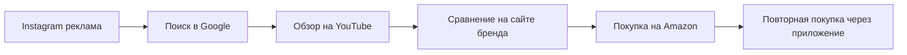
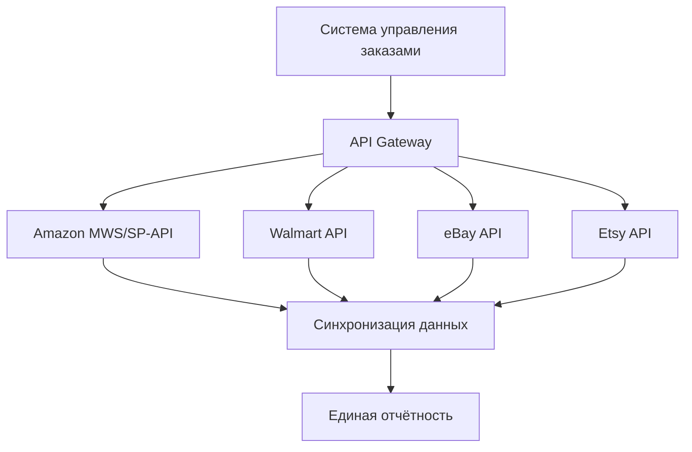

# Трафик из маркетплейсов: интеграция и атрибуция

Маркетплейсы стали доминирующей силой в электронной коммерции. Amazon, eBay, Walmart, Etsy и другие платформы генерируют триллионы долларов продаж ежегодно. Для брендов и продавцов эти платформы представляют как огромные возможности, так и серьёзные вызовы в части отслеживания и атрибуции трафика. В отличие от собственного сайта, где можно полностью контролировать аналитику, маркетплейсы создают "чёрный ящик" данных, усложняя понимание реального пути покупателя.

## Специфика трафика маркетплейсов

### Закрытая экосистема

Маркетплейсы функционируют как замкнутые экосистемы с собственными правилами игры. Amazon контролирует более 40% всей электронной торговли в США, при этом ограничивая доступ брендов к данным о покупателях. Продавцы не получают email-адреса клиентов, не могут установить пиксели отслеживания на страницы товаров и имеют ограниченный доступ к поведенческим данным.

!!! warning "Ограничения данных на маркетплейсах"
    
    **Недоступная информация:**
    
    - Email и контактные данные покупателей
    - Полная история просмотров товаров
    - Кросс-категорийное поведение пользователей
    - Источники трафика до попадания на маркетплейс
    
    **Доступные метрики:**
    
    - Просмотры страниц товаров
    - Конверсия в корзину
    - Продажи по SKU
    - Базовая демография (регион, устройство)

### Мультиканальная атрибуция

Путь покупателя на маркетплейсах редко бывает линейным. Типичный сценарий включает множество точек касания:

Каждая из этих точек влияет на решение о покупке, но традиционные системы атрибуции видят только последний клик — переход на Amazon. Это приводит к недооценке верхних воронок и неправильному распределению маркетинговых бюджетов.

## Amazon Attribution: прорыв в измерении

### Механика работы

Amazon Attribution представляет собой бесплатный инструмент измерения, который позволяет отслеживать влияние внешних маркетинговых каналов на продажи внутри Amazon. Система работает через специальные теги атрибуции, добавляемые к URL-ссылкам в рекламных кампаниях вне Amazon.

!!! info "Принцип работы Amazon Attribution"
    
    1. **Создание тегов**: Генерация уникальных параметров для каждого канала и кампании
    
    2. **Внедрение в кампании**: Добавление тегов к ссылкам в Google Ads, Facebook, email-рассылках
    
    3. **Отслеживание конверсий**: Мониторинг действий пользователей после клика
    
    4. **Атрибуция продаж**: Связывание покупок с конкретными маркетинговыми источниками

### Доступные метрики

Amazon Attribution предоставляет полный набор метрик для оценки эффективности:

| Метрика | Описание | Применение |
|---------|----------|------------|
| Impressions | Показы рекламы | Оценка охвата |
| Clicks | Клики по объявлениям | Измерение интереса |
| Detail Page Views | Просмотры страниц товаров | Качество трафика |
| Add to Cart | Добавления в корзину | Intent сигналы |
| Purchase | Завершённые покупки | ROI калькуляция |
| New-to-Brand | Новые покупатели бренда | Рост аудитории |

### Окна атрибуции

Система поддерживает различные окна атрибуции от 1 до 30 дней, что позволяет учитывать разные циклы принятия решений. Для импульсных покупок подходят короткие окна (1-3 дня), для товаров с длинным циклом рассмотрения — расширенные (14-30 дней).

## Walmart и омниканальная атрибуция

### Store Attribution для Sponsored Search

Walmart пошёл дальше Amazon, запустив атрибуцию офлайн-продаж к цифровой рекламе. Система Store Attribution связывает клики по рекламе в Walmart Connect с последующими покупками в физических магазинах.

!!! note "Типы атрибутированных продаж Walmart"
    
    **In-store Advertised Sales**: Прямые продажи товара после клика по рекламе
    
    **In-store Other Sales**: Halo-эффект — покупки других товаров бренда
    
    **In-store Attributed Sales**: Суммарный показатель всех атрибутированных офлайн-продаж

### Влияние на категории

Анализ данных Walmart показывает значительные различия в эффективности омниканальной атрибуции по категориям:

=== "Высокое влияние"

    Категории с редкими покупками и высоким риском ошибки:
    
    - Автозапчасти: +45% к атрибутированным продажам
    - Товары для дома: +38%
    - Игрушки: +35%
    - Специализированные продукты: +42%

=== "Низкое влияние"

    Повседневные товары с частыми покупками:
    
    - Продукты питания: +8%
    - Бытовая химия: +12%
    - Базовые товары: +10%
    - Регулярные покупки: +7%

## Интеграционные платформы

### Shopify Marketplace Connect

Shopify Marketplace Connect автоматизирует мультиканальные продажи, синхронизируя каталоги, заказы и инвентарь между Shopify и маркетплейсами.

!!! tip "Преимущества централизованного управления"
    
    **Унифицированный каталог товаров**
    
    - Единая точка управления для всех платформ
    - Автоматическая синхронизация изменений
    - Конвертация валют и локализация
    
    **Консолидированная аналитика**
    
    - Сравнение эффективности каналов
    - Единые метрики производительности
    - Кросс-платформенная атрибуция

### API-интеграции

Современные маркетплейсы предоставляют API для глубокой интеграции:

## Проблемы атрибуции и их решения

### Dark Traffic с маркетплейсов

Значительная часть трафика с маркетплейсов попадает в категорию "direct" из-за:

- Переходов из мобильных приложений
- Использования внутреннего поиска платформ
- Email-уведомлений маркетплейсов
- Рекомендательных алгоритмов

### Кросс-устройственное отслеживание

Покупатели часто исследуют товары на одном устройстве, а покупают на другом:

!!! example "Типичный мультидевайсный путь"
    
    1. **Утро (смартфон)**: Просмотр Instagram Stories с рекламой товара
    
    2. **День (десктоп на работе)**: Поиск отзывов и сравнение цен
    
    3. **Вечер (планшет)**: Изучение характеристик на сайте бренда
    
    4. **Ночь (смартфон)**: Покупка через приложение Amazon

### Расхождения в данных

Типичные расхождения между системами атрибуции составляют 15-25% и вызваны:

| Причина | Влияние | Решение |
|---------|---------|---------|
| Различные методологии подсчёта | 10-15% | Стандартизация определений |
| Разные окна атрибуции | 5-10% | Выравнивание периодов |
| Блокировка трекинга | 8-12% | Server-side отслеживание |
| Технические ошибки | 3-5% | Регулярный аудит тегов |

## Стратегии оптимизации

### Диверсификация источников трафика

Зависимость только от органического поиска внутри маркетплейса создаёт риски:

- Изменения алгоритмов ранжирования
- Усиление конкуренции
- Рост стоимости рекламы на платформе

!!! success "Оптимальное распределение источников"
    
    **Рекомендуемая структура трафика:**
    
    - Органический поиск маркетплейса: 30-35%
    - Платная реклама на платформе: 20-25%
    - Внешний платный трафик: 25-30%
    - Email и CRM: 10-15%
    - Социальные сети и контент: 10-15%

### Использование Brand Referral Bonus

Amazon предлагает возврат до 10% от продаж, генерируемых внешним трафиком с правильной атрибуцией. Это существенно улучшает экономику внешних кампаний:

=== "Без Brand Referral Bonus"

    - Стоимость привлечения: $50
    - Средний чек: $100
    - Комиссия Amazon: $15
    - Чистая прибыль: $35
    - ROI: 70%

=== "С Brand Referral Bonus"

    - Стоимость привлечения: $50
    - Средний чек: $100
    - Комиссия Amazon: $15
    - Бонус 10%: +$10
    - Чистая прибыль: $45
    - ROI: 90%

### A/B тестирование каналов

Систематическое тестирование позволяет определить наиболее эффективные комбинации:

## Будущее маркетплейсов и атрибуции

### Privacy-first подходы

С ужесточением требований к приватности, маркетплейсы развивают новые методы атрибуции:

- **Clean rooms** для безопасного сопоставления данных
- **Aggregated reporting** без индивидуальных идентификаторов
- **Probabilistic attribution** на основе статистических моделей
- **Cohort analysis** вместо персонального трекинга

### AI-driven оптимизация

Искусственный интеллект трансформирует управление трафиком на маркетплейсах:

!!! info "AI-возможности следующего поколения"
    
    **Предиктивная аналитика**
    
    - Прогноз lifetime value на уровне источника трафика
    - Определение оптимального времени для ретаргетинга
    - Предсказание вероятности повторных покупок
    
    **Автоматизация кампаний**
    
    - Динамическое распределение бюджетов между платформами
    - Автогенерация креативов под каждый маркетплейс
    - Real-time оптимизация ставок и таргетингов

### Emerging маркетплейсы

Новые игроки создают дополнительные возможности и сложности:

| Платформа | Специализация | Потенциал роста |
|-----------|---------------|-----------------|
| TikTok Shop | Social commerce | 200%+ в год |
| Instagram Shopping | Visual discovery | 150%+ в год |
| Pinterest Shopping | Inspiration to purchase | 100%+ в год |
| Google Shopping | Search-driven commerce | 80%+ в год |

Маркетплейсы продолжат доминировать в электронной коммерции, но успех на них требует sophistication в атрибуции и аналитике. Бренды, которые смогут эффективно измерять и оптимизировать мультиканальные пути покупателей, получат конкурентное преимущество в борьбе за внимание и кошельки потребителей.

Наша платформа веб-аналитики разрабатывает решения для преодоления ограничений традиционных систем при работе с трафиком маркетплейсов. Мы фокусируемся на создании технологий, которые позволят получить полную картину customer journey даже в условиях ограниченного доступа к данным платформ. Планируется реализация функциональности для автоматического сопоставления данных из различных источников и построения единой модели атрибуции across all touchpoints.

--8<-- "snippets/ai.ru.md"

!!! success "Готовы оптимизировать работу с маркетплейсами?"
    
    Зарегистрируйтесь для бесплатного тестирования нашей платформы аналитики. Получите инструменты для точной атрибуции мультиканального трафика, интеграции данных с маркетплейсов и оптимизации маркетинговых инвестиций без ограничений традиционных систем.