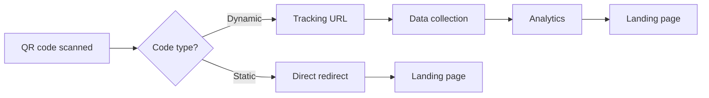
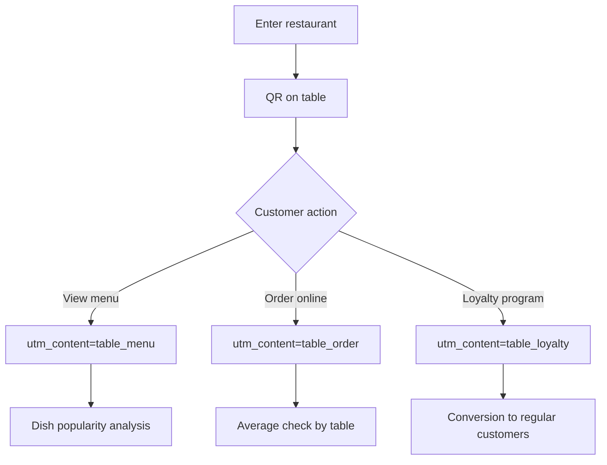
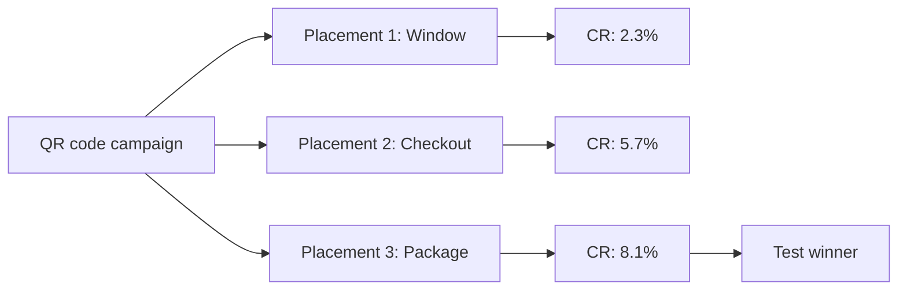
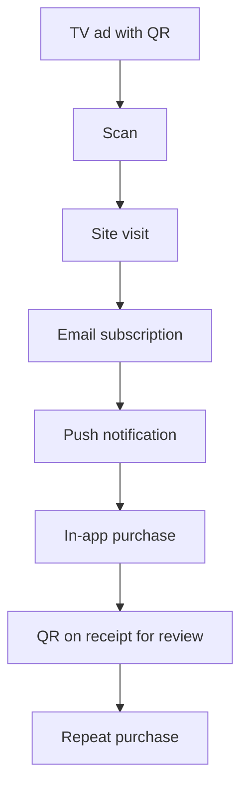

# QR Code Tracking: Bridge Between Offline and Online Analytics

QR codes have evolved from an industrial tool for tracking cars in manufacturing into a universal bridge between the physical and digital world. Invented in 1994 by Masahiro Hara, QR (quick response) codes were initially used for tracking vehicles during production. Today they have become a key element of omnichannel marketing strategies, enabling precise measurement of offline campaign effectiveness through digital metrics.

## QR Code Tracking Mechanics

A QR code by itself is simply a machine-readable link. Out of the box, no analytics tool can track traffic from QR codes. If you don't configure the QR link, all traffic from it will appear as direct. All the measurement magic happens through proper tracking parameter setup and choosing between static and dynamic QR codes.

### Static vs Dynamic QR Codes

The choice of QR code type determines analytics capabilities:

!!! warning "Critical Difference for Analytics"

    **Static QR codes:**
    
    - Contain the final URL directly in the code
    - Cannot be changed after creation
    - Don't provide detailed analytics
    - Suitable only for simple redirects
    
    **Dynamic QR codes:**
    
    - Use an intermediate URL for redirect
    - Allow changing the final link after printing
    - Collect detailed scan statistics
    - Required for comprehensive tracking

Only dynamic QR codes are suitable for real-time tracking. While static QR codes redirect you to the target URL without tracking, dynamic QR codes use short URLs or tracking URLs.



## UTM Parameters for QR Codes

UTM tags turn a simple scan into a data point for analysis. Proper UTM structure for QR codes requires detailing each placement.

### Basic UTM Structure for QR

Minimum parameter set for tracking:

| Parameter | Purpose | QR Example |
|-----------|---------|------------|
| utm_source | Where QR is placed | poster, flyer, package |
| utm_medium | Channel type | qr_code, offline, print |
| utm_campaign | Campaign | spring_sale_2025 |

### Extended Tagging for Details

Additional parameters for deep analysis:

!!! info "Example of Detailed UTM Link"

    **Base URL:** `example.com/special-offer`
    
    **With UTM for QR on packaging:**
    ```
    example.com/special-offer?utm_source=package&utm_medium=qr_code&utm_campaign=product_launch&utm_content=box_side&utm_term=sku_12345
    ```
    
    **What analytics will show:**
    
    - Source: Product packaging
    - Channel: QR code
    - Campaign: Product launch
    - Variant: Box side
    - Additional: Specific product SKU

## Key QR Tracking Metrics

Key QR code metrics to track: 1. Total scans: See how many times your QR code has been scanned. It's the simplest way to measure interest. 2. Unique scans: Shows how many different people scanned your QR code.

### Core Performance Indicators

=== "Quantitative Metrics"

    **Total Scan Count**
    
    Absolute indicator of placement interest. Includes all scans, including repeat ones from the same user.
    
    **Unique Scans**
    
    Number of unique devices that scanned the code. Shows real campaign reach.
    
    **Conversion to Target Action**
    
    Percentage of scanners who completed the target action on site (purchase, registration, download).

=== "Qualitative Metrics"

    **Scan Geography**
    
    Distribution by countries, cities and regions. Helps optimize placement geography.
    
    **Scan Time**
    
    Hourly and daily activity. Identifies peak periods of interaction with offline materials.
    
    **Devices and OS**
    
    Device types (iOS/Android) and browsers. Important for mobile experience optimization.

### Calculating Offline Campaign ROI

ROI calculation formula for QR campaigns:

!!! example "ROI Calculation Example"

    **Campaign Initial Data:**
    
    - Print 10,000 flyers with QR: $500
    - Design and setup: $200
    - Total costs: $700
    
    **Results after one month:**
    
    - Scans: 850
    - Conversions: 42
    - Average order: $35
    - Revenue: $1,470
    
    **ROI = (1,470 - 700) / 700 × 100% = 110%**

## Practical Use Cases

### Retail and Packaging

With unique UTM parameters for each, you can see which format gets more interaction and adjust future budget based on real numbers instead of guesswork.

Placing QR codes on packaging solves several tasks:

- Providing additional product information
- Cross-sales and upsells
- Post-purchase feedback collection
- Loyalty programs

!!! tip "Packaging Placement Strategy"

    1. **Box exterior**
    
       - QR for primary information
       - utm_content=box_front
    
    2. **Inside packaging**
    
       - QR for warranty registration
       - utm_content=warranty_card
    
    3. **On product itself**
    
       - QR for instructions and support
       - utm_content=product_label

### Restaurant Business

Table QR codes work well for upselling because customers are relaxed and browsing. Restaurants use QR at different customer journey stages:



### Event Marketing

Events provide a unique opportunity for multi-touch QR tracking:

!!! info "Event QR Placement Matrix"

    | Placement Point | UTM Source | Tracking Goal |
    |----------------|------------|---------------|
    | Entry tickets | ticket | Measuring pre-event interest |
    | Attendee badges | badge | Networking and contact exchange |
    | Booths and banners | booth | Content engagement |
    | Handouts | handout | Post-event conversions |
    | Speaker presentations | presentation | Material downloads |

## Integration with Analytics Systems

### Setting Up in Google Analytics 4

When a visitor lands on your site and the page URL contains things like utm_medium, utm_source, utm_campaign, GA4 will track this and attribute the session to the QR code.

Step-by-step setup process:

1. **Create UTM link**

   Use Campaign URL Builder or create manually with proper parameters.

2. **Generate QR code**

   Convert UTM link to QR through generator supporting long URLs.

3. **Test before launch**

   Scan code and check data in GA4 Realtime reports.

4. **Analyze results**

   After 24-48 hours data will appear in Reports > Acquisition > Traffic Acquisition.

### Creating Custom Channels for QR

If your business relies heavily on QR codes to track offline marketing campaigns, you should set up Custom Default Channel under Property Settings → Data Settings → Channel Groups.

!!! warning "Channel Grouping Setup"

    Without proper setup, QR traffic will fall into "Unassigned" or "Direct" groups, complicating analysis.
    
    **Recommended channel structure:**
    
    - QR Code - Print (for printed materials)
    - QR Code - Package (for packaging)
    - QR Code - OOH (for outdoor advertising)
    - QR Code - Event (for events)

## A/B Testing with QR Codes

You can use QR codes with slightly modified content, products, call-to-actions, designs and colors, or different URLs.

### Creative Testing

Parallel placement of different QR material versions:

=== "Variant A: Emotional"

    ```
    utm_content=poster_emotional
    utm_term=happiness_focus
    ```
    
    CTA: "Discover the joy of shopping"
    Design: Bright colors, smiling people

=== "Variant B: Rational"

    ```
    utm_content=poster_rational
    utm_term=savings_focus
    ```
    
    CTA: "Save up to 50% right now"
    Design: Clear numbers, savings charts

=== "Variant C: Urgency"

    ```
    utm_content=poster_urgency
    utm_term=limited_time
    ```
    
    CTA: "Only 3 days! Don't miss out"
    Design: Timer, red accents

### Placement Testing

Determining optimal touchpoints:



## Overcoming Traditional System Limitations

Standard analytics platforms impose various restrictions on QR tracking. Google Analytics limits URL length and event count, other systems don't allow creating arbitrary parameters.

### Existing Solution Problems

!!! note "Typical Platform Limitations"

    **Google Analytics:**
    
    - UTM parameter value length limits
    - 24-48 hour data processing delay
    - Sampling for large volumes
    
    **Social Networks:**
    
    - UTM truncation in reposts
    - Proprietary tracking parameters
    - Limited raw data access

### Our Approach to QR Analytics

We're working on a solution that eliminates typical QR tracking problems. Our approach provides:

**Flexible Parameter System**

Ability to create arbitrary tracking parameters without restrictions on quantity and value length. This will allow passing detailed information about each placement.

**Real-time Without Delays**

Data processing at scan moment without typical traditional system delays. Instant result visualization in dashboard.

**Intelligent Attribution**

Automatic source identification even with incomplete or incorrect UTM tagging. Machine learning for recovering lost parameters.

## Privacy-First Approach to QR Tracking

Tightening privacy requirements are changing tracking approaches:

### Server-Side Tracking

Moving data processing to server-side enables:

- Bypassing browser blocks
- Maintaining data completeness
- GDPR compliance
- Information collection control

### First-Party Data

Focus shifts to companies' own data:

!!! tip "First-Party Data Collection Strategy via QR"

    **Direct Identification**
    
    - Promo codes tied to QR
    - Registration for bonus
    
    **Progressive Profiling**
    
    - Gradual data collection
    - Value exchange for information
    
    **Touchpoint Unification**
    
    - Linking offline and online IDs
    - Unified customer profile

## Future of QR Tracking

With over 11 million QR scans expected in the US by 2025, the need to track their performance is growing fast. Technology continues to evolve:

### AR and AI Integration

Next generation QR codes will include:

- Augmented reality after scanning
- Content personalization through AI
- Predictive behavior analytics
- Voice interaction interfaces

### Omnichannel Attribution

QR codes become part of complex customer journeys:



Proper attribution must account for each touchpoint's contribution to final conversion, not just last touch.

QR codes have transformed from a simple link transfer method into a comprehensive marketing analytics tool. Proper tracking setup allows measuring offline campaign ROI with the same precision as digital channels. The key to success lies in detailed tagging, choosing the right tools, and continuous data-driven optimization.

--8<-- "snippets/ai.md"

---

!!! success "Ready to Measure Offline Campaign Effectiveness?"

    Sign up for a free trial of our analytics platform and gain complete control over QR tracking without traditional system limitations. Detailed attribution, real-time data, and flexible tracking parameters—everything for precise measurement of your offline investment ROI.