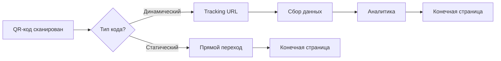
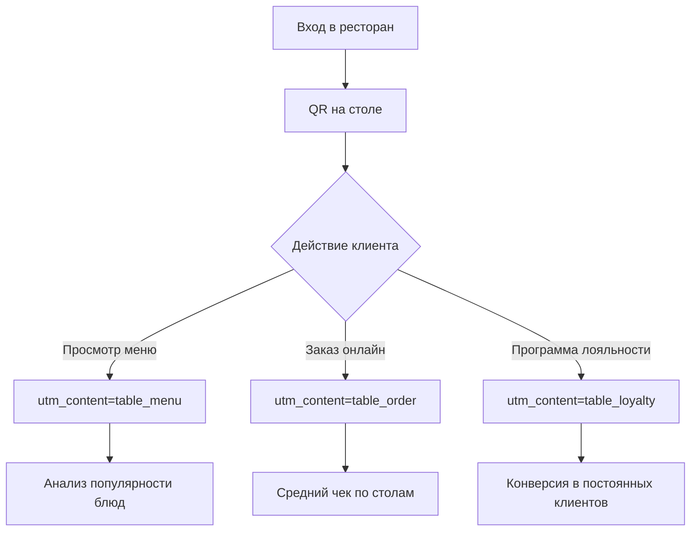
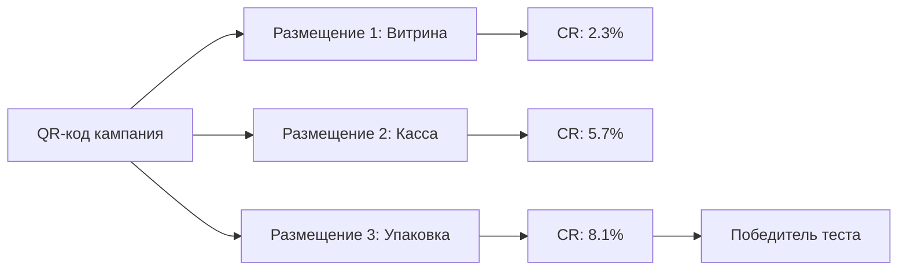
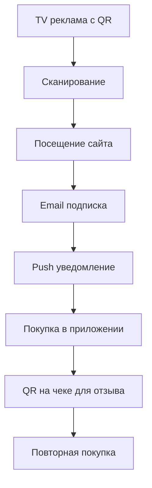

# QR Code Tracking: мост между офлайн и онлайн аналитикой

QR-коды превратились из промышленного инструмента для отслеживания автомобилей в производстве в универсальный мост между физическим и цифровым миром. Изобретенные в 1994 году Масахиро Хара, QR (quick response) коды изначально использовались для отслеживания транспортных средств во время производства. Сегодня они стали ключевым элементом омниканальных маркетинговых стратегий, позволяя точно измерять эффективность офлайн-кампаний через цифровые метрики.

## Механика отслеживания QR-кодов

QR-код сам по себе — это просто машиночитаемая ссылка. Из коробки ни один инструмент аналитики не может отслеживать трафик с QR-кодов. Если вы не настроите QR-ссылку, весь трафик с неё будет отображаться как прямой. Вся магия измерений происходит благодаря правильной настройке параметров отслеживания и выбору между статическими и динамическими QR-кодами.

### Статические vs динамические QR-коды

Выбор типа QR-кода определяет возможности аналитики:

!!! warning "Критическое различие для аналитики"

    **Статические QR-коды:**
    
    - Содержат конечный URL напрямую в коде
    - Не могут быть изменены после создания
    - Не предоставляют детальной аналитики
    - Подходят только для простых переходов
    
    **Динамические QR-коды:**
    
    - Используют промежуточный URL для редиректа
    - Позволяют менять конечную ссылку после печати
    - Собирают подробную статистику сканирований
    - Необходимы для полноценного трекинга

Только динамические QR-коды подходят для отслеживания в реальном времени. В то время как статические QR-коды переводят вас на целевой URL без отслеживания, динамические QR-коды используют короткие URL или отслеживающие URL.



## UTM-параметры для QR-кодов

UTM-теги превращают обычное сканирование в точку данных для анализа. Правильная структура UTM для QR-кодов требует детализации каждого размещения.

### Базовая структура UTM для QR

Минимальный набор параметров для отслеживания:

| Параметр | Назначение | Пример для QR |
|----------|-----------|---------------|
| utm_source | Где размещён QR | poster, flyer, package |
| utm_medium | Тип канала | qr_code, offline, print |
| utm_campaign | Кампания | spring_sale_2025 |

### Расширенная разметка для детализации

Дополнительные параметры для глубокого анализа:

!!! info "Пример детализированной UTM-ссылки"

    **Базовый URL:** `example.com/special-offer`
    
    **С UTM для QR на упаковке:**
    ```
    example.com/special-offer?utm_source=package&utm_medium=qr_code&utm_campaign=product_launch&utm_content=box_side&utm_term=sku_12345
    ```
    
    **Что покажет аналитика:**
    
    - Источник: Упаковка продукта
    - Канал: QR-код
    - Кампания: Запуск продукта
    - Вариант: Боковая сторона коробки
    - Дополнительно: Конкретный SKU товара

## Ключевые метрики QR-трекинга

Ключевые метрики QR-кодов, которые следует отслеживать: 1. Общее количество сканирований: Смотрите, сколько раз ваш QR-код был отсканирован. Это самый простой способ измерить интерес. 2. Уникальные сканирования: Показывает, сколько разных людей отсканировали ваш QR-код.

### Основные показатели эффективности

=== "Количественные метрики"

    **Общее количество сканирований**
    
    Абсолютный показатель интереса к размещению. Учитывает все сканирования, включая повторные от одного пользователя.
    
    **Уникальные сканирования**
    
    Количество уникальных устройств, отсканировавших код. Показывает реальный охват кампании.
    
    **Конверсия в целевое действие**
    
    Процент сканировавших, которые выполнили целевое действие на сайте (покупка, регистрация, загрузка).

=== "Качественные метрики"

    **География сканирований**
    
    Распределение по странам, городам и регионам. Помогает оптимизировать географию размещений.
    
    **Время сканирования**
    
    Почасовая и дневная активность. Определяет пиковые периоды взаимодействия с офлайн-материалами.
    
    **Устройства и ОС**
    
    Тип устройств (iOS/Android) и браузеров. Важно для оптимизации мобильного опыта.

### Расчёт ROI офлайн-кампаний

Формула расчёта возврата инвестиций для QR-кампаний:

!!! example "Пример расчёта ROI"

    **Исходные данные кампании:**
    
    - Печать 10,000 флаеров с QR: $500
    - Дизайн и настройка: $200
    - Общие затраты: $700
    
    **Результаты через месяц:**
    
    - Сканирований: 850
    - Конверсий: 42
    - Средний чек: $35
    - Доход: $1,470
    
    **ROI = (1,470 - 700) / 700 × 100% = 110%**

## Практические кейсы использования

### Розничная торговля и упаковка

С уникальными UTM-параметрами для каждого можно увидеть, какой формат получает больше взаимодействия и корректировать будущий бюджет на основе реальных цифр вместо догадок.

Размещение QR-кодов на упаковке решает несколько задач:

- Предоставление дополнительной информации о продукте
- Кросс-продажи и апселлы
- Сбор отзывов после покупки
- Программы лояльности

!!! tip "Стратегия размещения на упаковке"

    1. **Внешняя сторона коробки**
    
       - QR для первичной информации
       - utm_content=box_front
    
    2. **Внутри упаковки**
    
       - QR для регистрации гарантии
       - utm_content=warranty_card
    
    3. **На самом продукте**
    
       - QR для инструкций и поддержки
       - utm_content=product_label

### Ресторанный бизнес

QR-коды на столах работают хорошо для апселлинга, потому что клиенты расслаблены и просматривают меню. Рестораны используют QR на разных этапах customer journey:



### Событийный маркетинг

События предоставляют уникальную возможность для многоточечного QR-трекинга:

!!! info "Матрица QR-размещений на мероприятии"

    | Точка размещения | UTM Source | Цель трекинга |
    |------------------|------------|---------------|
    | Входные билеты | ticket | Измерение pre-event интереса |
    | Бейджи участников | badge | Нетворкинг и обмен контактами |
    | Стенды и баннеры | booth | Вовлечённость в контент |
    | Раздаточные материалы | handout | Post-event конверсии |
    | Презентации спикеров | presentation | Загрузка материалов |

## Интеграция с системами аналитики

### Настройка в Google Analytics 4

Когда посетитель приземляется на ваш сайт и URL страницы содержит такие вещи как utm_medium, utm_source, utm_campaign, GA4 будет отслеживать это и атрибутировать сессию к QR-коду.

Пошаговый процесс настройки:

1. **Создание UTM-ссылки**

   Используйте Campaign URL Builder или создайте вручную с правильными параметрами.

2. **Генерация QR-кода**

   Конвертируйте UTM-ссылку в QR через генератор, поддерживающий длинные URL.

3. **Тестирование перед запуском**

   Отсканируйте код и проверьте данные в Realtime отчётах GA4.

4. **Анализ результатов**

   После 24-48 часов данные появятся в Reports > Acquisition > Traffic Acquisition.

### Создание кастомных каналов для QR

Если ваш бизнес сильно зависит от QR-кодов для отслеживания офлайн маркетинговых кампаний, вам следует настроить Custom Default Channel в Property Settings → Data Settings → Channel Groups.

!!! warning "Настройка группировки каналов"

    Без правильной настройки QR-трафик попадёт в группу "Unassigned" или "Direct", что затруднит анализ.
    
    **Рекомендуемая структура каналов:**
    
    - QR Code - Print (для печатных материалов)
    - QR Code - Package (для упаковки)
    - QR Code - OOH (для наружной рекламы)
    - QR Code - Event (для мероприятий)

## A/B тестирование с QR-кодами

Можно использовать QR-коды с немного изменённым содержанием, продуктами, призывами к действию, дизайном и цветами или разными URL.

### Тестирование креативов

Параллельное размещение разных версий QR-материалов:

=== "Вариант A: Эмоциональный"

    ```
    utm_content=poster_emotional
    utm_term=happiness_focus
    ```
    
    CTA: "Откройте для себя радость покупок"
    Дизайн: Яркие цвета, улыбающиеся люди

=== "Вариант B: Рациональный"

    ```
    utm_content=poster_rational
    utm_term=savings_focus
    ```
    
    CTA: "Экономьте до 50% прямо сейчас"
    Дизайн: Чёткие цифры, графики экономии

=== "Вариант C: Срочность"

    ```
    utm_content=poster_urgency
    utm_term=limited_time
    ```
    
    CTA: "Только 3 дня! Не упустите"
    Дизайн: Таймер, красные акценты

### Тестирование размещений

Определение оптимальных точек контакта:



## Преодоление ограничений традиционных систем

Стандартные платформы аналитики накладывают различные ограничения на работу с QR-отслеживанием. Google Analytics ограничивает длину URL и количество событий, другие системы не позволяют создавать произвольные параметры.

### Проблемы существующих решений

!!! note "Типичные ограничения платформ"

    **Google Analytics:**
    
    - Лимит длины значений UTM-параметров
    - Задержка обработки данных 24-48 часов
    - Сэмплирование при больших объёмах
    
    **Социальные сети:**
    
    - Обрезание UTM при репостах
    - Собственные параметры отслеживания
    - Ограниченный доступ к raw data

### Наш подход к QR-аналитике

Мы работаем над решением, которое устраняет типичные проблемы QR-трекинга. Наш подход предусматривает:

**Гибкая система параметров**

Возможность создания произвольных параметров отслеживания без ограничений на количество и длину значений. Это позволит передавать детальную информацию о каждом размещении.

**Реальное время без задержек**

Обработка данных в момент сканирования без типичных задержек традиционных систем. Мгновенная визуализация результатов в дашборде.

**Интеллектуальная атрибуция**

Автоматическое определение источника даже при неполной или некорректной UTM-разметке. Машинное обучение для восстановления потерянных параметров.

## Privacy-first подход к QR-трекингу

Ужесточение требований к конфиденциальности меняет подходы к отслеживанию:

### Server-side трекинг

Перенос обработки данных на серверную сторону позволяет:

- Обходить блокировки браузеров
- Сохранять полноту данных
- Соблюдать требования GDPR
- Контролировать сбор информации

### First-party данные

Фокус смещается на собственные данные компаний:

!!! tip "Стратегия сбора first-party данных через QR"

**Прямая идентификация**
    
    - Промокоды привязанные к QR
    - Регистрация для получения бонуса
    
**Прогрессивное профилирование**
    
    - Сбор данных поэтапно
    - Обмен ценности на информацию
    
**Объединение touchpoints**
    
    - Связывание офлайн и онлайн ID
    - Единый профиль покупателя

## Будущее QR-отслеживания

С более чем 11 миллионами QR-сканирований, ожидаемых в США к 2025 году, необходимость отслеживать их производительность растёт быстро. Технология продолжает эволюционировать:

### Интеграция с AR и AI

Следующее поколение QR-кодов будет включать:

- Дополненную реальность после сканирования
- Персонализацию контента через AI
- Предиктивную аналитику поведения
- Голосовые интерфейсы взаимодействия

### Омниканальная атрибуция

QR-коды становятся частью сложных customer journey:



Правильная атрибуция должна учитывать вклад каждой точки контакта в финальную конверсию, а не только последнее касание.

QR-коды превратились из простого способа передачи ссылки в полноценный инструмент маркетинговой аналитики. Правильная настройка отслеживания позволяет измерять ROI офлайн-кампаний с той же точностью, что и цифровые каналы. Ключ к успеху — в детальной разметке, выборе правильных инструментов и постоянной оптимизации на основе данных.

--8<-- "snippets/ai.ru.md"

---

!!! success "Готовы измерять эффективность офлайн-кампаний?"

    Зарегистрируйтесь для бесплатного тестирования нашей платформы аналитики и получите полный контроль над QR-трекингом без ограничений традиционных систем. Детальная атрибуция, real-time данные и гибкие параметры отслеживания — всё для точного измерения ROI ваших офлайн-инвестиций.