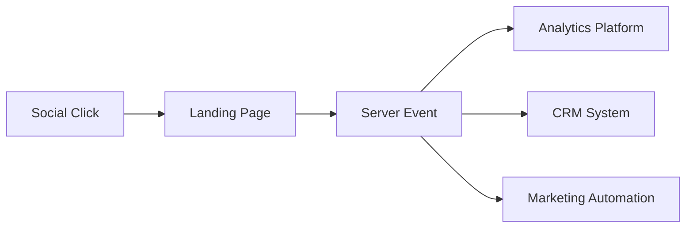

# Social Media in Web Analytics: Traffic Tracking and Engagement Metrics

Social media generates between 15% and 35% of all web traffic for most websites. Every click from Facebook, Instagram, LinkedIn, or TikTok carries information about audience behavior, content effectiveness, and viral potential. Proper social traffic tracking setup transforms a chaotic stream of clicks into structured data for decision-making.

## Anatomy of Social Traffic

### Source Classification

Social traffic includes transitions from various platform types:

**Major social networks:**

- Facebook, Instagram, LinkedIn, Twitter (X)
- Video content platforms YouTube, TikTok, Twitch
- Messengers with social features WhatsApp, Telegram
- Niche platforms Reddit, Pinterest, Discord

Each platform has unique traffic characteristics. Facebook generates stable flow with high page depth. Instagram drives impulsive traffic with short session times. LinkedIn delivers quality B2B traffic with high conversion.

### Organic vs Paid Traffic

Distinguishing between organic and paid social traffic is critical for ROI assessment:

!!! info "Social Traffic Tagging Structure"

    **Organic posts:**
    ```
    utm_source=facebook&utm_medium=social&utm_campaign=content_calendar
    ```
    
    **Paid advertising:**
    ```
    utm_source=instagram&utm_medium=cpc&utm_campaign=product_launch
    ```
    
    **Influencer marketing:**
    ```
    utm_source=instagram&utm_medium=influencer&utm_campaign=brand_collab
    ```

Organic traffic is characterized by wave patterns with peaks after publications. Paid traffic shows stable flow with predictable quality metrics.

## UTM Tagging for Social Media

### Parameter Standardization

Social networks require special attention to UTM tagging due to content format diversity:

| Platform | Source | Medium | Content variants |
|----------|--------|---------|------------------|
| Facebook | facebook | social/cpc | post, story, video, event |
| Instagram | instagram | social/cpc | feed, stories, reels, igtv |
| LinkedIn | linkedin | social/cpc | article, post, inmail |
| TikTok | tiktok | social/cpc | video, live, effect |

### Content Format Tracking

Different formats show varying effectiveness:

**Stories and ephemeral content:**

- High CTR (3-5%)
- Short lifespan (24 hours)
- Impulsive transitions

**Feed posts and static content:**

- Stable traffic
- Long lifespan
- Deep engagement

**Video and live streams:**

- Maximum reach
- High virality
- Complex attribution

!!! tip "Social Campaign Documentation Template"

    **Facebook:**
    
    - Organic: `source=facebook, medium=social`
    - Ads: `source=facebook, medium=cpc`
    - Retargeting: `source=facebook, medium=retargeting`
    
    **Instagram:**
    
    - Feed: `source=instagram, medium=social, content=feed`
    - Stories: `source=instagram, medium=stories`
    - Reels: `source=instagram, medium=reels`

## Engagement Metrics

### Basic Interaction Metrics

Engagement is measured through a set of user actions:

**Engagement Rate (ER)** — percentage of audience interacting with content:

```
ER = (Likes + Comments + Shares) / Reach × 100
```

Average rates by platform:

- TikTok: 2.5-8.5%
- Instagram: 0.45-0.99%
- Facebook: 0.15-0.35%
- LinkedIn: 1.68-2.1%

### Advanced Metrics

**Amplification Rate** — percentage of shares from total interactions:

Shares represent the highest form of engagement — users put their personal brand behind your content. Rate above 10% indicates high content value or viral potential.

**Conversation Rate** — ratio of comments to total reach:

Comments require more effort than likes. High rate (>2%) indicates content that sparks discussion and builds community.

**Save Rate** — percentage of content saves:

Saves are the strongest value signal. Users save content for future reference. Rate >5% is typical for educational and reference content.

!!! note "Content Strategy Matrix"

    **High saves + high shares:**
    
    - Universally valuable content
    - Practical guides
    - Data infographics
    
    **High saves + low shares:**
    
    - Personal or niche information
    - Detailed tutorials
    - Industry insights
    
    **Low saves + high engagement:**
    
    - Entertainment content
    - Trends and challenges
    - Discussion topics

## Viral Potential and Measurement

### Virality Rate

Virality coefficient shows content spread velocity:

```
Virality Rate = (Number of shares / Number of impressions) × 100
```

Rate above 1% is considered the beginning of virality. At 3-5%, content actively spreads beyond the initial audience.

### K-Factor (Virality Coefficient)

K-Factor measures how many new users each current user attracts:

```
K = i × c
```

Where:
- i = average number of invitations per user
- c = percentage of accepted invitations

When K > 1, exponential growth occurs. Facebook in early years achieved K = 2.0, ensuring explosive platform growth.

### Velocity Patterns

Engagement accumulation speed predicts viral potential:

**Instant spike (0-2 hours):**

- Trending capture
- Algorithmic promotion
- High relevance

**Gradual growth (2-24 hours):**

- Organic spread
- Quality content
- Sustainable virality

**Delayed engagement (24+ hours):**

- Evergreen content
- Search discovery
- Repeat views

## Dark Social and Attribution Problems

### Invisible Social Traffic

Up to 60% of social traffic can be misclassified as direct:

**Dark social sources:**

- Private messages in messengers
- Closed groups and channels
- Mobile apps without referrer
- Email forwards

**Identification methods:**

Analyzing dark social traffic behavior patterns:

- High percentage of new users
- Direct transitions to deep pages
- Mobile traffic with short session time
- Spikes after social media posts

### Cross-device Tracking

Users often see content on one device but visit from another:

!!! example "Typical User Journey"

    1. **Instagram view** on smartphone (like, save)
    2. **Google search** on desktop after 2 hours
    3. **Site visit** and conversion
    
    Without proper attribution, all value goes to organic search, though Instagram was the initiator.

## Algorithmic Optimization

### Algorithm Signals

Social platforms use complex algorithms to determine reach:

**Facebook and Instagram:**

- Meaningful interactions (comments > likes)
- Content viewing time
- Interaction frequency with author
- Saves and Direct sends

**LinkedIn:**

- Dwell time (post reading time)
- Comments in first hour
- Interaction between commenters
- Professional relevance

**TikTok:**

- Completion rate (watch-throughs)
- Replay rate (repeat views)
- Share velocity (repost speed)
- Sound usage (audio use)

### Timing and Posting Frequency

Optimal posting time depends on platform and audience:

=== "B2C Audience"

    **Peak activity:**
    
    - Morning: 7:00-9:00 (commute viewing)
    - Lunch: 12:00-13:00 (break)
    - Evening: 19:00-22:00 (main prime time)
    
    **Posting frequency:**
    
    - Instagram: 1-2 times daily
    - Facebook: 3-5 times weekly
    - TikTok: 1-4 times daily

=== "B2B Audience"

    **Peak activity:**
    
    - Morning: 8:00-10:00 (workday start)
    - Lunch: 12:00-14:00 (break)
    - End of day: 16:00-18:00 (task completion)
    
    **Posting frequency:**
    
    - LinkedIn: 2-5 times weekly
    - Twitter: 3-5 times daily
    - Facebook: 2-3 times weekly

## Social Traffic Conversion Funnel

### Behavior Characteristics

Traffic from social networks has specific characteristics:

| Metric | Social | Search | Direct |
|---------|--------|--------|--------|
| Bounce Rate | 65-75% | 35-45% | 45-55% |
| Pages/Session | 1.8-2.5 | 3.5-4.5 | 2.8-3.5 |
| Avg. Duration | 0:45-1:30 | 2:30-3:30 | 1:45-2:45 |
| Conversion Rate | 1.1-1.8% | 3.2-4.5% | 5.8-7.2% |

### Social Traffic Optimization

**Landing pages for social traffic require:**

- Fast loading (< 2 seconds)
- Visual consistency with post
- Minimal capture form
- Social proof elements
- Mobile optimization

**Micro-conversions for nurturing:**

Social traffic rarely converts immediately. Focus on micro-conversions:

- Email subscription
- Content download
- Wishlist addition
- Webinar registration

## Analytics System Integration

### Goals and Events Setup

Proper social traffic tracking setup includes:

**Engagement events:**

```javascript
// Example of social interaction tracking
dataLayer.push({
  'event': 'social_interaction',
  'social_network': 'facebook',
  'social_action': 'share',
  'social_target': window.location.href
});
```

**Source-specific goals:**

- Newsletter signup from social: 8-12% CR
- Content download from social: 5-8% CR
- Product view from social: 15-25% CR
- Add to cart from social: 3-5% CR

### Multi-touch Attribution

Social networks often serve as first touchpoint:

!!! info "Attribution Models for Social Traffic"

    **First-Touch:** Overestimates social media role in awareness
    
    **Last-Touch:** Underestimates influence at initial stages
    
    **Linear:** Fair for long cycles
    
    **Time-Decay:** Optimal for e-commerce
    
    **Data-Driven:** Requires large data volume

## Measurement Challenges and Solutions

### Platform Limitations

Modern privacy restrictions affect tracking accuracy:

**iOS 14.5+ and App Tracking Transparency:**

- Loss of 15-25% attribution data
- Reporting delay up to 72 hours
- Aggregated data instead of detailed

**Third-party cookie blocking:**

- Impossible cross-domain tracking
- Retargeting data loss
- Customer journey fragmentation

### Server-side Tracking

Solution through server tracking:



Server-side approach advantages:

- Bypass blockers
- Full data control
- Accurate conversion attribution
- Privacy compliance

## Our Approach to Social Analytics

We're developing a solution that addresses key social traffic tracking problems. Traditional platforms limit analysis capabilities with artificial limits and preset metrics.

Our approach provides extended social source classification with automatic dark social pattern detection. We're working on an intelligent system that will recover lost touchpoints through behavioral pattern analysis.

We plan to implement functionality for tracking viral chains with content spread path visualization. This will allow precise identification of influencers and advocates within the audience.

Unlike standard system limitations where social traffic often gets lost in the "Other" category, we focus on providing a detailed picture of social interactions. Each transition from social media will be enriched with contextual data to understand the channel's true value.

--8<-- "snippets/ai.md"


!!! success "Ready to gain full control over social traffic?"

    Sign up for a free trial of our analytics platform and discover new possibilities for tracking social campaigns without traditional system limitations.