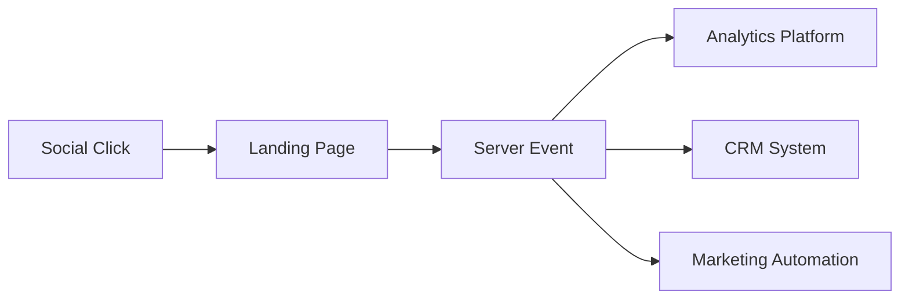

# Социальные сети в веб-аналитике: отслеживание трафика и метрики вовлечённости

Социальные сети генерируют от 15% до 35% всего веб-трафика для большинства сайтов. Каждый переход из Facebook, Instagram, LinkedIn или TikTok несёт информацию о поведении аудитории, эффективности контента и потенциале виральности. Правильная настройка отслеживания социального трафика превращает хаотичный поток кликов в структурированные данные для принятия решений.

## Анатомия социального трафика

### Классификация источников

Социальный трафик включает переходы из различных типов платформ:

**Основные социальные сети:**

- Facebook, Instagram, LinkedIn, Twitter (X)
- Платформы видеоконтента YouTube, TikTok, Twitch
- Мессенджеры с социальными функциями WhatsApp, Telegram
- Нишевые платформы Reddit, Pinterest, Discord

Каждая платформа имеет уникальные характеристики трафика. Facebook генерирует стабильный поток с высокой глубиной просмотра. Instagram приводит импульсивный трафик с коротким временем сессии. LinkedIn даёт качественный B2B-трафик с высокой конверсией.

### Органический vs платный трафик

Различение органического и платного социального трафика критично для оценки ROI:

!!! info "Структура разметки социального трафика"

    **Органические публикации:**
    ```
    utm_source=facebook&utm_medium=social&utm_campaign=content_calendar
    ```
    
    **Платная реклама:**
    ```
    utm_source=instagram&utm_medium=cpc&utm_campaign=product_launch
    ```
    
    **Инфлюенсер-маркетинг:**
    ```
    utm_source=instagram&utm_medium=influencer&utm_campaign=brand_collab
    ```

Органический трафик характеризуется волнообразным паттерном с пиками после публикаций. Платный трафик показывает стабильный поток с предсказуемыми метриками качества.

## UTM-разметка для социальных сетей

### Стандартизация параметров

Социальные сети требуют особого внимания к UTM-разметке из-за разнообразия форматов контента:

| Платформа | Source | Medium | Content варианты |
|-----------|--------|---------|------------------|
| Facebook | facebook | social/cpc | post, story, video, event |
| Instagram | instagram | social/cpc | feed, stories, reels, igtv |
| LinkedIn | linkedin | social/cpc | article, post, inmail |
| TikTok | tiktok | social/cpc | video, live, effect |

### Отслеживание форматов контента

Разные форматы показывают различную эффективность:

**Stories и временный контент:**

- Высокий CTR (3-5%)
- Короткое время жизни (24 часа)
- Импульсивные переходы

**Feed posts и статичный контент:**

- Стабильный трафик
- Длительное время жизни
- Глубокая вовлечённость

**Video и live-трансляции:**

- Максимальный охват
- Высокая виральность
- Сложная атрибуция

!!! tip "Шаблон документации социальных кампаний"

    **Facebook:**
    
    - Органика: `source=facebook, medium=social`
    - Реклама: `source=facebook, medium=cpc`
    - Ретаргетинг: `source=facebook, medium=retargeting`
    
    **Instagram:**
    
    - Feed: `source=instagram, medium=social, content=feed`
    - Stories: `source=instagram, medium=stories`
    - Reels: `source=instagram, medium=reels`

## Метрики вовлечённости

### Базовые метрики взаимодействия

Вовлечённость измеряется через набор действий пользователей:

**Engagement Rate (ER)** — процент аудитории, взаимодействующей с контентом:

```
ER = (Лайки + Комментарии + Репосты) / Охват × 100
```

Средние показатели по платформам:

- TikTok: 2.5-8.5%
- Instagram: 0.45-0.99%
- Facebook: 0.15-0.35%
- LinkedIn: 1.68-2.1%

### Продвинутые метрики

**Amplification Rate** — процент репостов от общего числа взаимодействий:

Репосты представляют высшую форму вовлечённости — пользователь ставит личный бренд за ваш контент. Показатель выше 10% указывает на высокую ценность контента или виральный потенциал.

**Conversation Rate** — соотношение комментариев к общему охвату:

Комментарии требуют больше усилий чем лайки. Высокий показатель (>2%) указывает на контент, вызывающий дискуссию и формирующий сообщество.

**Save Rate** — процент сохранений контента:

Сохранения — сильнейший сигнал ценности. Пользователи сохраняют контент для повторного использования. Показатель >5% характерен для образовательного и справочного контента.

!!! note "Матрица контент-стратегии"

    **Высокие сохранения + высокие репосты:**
    
    - Универсально ценный контент
    - Практические руководства
    - Инфографика с данными
    
    **Высокие сохранения + низкие репосты:**
    
    - Личная или нишевая информация
    - Детальные туториалы
    - Отраслевые инсайты
    
    **Низкие сохранения + высокая вовлечённость:**
    
    - Развлекательный контент
    - Тренды и челленджи
    - Дискуссионные темы

## Виральный потенциал и его измерение

### Virality Rate

Коэффициент виральности показывает скорость распространения контента:

```
Virality Rate = (Количество репостов / Количество показов) × 100
```

Показатель выше 1% считается началом виральности. При 3-5% контент активно распространяется за пределы изначальной аудитории.

### K-Factor (коэффициент виральности)

K-Factor измеряет, сколько новых пользователей привлекает каждый текущий:

```
K = i × c
```

Где:
- i = среднее количество приглашений от пользователя
- c = процент принятых приглашений

При K > 1 происходит экспоненциальный рост. Facebook в ранние годы достигал K = 2.0, что обеспечило взрывной рост платформы.

### Velocity паттерны

Скорость набора вовлечённости предсказывает виральный потенциал:

**Мгновенный всплеск (0-2 часа):**

- Попадание в тренды
- Алгоритмическое продвижение
- Высокая актуальность

**Постепенный рост (2-24 часа):**

- Органическое распространение
- Качественный контент
- Устойчивая виральность

**Отложенная вовлечённость (24+ часов):**

- Вечнозелёный контент
- Поисковое обнаружение
- Повторные просмотры

## Dark Social и проблемы атрибуции

### Невидимый социальный трафик

До 60% социального трафика может быть неправильно классифицировано как прямой:

**Источники dark social:**

- Приватные сообщения в мессенджерах
- Закрытые группы и каналы
- Мобильные приложения без referrer
- Email-пересылки

**Методы идентификации:**

Анализ паттернов поведения dark social трафика:

- Высокий процент новых пользователей
- Прямые переходы на глубокие страницы
- Мобильный трафик с коротким временем сессии
- Всплески после публикаций в социальных сетях

### Cross-device tracking

Пользователи часто видят контент на одном устройстве, а переходят с другого:

!!! example "Типичный путь пользователя"

    1. **Просмотр в Instagram** на смартфоне (лайк, сохранение)
    2. **Поиск в Google** на десктопе через 2 часа
    3. **Переход на сайт** и конверсия
    
    Без правильной атрибуции вся ценность достанется органическому поиску, хотя инициатором был Instagram.

## Алгоритмическая оптимизация

### Сигналы для алгоритмов

Социальные платформы используют сложные алгоритмы для определения охвата:

**Facebook и Instagram:**

- Meaningful interactions (комментарии > лайки)
- Время просмотра контента
- Частота взаимодействий с автором
- Сохранения и отправки в Direct

**LinkedIn:**

- Dwell time (время чтения поста)
- Комментарии в первый час
- Взаимодействие между комментаторами
- Профессиональная релевантность

**TikTok:**

- Completion rate (досмотры)
- Replay rate (повторные просмотры)
- Share velocity (скорость репостов)
- Sound usage (использование аудио)

### Timing и частота публикаций

Оптимальное время публикации зависит от платформы и аудитории:

=== "B2C аудитория"

    **Пиковая активность:**
    
    - Утро: 7:00-9:00 (просмотр в транспорте)
    - Обед: 12:00-13:00 (перерыв)
    - Вечер: 19:00-22:00 (основной prime time)
    
    **Частота публикаций:**
    
    - Instagram: 1-2 раза в день
    - Facebook: 3-5 раз в неделю
    - TikTok: 1-4 раза в день

=== "B2B аудитория"

    **Пиковая активность:**
    
    - Утро: 8:00-10:00 (начало рабочего дня)
    - Обед: 12:00-14:00 (перерыв)
    - Конец дня: 16:00-18:00 (завершение задач)
    
    **Частота публикаций:**
    
    - LinkedIn: 2-5 раз в неделю
    - Twitter: 3-5 раз в день
    - Facebook: 2-3 раза в неделю

## Конверсионная воронка социального трафика

### Особенности поведения

Трафик из социальных сетей имеет специфические характеристики:

| Метрика | Social | Search | Direct |
|---------|--------|--------|--------|
| Bounce Rate | 65-75% | 35-45% | 45-55% |
| Pages/Session | 1.8-2.5 | 3.5-4.5 | 2.8-3.5 |
| Avg. Duration | 0:45-1:30 | 2:30-3:30 | 1:45-2:45 |
| Conversion Rate | 1.1-1.8% | 3.2-4.5% | 5.8-7.2% |

### Оптимизация под социальный трафик

**Landing pages для социального трафика требуют:**

- Быстрая загрузка (< 2 секунды)
- Визуальная согласованность с постом
- Минимальная форма захвата
- Social proof элементы
- Мобильная оптимизация

**Микроконверсии для nurturing:**

Социальный трафик редко конвертируется сразу. Фокус на микроконверсиях:

- Email-подписка
- Скачивание контента
- Добавление в wishlist
- Регистрация на вебинар

## Интеграция с системами аналитики

### Настройка целей и событий

Правильная настройка отслеживания социального трафика включает:

**События вовлечённости:**

```javascript
// Пример отслеживания социальных взаимодействий
dataLayer.push({
  'event': 'social_interaction',
  'social_network': 'facebook',
  'social_action': 'share',
  'social_target': window.location.href
});
```

**Цели по источникам:**

- Newsletter signup from social: 8-12% CR
- Content download from social: 5-8% CR
- Product view from social: 15-25% CR
- Add to cart from social: 3-5% CR

### Multi-touch атрибуция

Социальные сети часто выступают точкой первого касания:

!!! info "Модели атрибуции для социального трафика"

    **First-Touch:** Переоценивает роль социальных сетей в awareness
    
    **Last-Touch:** Недооценивает влияние на начальных этапах
    
    **Linear:** Справедливо для длинных циклов
    
    **Time-Decay:** Оптимально для e-commerce
    
    **Data-Driven:** Требует большого объёма данных

## Проблемы измерения и решения

### Ограничения платформ

Современные ограничения privacy влияют на точность отслеживания:

**iOS 14.5+ и App Tracking Transparency:**

- Потеря 15-25% данных атрибуции
- Задержка в отчётности до 72 часов
- Агрегированные данные вместо детальных

**Блокировка third-party cookies:**

- Невозможность cross-domain tracking
- Потеря данных ретаргетинга
- Фрагментация customer journey

### Server-side tracking

Решение через серверное отслеживание:



Преимущества server-side подхода:

- Обход блокировщиков
- Полный контроль над данными
- Точная атрибуция конверсий
- Соответствие privacy-требованиям

## Наш подход к социальной аналитике

Мы разрабатываем решение, которое адресует ключевые проблемы отслеживания социального трафика. Традиционные платформы ограничивают возможности анализа искусственными лимитами и предустановленными метриками.

Наш подход предусматривает расширенную классификацию социальных источников с автоматическим определением dark social паттернов. Мы работаем над интеллектуальной системой, которая будет восстанавливать потерянные точки касания через анализ поведенческих паттернов.

Планируется реализация функциональности для отслеживания виральных цепочек с визуализацией путей распространения контента. Это позволит точно определять influencers и advocates внутри аудитории.

В отличие от ограничений стандартных систем, где социальный трафик часто теряется в категории "Other", мы фокусируемся на предоставлении детализированной картины социальных взаимодействий. Каждый переход из социальной сети будет обогащён контекстными данными для понимания истинной ценности канала.

--8<-- "snippets/ai.ru.md"

!!! success "Готовы получить полный контроль над социальным трафиком?"

    Зарегистрируйтесь для бесплатного тестирования нашей платформы аналитики и откройте новые возможности отслеживания социальных кампаний без ограничений традиционных систем.