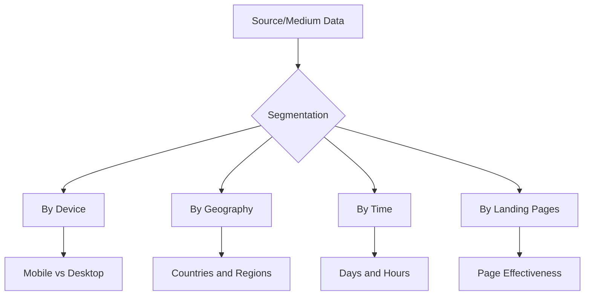

# Source and Medium: In-Depth Analysis of Traffic Origin in Web Analytics

Source and Medium are fundamental web analytics parameters that determine visitor origin and delivery method to a site. This parameter pair forms the foundation for understanding marketing channel effectiveness and enables data-driven decisions about advertising budget allocation. Unlike general traffic channels, the Source/Medium combination provides detailed information about each source, making analysis more precise and actionable.

## Anatomy of Source and Medium Parameters

### Source — Where the Visitor Came From

Source identifies the specific platform or resource from which the transition occurred. This can be a website domain, search engine name, social network, or any other traffic source.

**Source examples:**

- google, bing, duckduckgo — search engines
- facebook, instagram, linkedin — social networks
- example.com — specific referral site
- newsletter — email newsletter
- (direct) — direct visits without identifiable source

### Medium — How the Visitor Reached the Site

Medium defines the channel type or traffic delivery method. While Source answers "from where", Medium explains "how" the user arrived at the site.

**Standard Medium values:**

| Medium | Description | Use Case |
|--------|-------------|----------|
| organic | Organic search | Unpaid search results |
| cpc/ppc | Pay-per-click | Contextual advertising |
| referral | Referral link | Transition from another site |
| email | Email distribution | Links from emails |
| social | Social traffic | Organic social media posts |
| display | Display advertising | Banner advertising |
| affiliate | Partner traffic | Partner links |
| (none) | Undefined | Direct visits |

## Source/Medium Relationship with UTM Parameters

UTM parameters allow explicitly setting Source and Medium values for any link, ensuring accurate marketing campaign tracking.

### UTM Link Structure

```
example.com/landing?utm_source=facebook&utm_medium=cpc&utm_campaign=summer_sale
```

In this example:

- **utm_source=facebook** — traffic comes from Facebook
- **utm_medium=cpc** — paid advertising with pay-per-click
- **utm_campaign=summer_sale** — summer sale campaign

!!! info "Complete UTM Parameter Structure"

    | Parameter | Required | Purpose | Example |
    |-----------|----------|---------|---------|
    | utm_source | Yes | Traffic source | facebook, google, newsletter |
    | utm_medium | Yes | Channel type | cpc, email, social |
    | utm_campaign | Yes | Campaign name | product_launch_2025 |
    | utm_content | No | Ad variant | banner_blue, text_link |
    | utm_term | No | Keyword | web_analytics |

### Automatic Detection vs Manual Tagging

Analytics systems attempt to automatically determine Source and Medium for untagged traffic:

**Automatic detection works for:**

- Organic search — system recognizes known search engines
- Referral traffic — source domain is extracted
- Direct visits — when referrer is absent

**Manual tagging is necessary for:**

- Advertising campaigns — for accurate attribution
- Email distributions — otherwise fall into Direct
- Social networks — to separate paid and organic traffic
- Partner programs — to track partner effectiveness

## Rules for Creating Effective Source/Medium Tagging

### Naming Standardization

Consistency in naming is critical for correct data analysis.

!!! warning "Common Mistakes"

    **Case issues:**

    - ❌ Facebook, facebook, FACEBOOK — counted as three different sources
    - ✅ Use consistent case: facebook
    
    **Inconsistent names:**

    - ❌ fb, facebook, Facebook_ads — fragment data
    - ✅ Choose one designation: facebook
    
    **Spaces in parameters:**

    - ❌ utm_medium=paid social — truncated to "paid"
    - ✅ Use underscores: paid_social

### Detail Hierarchy

Proper Source/Medium detailing allows data analysis at different levels:

=== "Basic Level"

    Minimal detail for general analysis:
    ```
    utm_source=facebook
    utm_medium=paid
    ```

=== "Advanced Level"

    Detail for deep analysis:
    ```
    utm_source=facebook_feed
    utm_medium=cpc_retargeting
    ```

=== "Expert Level"

    Maximum detail considering all nuances:
    ```
    utm_source=facebook_lookalike_us
    utm_medium=cpc_conversion_optimized
    ```

### Convention Documentation

Creating and maintaining Source/Medium usage documentation is mandatory for team collaboration.

!!! tip "Source/Medium Documentation Template"

    **Social Networks:**

    - Facebook organic: `source=facebook, medium=social`
    - Facebook ads: `source=facebook, medium=cpc`
    - Instagram Stories: `source=instagram, medium=stories`
    
    **Email Marketing:**

    - Regular newsletter: `source=newsletter, medium=email`
    - Trigger emails: `source=automation, medium=email`
    - Promo campaigns: `source=promo, medium=email`
    
    **Partner Programs:**

    - Main partners: `source=[partner_name], medium=affiliate`
    - Referral links: `source=[referrer_name], medium=referral`

## Effectiveness Analysis Through Source/Medium Lens

### Key Metrics for Evaluation

Source/Medium combination analysis should consider both quantitative and qualitative indicators:

| Metric | What It Shows | How to Interpret |
|--------|---------------|------------------|
| Sessions | Traffic volume | Source popularity |
| Bounce Rate | Traffic relevance | Targeting quality |
| Conversion | Source effectiveness | ROI potential |
| Average Order Value | Visitor value | LTV forecast |
| Time on Site | Engagement | Content quality for audience |

### Segmentation for Deep Analysis



### Multi-Channel Funnel Analysis

Source/Medium play a key role in understanding customer journey:

!!! example "Typical B2B Conversion Path"

    1. **First touch:** `google / organic` — solution search
    2. **Research:** `linkedin / social` — company research
    3. **Comparison:** `capterra.com / referral` — reading reviews
    4. **Return:** `(direct) / (none)` — direct visit
    5. **Conversion:** `newsletter / email` — purchase after email
    
    Full path analysis shows that email gets the conversion, but organic search initiated the purchase process.

## Source/Medium Specifics for Different Channels

### Paid Advertising

Accurate tagging is critical for advertising campaigns to calculate ROI:

**Google Ads:**
```
utm_source=google
utm_medium=cpc
utm_campaign={campaign_name}
utm_content={ad_id}
utm_term={keyword}
```

**Facebook Ads:**
```
utm_source=facebook
utm_medium=paid_social
utm_campaign={campaign_name}
utm_content={ad_set_name}
```

### Organic Channels

Even free traffic requires tagging for complete effectiveness understanding:

**Blog and Content Marketing:**
```
utm_source=blog
utm_medium=article
utm_campaign=seo_content
utm_content=guide_analytics
```

**Social Networks (Organic):**
```
utm_source=linkedin
utm_medium=social_organic
utm_campaign=thought_leadership
```

### Email Marketing

Email traffic without UTM often gets lost in Direct, distorting the real picture:

!!! note "Structure for Email Campaigns"

    **Welcome Series:**
    ```
    utm_source=welcome_series
    utm_medium=email
    utm_campaign=onboarding
    utm_content=email_{number}
    ```
    
    **Promo Newsletter:**
    ```
    utm_source=promo_newsletter
    utm_medium=email  
    utm_campaign=black_friday_2025
    utm_content={link_position}
    ```

## Traditional System Limitations and Our Solutions

### Standard Platform Constraints

Traditional analytics systems impose various limitations on Source/Medium work:

- **Parameter length limits** — truncation of long values
- **Attribution loss** — during cross-domain transitions
- **Retrospective analysis complexity** — inability to change historical data classification
- **Limited customization** — rigid grouping rules

### Our Improvement Approach

We're working on a solution that eliminates these limitations and provides enhanced Source/Medium analysis capabilities.

**Intelligent Classification:**

Our platform will use machine learning for automatic Source/Medium determination even without explicit tagging, analyzing behavior patterns and contextual signals.

**Flexible Attribution:**

We plan to implement dynamic attribution, allowing different models to be applied to the same data without losing historical information.

**Tagging Automation:**

We're developing tools for automatic UTM parameter generation with validation and compliance control for corporate standards.

## Practical Implementation Recommendations

### Tracking System Launch Checklist

- [ ] Create naming convention document
- [ ] Set up templates for all channels
- [ ] Implement automatic link generators
- [ ] Train team on tagging rules
- [ ] Set up regular parameter audits
- [ ] Create monitoring dashboards
- [ ] Implement anomaly alerts

### Source/Medium Working Tools

**UTM Link Generators:**

Using specialized tools minimizes errors and ensures tagging consistency.

**Bulk Generation Spreadsheets:**

Excel or Google Sheets with formulas for automatic creation of tagged URLs when working with large campaigns.

**Automation Systems:**

Integration with advertising platforms for automatic dynamic parameter substitution.

## Future of Source/Medium Tracking

### Privacy Regulation Impact

Tightening privacy requirements is changing tracking approaches:

- **Referrer blocking** — browsers restrict source information transmission
- **Intelligent Tracking Prevention** — automatic removal of tracking parameters
- **Consent-based tracking** — explicit consent required for tracking

### Adapting to New Realities

**Server-side tracking:**

Moving tracking to server-side to bypass browser restrictions.

**First-party attribution:**

Using proprietary data and identifiers instead of relying on third-party systems.

**Probabilistic attribution:**

Applying statistical models to restore lost attribution.

Proper Source/Medium parameter setup and use is fundamental for understanding marketing effectiveness. In the era of multi-channel customer journey and tightening privacy requirements, accurate source tracking becomes both more challenging and more important. Investment in proper Source/Medium tracking system setup pays off through marketing spend optimization and improved user behavior understanding.

--8<-- "snippets/ai.md"

---

!!! success "Ready to gain full control over traffic source analysis?"

    Sign up for a free trial of our web analytics platform. Unlock advanced Source/Medium tracking capabilities without traditional system limitations — intelligent attribution, automatic classification, and flexible rules for any business.