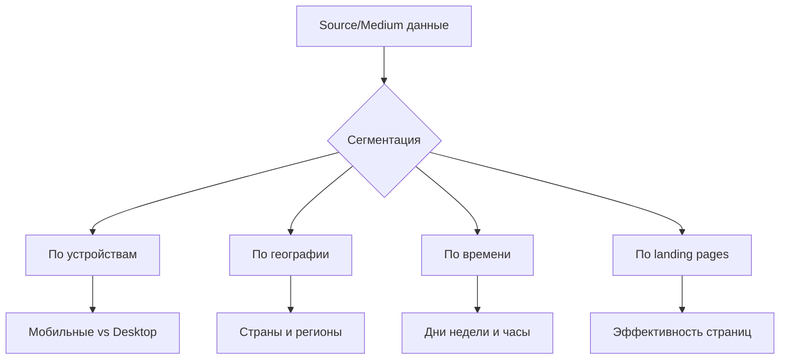

# Source и Medium: детальный анализ происхождения трафика в веб-аналитике

Source (источник) и Medium (канал) — фундаментальные параметры веб-аналитики, определяющие происхождение и способ доставки посетителей на сайт. Эта пара параметров формирует основу для понимания эффективности маркетинговых каналов и позволяет принимать обоснованные решения о распределении рекламных бюджетов. В отличие от общих каналов трафика, комбинация Source/Medium предоставляет детализированную информацию о каждом источнике, делая анализ более точным и actionable.

## Анатомия параметров Source и Medium

### Source — откуда пришёл посетитель

Source идентифицирует конкретную платформу или ресурс, с которого произошёл переход. Это может быть домен сайта, название поисковой системы, социальная сеть или любой другой источник трафика.

**Примеры источников:**

- google, bing, duckduckgo — поисковые системы
- facebook, instagram, linkedin — социальные сети
- example.com — конкретный реферальный сайт
- newsletter — почтовая рассылка
- (direct) — прямые заходы без определяемого источника

### Medium — как посетитель попал на сайт

Medium определяет тип канала или метод доставки трафика. В то время как Source отвечает на вопрос "откуда", Medium объясняет "каким образом" пользователь оказался на сайте.

**Стандартные значения Medium:**

| Medium | Описание | Пример использования |
|--------|----------|---------------------|
| organic | Органический поиск | Неоплаченные результаты поиска |
| cpc/ppc | Оплата за клик | Контекстная реклама |
| referral | Реферальная ссылка | Переход с другого сайта |
| email | Email-рассылка | Ссылки из писем |
| social | Социальный трафик | Органические посты в соцсетях |
| display | Медийная реклама | Баннерная реклама |
| affiliate | Партнёрский трафик | Ссылки от партнёров |
| (none) | Не определён | Прямые заходы |

## Взаимосвязь Source/Medium с UTM-параметрами

UTM-параметры позволяют явно задавать значения Source и Medium для любой ссылки, обеспечивая точное отслеживание маркетинговых кампаний.

### Структура UTM-ссылки

```
example.com/landing?utm_source=facebook&utm_medium=cpc&utm_campaign=summer_sale
```

В этом примере:

- **utm_source=facebook** — трафик приходит с Facebook
- **utm_medium=cpc** — это платная реклама с оплатой за клик
- **utm_campaign=summer_sale** — кампания летней распродажи

!!! info "Полная структура UTM-параметров"

    | Параметр | Обязательный | Назначение | Пример |
    |----------|--------------|------------|--------|
    | utm_source | Да | Источник трафика | facebook, google, newsletter |
    | utm_medium | Да | Тип канала | cpc, email, social |
    | utm_campaign | Да | Название кампании | product_launch_2025 |
    | utm_content | Нет | Вариант объявления | banner_blue, text_link |
    | utm_term | Нет | Ключевое слово | web_analytics |

### Автоматическое определение vs ручная разметка

Системы аналитики пытаются автоматически определить Source и Medium для немаркированного трафика:

**Автоматическое определение работает для:**

- Органического поиска — система распознаёт известные поисковики
- Реферального трафика — извлекается домен источника
- Прямых заходов — когда отсутствует referrer

**Ручная разметка необходима для:**

- Рекламных кампаний — для точной атрибуции
- Email-рассылок — иначе попадут в Direct
- Социальных сетей — для разделения платного и органического трафика
- Партнёрских программ — для отслеживания эффективности партнёров

## Правила создания эффективной разметки Source/Medium

### Стандартизация именования

Последовательность в именовании критически важна для корректного анализа данных.

!!! warning "Распространённые ошибки"

    **Проблема с регистром:**

    - ❌ Facebook, facebook, FACEBOOK — учитываются как три разных источника
    - ✅ Используйте единый регистр: facebook
    
    **Несогласованные названия:**

    - ❌ fb, facebook, Facebook_ads — фрагментируют данные
    - ✅ Выберите одно обозначение: facebook
    
    **Пробелы в параметрах:**

    - ❌ utm_medium=paid social — обрежется до "paid"
    - ✅ Используйте подчёркивания: paid_social

### Иерархия детализации

Правильная детализация Source/Medium позволяет анализировать данные на разных уровнях:

=== "Базовый уровень"

    Минимальная детализация для общего анализа:
    ```
    utm_source=facebook
    utm_medium=paid
    ```

=== "Продвинутый уровень"

    Детализация для углублённого анализа:
    ```
    utm_source=facebook_feed
    utm_medium=cpc_retargeting
    ```

=== "Экспертный уровень"

    Максимальная детализация с учётом всех нюансов:
    ```
    utm_source=facebook_lookalike_us
    utm_medium=cpc_conversion_optimized
    ```

### Документирование соглашений

Создание и поддержание документации по использованию Source/Medium обязательно для командной работы.

!!! tip "Шаблон документации Source/Medium"

    **Социальные сети:**

    - Facebook органика: `source=facebook, medium=social`
    - Facebook реклама: `source=facebook, medium=cpc`
    - Instagram Stories: `source=instagram, medium=stories`
    
    **Email-маркетинг:**

    - Регулярная рассылка: `source=newsletter, medium=email`
    - Триггерные письма: `source=automation, medium=email`
    - Промо-кампании: `source=promo, medium=email`
    
    **Партнёрские программы:**

    - Основные партнёры: `source=[partner_name], medium=affiliate`
    - Реферальные ссылки: `source=[referrer_name], medium=referral`

## Анализ эффективности через призму Source/Medium

### Ключевые метрики для оценки

Анализ комбинации Source/Medium должен учитывать как количественные, так и качественные показатели:

| Метрика | Что показывает | Как интерпретировать |
|---------|----------------|---------------------|
| Сессии | Объём трафика | Популярность источника |
| Bounce Rate | Релевантность трафика | Качество таргетинга |
| Конверсия | Эффективность источника | ROI потенциал |
| Средний чек | Ценность посетителей | LTV прогноз |
| Время на сайте | Вовлечённость | Качество контента для аудитории |

### Сегментация для углублённого анализа



### Multi-Channel Funnel анализ

Source/Medium играют ключевую роль в понимании customer journey:

!!! example "Типичный путь конверсии B2B"

    1. **Первое касание:** `google / organic` — поиск решения
    2. **Исследование:** `linkedin / social` — изучение компании
    3. **Сравнение:** `capterra.com / referral` — чтение отзывов
    4. **Возврат:** `(direct) / (none)` — прямой заход
    5. **Конверсия:** `newsletter / email` — покупка после письма
    
    Анализ всего пути показывает, что email получает конверсию, но органический поиск инициировал процесс покупки.

## Специфика Source/Medium для разных каналов

### Платная реклама

Для рекламных кампаний критически важна точная разметка для расчёта ROI:

**Google Ads:**
```
utm_source=google
utm_medium=cpc
utm_campaign={campaign_name}
utm_content={ad_id}
utm_term={keyword}
```

**Facebook Ads:**
```
utm_source=facebook
utm_medium=paid_social
utm_campaign={campaign_name}
utm_content={ad_set_name}
```

### Органические каналы

Даже бесплатный трафик требует разметки для полного понимания его эффективности:

**Блог и контент-маркетинг:**
```
utm_source=blog
utm_medium=article
utm_campaign=seo_content
utm_content=guide_analytics
```

**Социальные сети (органика):**
```
utm_source=linkedin
utm_medium=social_organic
utm_campaign=thought_leadership
```

### Email-маркетинг

Email-трафик без UTM часто теряется в Direct, искажая реальную картину:

!!! note "Структура для email-кампаний"

    **Welcome-серия:**
    ```
    utm_source=welcome_series
    utm_medium=email
    utm_campaign=onboarding
    utm_content=email_{number}
    ```
    
    **Промо-рассылка:**
    ```
    utm_source=promo_newsletter
    utm_medium=email  
    utm_campaign=black_friday_2025
    utm_content={link_position}
    ```

## Проблемы традиционных систем и наши решения

### Ограничения стандартных платформ

Традиционные системы аналитики накладывают различные ограничения на работу с Source/Medium:

- **Лимиты на длину параметров** — обрезание длинных значений
- **Потеря атрибуции** — при переходах между доменами
- **Сложность ретроспективного анализа** — невозможность изменить классификацию исторических данных
- **Ограниченная кастомизация** — жёсткие правила группировки

### Наш подход к улучшению

Мы работаем над решением, которое устраняет эти ограничения и предоставляет расширенные возможности анализа Source/Medium.

**Интеллектуальная классификация:**

Наша платформа будет использовать машинное обучение для автоматического определения Source/Medium даже при отсутствии явной разметки, анализируя паттерны поведения и контекстные сигналы.

**Гибкая атрибуция:**

Планируется реализация динамической атрибуции, позволяющей применять разные модели к одним и тем же данным без потери исторической информации.

**Автоматизация разметки:**

Мы разрабатываем инструменты автоматической генерации UTM-параметров с валидацией и контролем соответствия корпоративным стандартам.

## Практические рекомендации по внедрению

### Чек-лист запуска системы отслеживания

- [ ] Создать документ с соглашениями по именованию
- [ ] Настроить шаблоны для всех каналов
- [ ] Внедрить автоматические генераторы ссылок
- [ ] Обучить команду правилам разметки
- [ ] Настроить регулярный аудит параметров
- [ ] Создать дашборды для мониторинга
- [ ] Внедрить алерты на аномалии

### Инструменты для работы с Source/Medium

**Генераторы UTM-ссылок:**

Использование специализированных инструментов минимизирует ошибки и обеспечивает консистентность разметки.

**Таблицы для массовой генерации:**

Excel или Google Sheets с формулами для автоматического создания размеченных URL при работе с большими кампаниями.

**Системы автоматизации:**

Интеграция с рекламными платформами для автоматической подстановки динамических параметров.

## Будущее отслеживания Source/Medium

### Влияние privacy-регуляций

Ужесточение требований к приватности меняет подходы к отслеживанию:

- **Блокировка referrer** — браузеры ограничивают передачу информации об источнике
- **Intelligent Tracking Prevention** — автоматическое удаление параметров отслеживания
- **Consent-based tracking** — необходимость явного согласия на отслеживание

### Адаптация к новым реалиям

**Server-side tracking:**

Перенос отслеживания на серверную сторону для обхода ограничений браузеров.

**First-party attribution:**

Использование собственных данных и идентификаторов вместо зависимости от сторонних систем.

**Probabilistic attribution:**

Применение статистических моделей для восстановления потерянной атрибуции.

Правильная настройка и использование параметров Source/Medium — это фундамент для понимания эффективности маркетинга. В эпоху многоканального customer journey и ужесточения privacy-требований, точное отслеживание источников становится одновременно сложнее и важнее. Инвестиции в правильную настройку системы отслеживания Source/Medium окупаются через оптимизацию маркетинговых расходов и улучшение понимания поведения пользователей.

--8<-- "snippets/ai.ru.md"

---

!!! success "Готовы получить полный контроль над анализом источников трафика?"

    Зарегистрируйтесь для бесплатного тестирования нашей платформы веб-аналитики. Откройте расширенные возможности отслеживания Source/Medium без ограничений традиционных систем — интеллектуальная атрибуция, автоматическая классификация и гибкие правила для любого бизнеса.