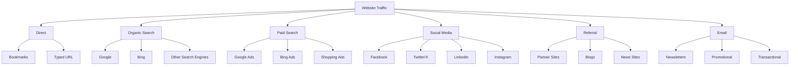
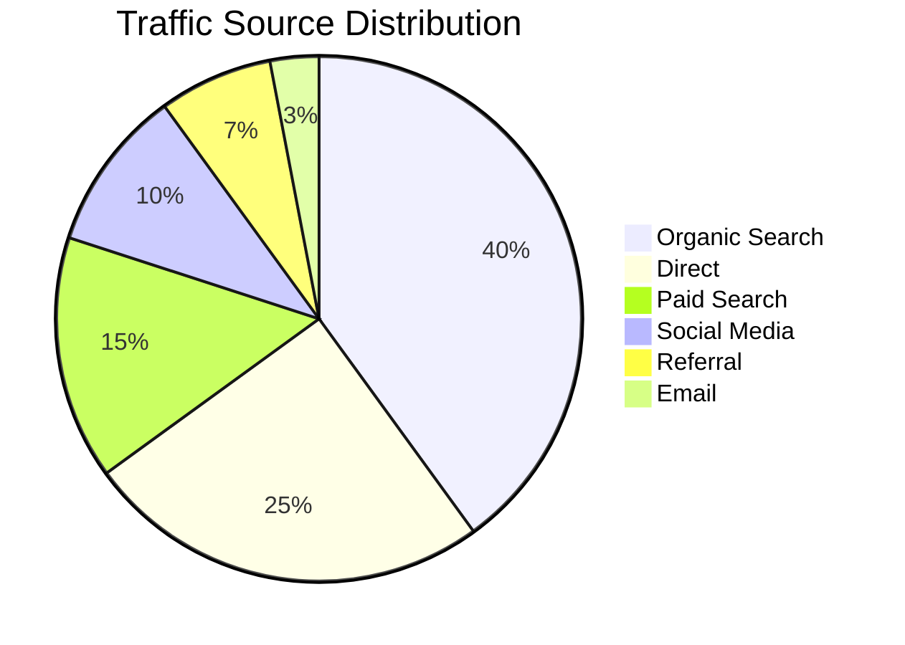
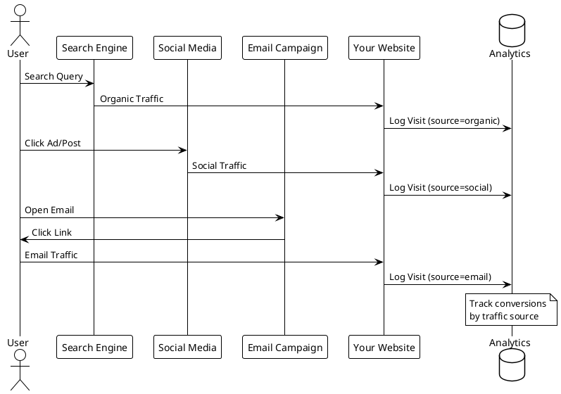
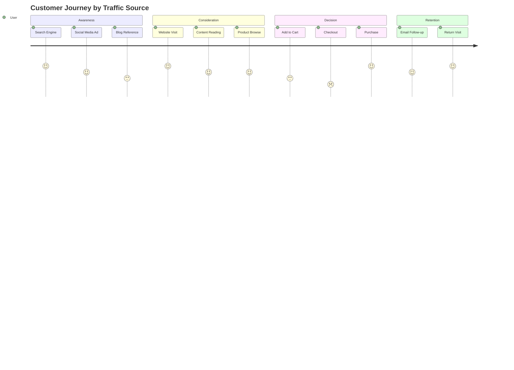
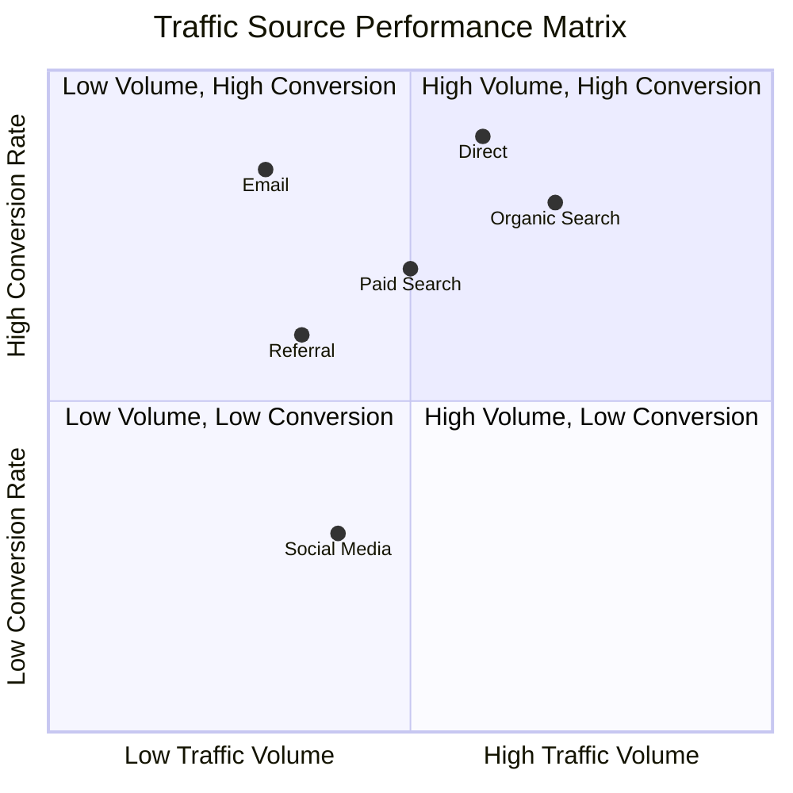
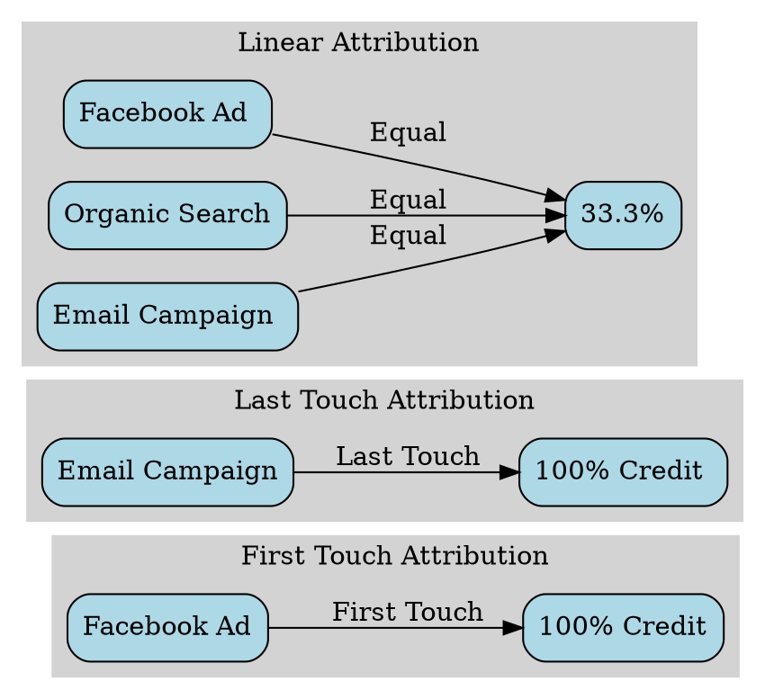

# Traffic Sources

## Overview
Traffic sources are the origin points from which visitors arrive at your website. Understanding traffic sources helps you identify which marketing channels drive the most valuable traffic and optimize your marketing spend accordingly.

## Types of Traffic Sources

### Visual Overview

## Traffic Source Distribution Example

## Traffic Flow Analysis

## Customer Journey Map

## Traffic Source Performance Matrix

## Attribution Model Comparison

## Key Metrics by Source

| Traffic Source | Avg. Session Duration | Bounce Rate | Conversion Rate |
|---------------|----------------------|-------------|-----------------|
| Direct | 3:45 | 35% | 4.2% |
| Organic Search | 2:30 | 45% | 3.8% |
| Paid Search | 2:15 | 50% | 3.5% |
| Social Media | 1:45 | 60% | 2.1% |
| Email | 4:20 | 25% | 5.6% |
| Referral | 2:50 | 40% | 3.2% |

## Best Practices

1. **Diversify Traffic Sources**: Don't rely on a single channel
2. **Track UTM Parameters**: Use consistent tagging for campaigns
3. **Monitor Quality Metrics**: Focus on engagement, not just volume
4. **Optimize by Source**: Tailor landing pages for different sources
5. **Regular Analysis**: Review source performance weekly

## Related Topics
- [UTM Parameters](utm-parameter.md)
- [Channel Grouping](channel.md)
- [Source/Medium](source-medium.md)
- [Campaign Tracking](campaign.md)