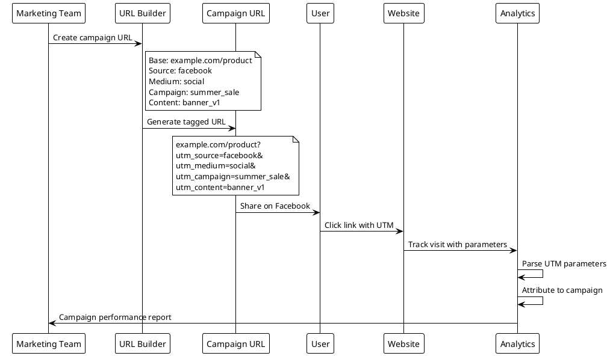
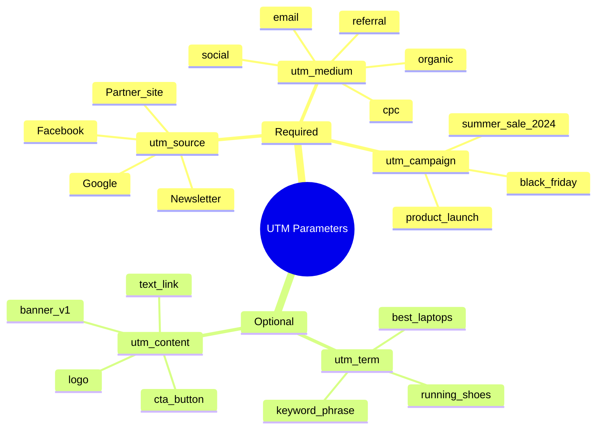
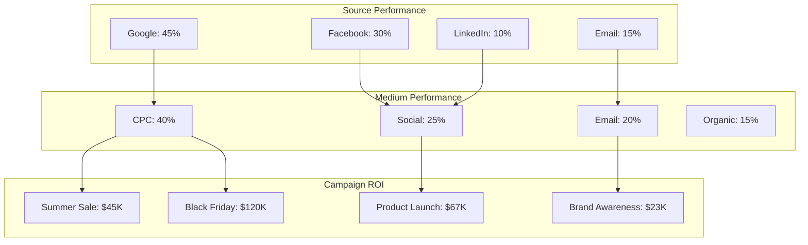
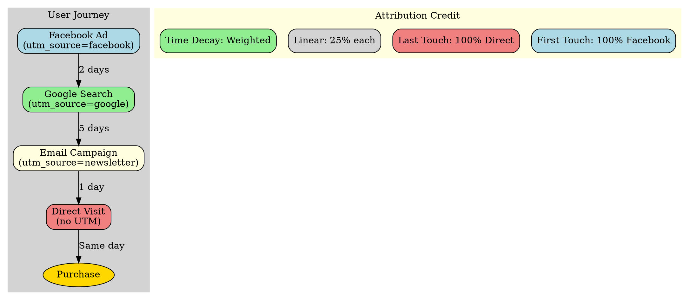
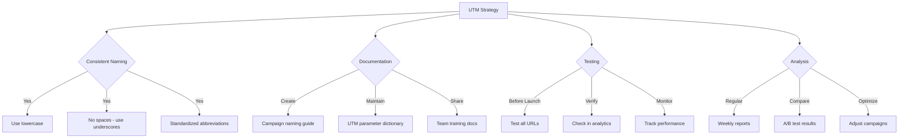

# UTM Parameters

## Overview
UTM parameters are tags added to URLs to track the effectiveness of marketing campaigns across traffic sources. They help identify which campaigns, mediums, and sources drive the most traffic and conversions.

## UTM Parameter Structure

```mermaid
graph LR
    A[Base URL] --> B[?]
    B --> C[utm_source]
    C --> D[&]
    D --> E[utm_medium]
    E --> F[&]
    F --> G[utm_campaign]
    G --> H[&]
    H --> I[utm_term]
    I --> J[&]
    J --> K[utm_content]
    
    style A fill:#f9f,stroke:#333,stroke-width:2px
    style C fill:#bbf,stroke:#333,stroke-width:2px
    style E fill:#bbf,stroke:#333,stroke-width:2px
    style G fill:#bbf,stroke:#333,stroke-width:2px
    style I fill:#fbb,stroke:#333,stroke-width:2px
    style K fill:#fbb,stroke:#333,stroke-width:2px
```



## UTM Parameter Flow



## UTM Parameter Types



## Campaign Performance Dashboard



## UTM Builder Example

```nomnoml
[URL Builder|
  [Input Fields|
    Website URL: example.com/product
    Campaign Source: facebook
    Campaign Medium: social  
    Campaign Name: summer_sale
    Campaign Term: (optional)
    Campaign Content: banner_ad
  ]
  [Generated URL|
    example.com/product?
    utm_source=facebook&
    utm_medium=social&
    utm_campaign=summer_sale&
    utm_content=banner_ad
  ]
]

[Input Fields] -> [Generated URL]: Build

[Generated URL] -> [Copy to Clipboard]: Copy
[Generated URL] -> [QR Code]: Generate QR
[Generated URL] -> [Shorten URL]: Create Short Link
```

## Campaign Attribution Model



## UTM Best Practices Checklist



## Common UTM Examples

| Platform | Source | Medium | Campaign Example | Full URL |
|----------|---------|---------|-----------------|----------|
| Google Ads | google | cpc | summer_sale_2024 | `example.com?utm_source=google&utm_medium=cpc&utm_campaign=summer_sale_2024` |
| Facebook | facebook | social | product_launch | `example.com?utm_source=facebook&utm_medium=social&utm_campaign=product_launch` |
| Newsletter | mailchimp | email | weekly_digest | `example.com?utm_source=mailchimp&utm_medium=email&utm_campaign=weekly_digest` |
| Partner | partner_xyz | referral | co_marketing | `example.com?utm_source=partner_xyz&utm_medium=referral&utm_campaign=co_marketing` |

## Related Topics
- [Traffic Sources](traffic-sources.md)
- [Campaign Tracking](campaign.md)
- [Source/Medium](source-medium.md)
- [Channel Grouping](channel.md)